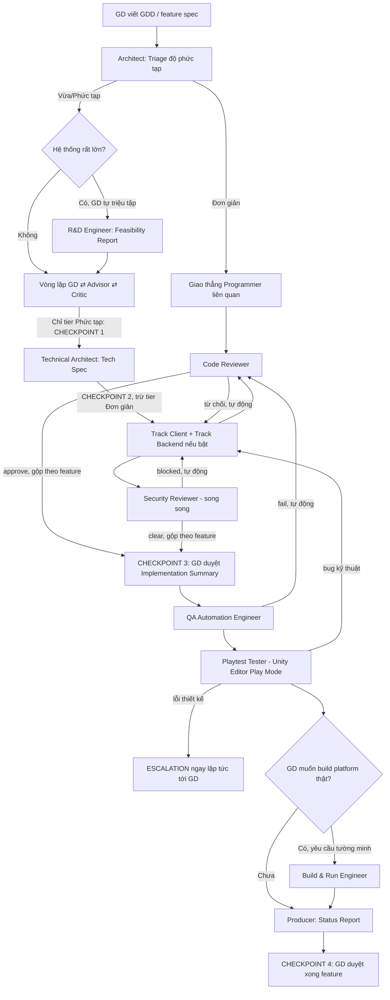
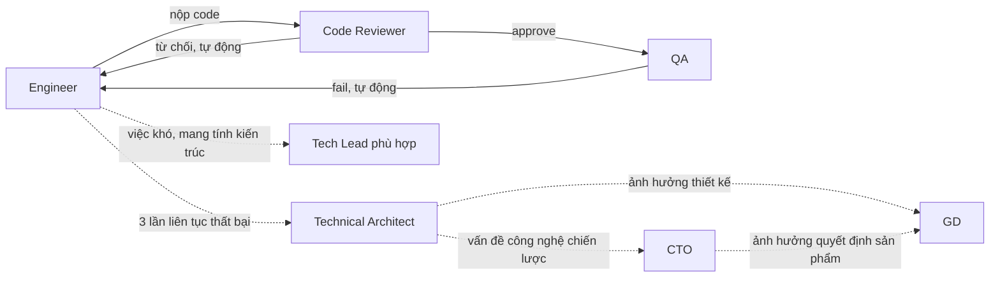

# Đội hình phát triển Unity — Bộ khung Agent

Tài liệu này mô tả đội hình agent tự động hóa quy trình phát triển game Unity (PC + Mobile, mid-core/hardcore, có yếu tố multiplayer client-server), cùng toàn bộ quy trình phối hợp giữa các vai trò. Các agent thật tương ứng nằm trong `.claude/agents/`.

## 1. Tổng quan & triết lý

- **Game Designer (GD)** là con người duy nhất trong đội hình, giữ quyền quyết định cuối cùng về hướng đi/thiết kế. Mọi agent khác thực thi tự động, chỉ dừng lại xin ý kiến GD ở đúng những điểm cần quyết định.
- **Nguyên tắc xuyên suốt:**
  - GD chỉ tham gia ở điểm quyết định (checkpoint), không phải mọi bước thực thi.
  - Code Reviewer luôn khác người viết code; QA/Playtest luôn khác người triển khai — không agent nào tự chấm điểm chính mình.
  - Mỗi agent chỉ làm đúng phạm vi được giao, không tự ý mở rộng việc không ai yêu cầu.
  - Output súc tích, tiết kiệm token — không báo cáo dài dòng không cần thiết.
  - Không bao giờ build platform thật hoặc chạy nhiều Unity Editor instance cùng lúc mà không có yêu cầu tường minh từ GD.

## 2. Bảng vai trò đầy đủ (21 agent, 7 nhóm)

### Nhóm `leadership`

| Agent | Input | Nhiệm vụ | Output |
|---|---|---|---|
| **Advisor** | Câu hỏi/vướng mắc GD đang thiếu hướng | Đưa nhiều phương án tham khảo (game tương tự, pattern phổ biến) — không kết luận thay GD, không đào sâu kỹ thuật | Danh sách phương án + trade-off ngắn gọn |
| **Critic** | Hướng GD đang nghiêng về | Chủ động tìm lỗ hổng — giả định sai, case biên bị bỏ sót, mâu thuẫn nội tại. Đóng vai "người cần được thuyết phục" | Danh sách rủi ro/câu hỏi chưa có lời giải, xếp theo mức nghiêm trọng |
| **Producer/Report Lead** | Output tổng hợp từ mọi vai trò | Tổng hợp tiến độ, rủi ro — không tự quyết kỹ thuật | Status Report định kỳ cho GD |

### Nhóm `architecture`

| Agent | Input | Nhiệm vụ | Output |
|---|---|---|---|
| **CTO** | Quyết định công nghệ chiến lược/khó đảo ngược (escalate từ Architect, hoặc GD hỏi ý kiến kỹ thuật cho quyết định sản phẩm) | Đặt tiêu chuẩn kỹ thuật chung toàn dự án; quyết định đánh đổi công nghệ lớn (netcode framework, build vs buy backend, ad mediation...); điểm escalate kỹ thuật cao nhất trước khi vấn đề chạm quyết định sản phẩm của GD; cầu nối kỹ thuật ↔ leadership | Quyết định công nghệ chiến lược + tiêu chuẩn kỹ thuật áp dụng toàn dự án |
| **Technical Architect** | Hướng đã chốt (GD/Advisor/Critic) + Feasibility Report nếu có | Triage độ phức tạp (mục 3), chia module, ranh giới client-server, chọn pattern, viết Tech Spec, phân loại mức ảnh hưởng khi GDD đổi giữa chừng (mục 6), escalation kỹ thuật cấp 1 | Tech Spec + sơ đồ kiến trúc + Implementation Summary (Checkpoint 3) |
| **R&D Engineer** *(Optional — chỉ hệ thống rất lớn, GD tự triệu tập)* | Câu hỏi khả thi kỹ thuật tầm nền tảng | Spike/prototype nhỏ, đo đạc thực tế (vd benchmark độ trễ mạng) — không nhắm code production | Feasibility Report kèm bằng chứng đo đạc + khuyến nghị nền tảng |

### Nhóm `client`

| Agent | Input | Nhiệm vụ | Output |
|---|---|---|---|
| **C# Software Engineer** | Tech spec phần client (gameplay logic, rules) | Viết **Shared Core** — luật chơi thuần C#, không phụ thuộc UnityEngine, dùng chung cho cả client lẫn server để tránh trùng lặp/lệch logic | C# modules/code |
| **Unity Engineer** | Code từ C# Engineer + budget platform PC/mobile | Tích hợp Shared Core vào scene/GameObject phía client (dự đoán/phản hồi hình ảnh); physics, graphics, optimization thường ngày, asset pipeline, Input System, quality settings | Scene/prefab hoàn chỉnh đã tích hợp + tối ưu theo platform |
| **UI/UX Programmer** | Tech spec UI + flow màn hình từ GDD | Xây UI responsive PC/mobile, nối UI với gameplay state | UI implementation |
| **Tech Lead – C# Unity** | Bài toán C#/Unity khó, mang tính kiến trúc — escalate từ C# Engineer/Unity Engineer khi việc thường không giải quyết được | Giải quyết vấn đề kỹ thuật sâu, định hướng pattern cho track client — **không làm việc thường ngày, chỉ nhận escalate** | Giải pháp kỹ thuật sâu |
| **Tech Lead – SDK/Platform** | Yêu cầu tích hợp SDK/platform từ Tech Spec | Firebase (analytics/crashlytics/remote config), Ad SDK, IAP, Steam/Google Play/App Store | Tích hợp hoàn chỉnh + tuân thủ store policy |
| **Tech Lead – Performance** | Vấn đề hiệu năng vượt phạm vi tối ưu thường ngày của Unity Engineer | Tối ưu sâu: memory, GPU can thiệp low-level, native plugin. Compute shader **chỉ khi mục đích là tối ưu thuần túy** | Code tối ưu sâu + báo cáo hiệu năng |
| **Technical Artist** | Yêu cầu hiệu ứng hình ảnh từ Tech Spec/GD | Shader, VFX, Compute Shader **khi mục đích là hiệu ứng hình ảnh** | Shader/VFX/Compute Shader hoàn chỉnh |

### Nhóm `backend` *(Optional — GD tự bật/tắt tay, chỉ khi dự án có multiplayer)*

| Agent | Input | Nhiệm vụ | Output |
|---|---|---|---|
| **Network/Netcode Engineer** | Tech spec netcode | Giao thức đồng bộ, client-side prediction/reconciliation, lag compensation | Netcode code + tài liệu giao thức (message format, tick rate) |
| **Server-Authoritative Logic Engineer** | Luật chơi (GDD) + giao thức từ Netcode Engineer | Bọc **Shared Core** (không viết lại luật chơi) bằng lớp validate/chống cheat phía server, làm nguồn sự thật | Server logic code |

### Nhóm `qa`

| Agent | Input | Nhiệm vụ | Output |
|---|---|---|---|
| **Code Reviewer** | Code từ bất kỳ programmer nào | Đối chiếu Tech Spec, tìm bug, đề xuất đơn giản hóa, kiểm tra không có luật chơi viết trùng ngoài Shared Core | Review Verdict (approve / yêu cầu sửa) |
| **Security Reviewer** | Code từ bất kỳ programmer nào — **mặc định chạy song song với Code Reviewer** trên cùng 1 submission (2 gate độc lập, không chờ nhau); cũng có thể được gọi chạy đơn lẻ để audit code cũ theo yêu cầu riêng | Quét code/file nguy hiểm, chặn logic gian lận (tamper IAP, tắt anti-cheat, gian lận analytics/ads, backdoor), rà soát rò rỉ thông tin nhạy cảm (API key, private key, keystore, `.env`) — có allowlist cho ID công khai hợp lệ (AdMob App ID, Ad Unit ID, IAP product ID...), gặp ID mơ hồ thì hỏi thay vì tự chặn/tự bỏ qua | Security Verdict (Clear / Blocked / Needs Confirmation) + danh sách finding phân loại mức nghiêm trọng |
| **QA Automation Engineer** | Code đã qua review | Unit/integration test (Edit Mode + Play Mode), test case mạng (packet loss, độ trễ) — chạy trong Unity Editor | Test Report (pass/fail, defect list) |
| **Playtest/Integration Tester** | Editor session sẵn sàng + kịch bản chơi từ GDD | Chạy trong **Unity Editor Play Mode** qua MCP tool, mô phỏng người chơi, so sánh kỳ vọng vs thực tế | Bug Report + bằng chứng (log, ảnh) |

### Nhóm `devops`

| Agent | Input | Nhiệm vụ | Output |
|---|---|---|---|
| **Build & Run Engineer** | Yêu cầu build tường minh từ GD — **KHÔNG BAO GIỜ tự động** | Build PC/mobile thật, hoặc chạy nhiều Editor instance cùng lúc (multiplayer simulation) | Build artifact / môi trường multi-instance |

### Nhóm `live-ops` *(giai đoạn sau phát hành, ngoài pipeline theo feature)*

| Agent | Input | Nhiệm vụ | Output |
|---|---|---|---|
| **Crash/ANR Investigator** | Crash report/stack trace/tombstone **chỉ từ dữ liệu production thật** (Google Play Console, Firebase Crashlytics, App Store Connect) | Phân tích nguyên nhân gốc rễ (native crash, managed exception, ANR do block main thread, memory corruption...), đánh giá mức độ nghiêm trọng/tần suất | Root Cause Report — chuyển cho Engineer phù hợp để fix, quay lại pipeline qua Code Reviewer |

## 3. Cơ chế Triage — 3 tier

Architect tự đánh giá độ phức tạp của mỗi yêu cầu (không cần GD xác nhận trước khi phân loại):

| Tier | Đặc điểm nhận diện | Checkpoint áp dụng |
|---|---|---|
| **Đơn giản** | 1 role duy nhất, không có quyết định kiến trúc mới | Bỏ Checkpoint 1+2. Code Reviewer (bắt buộc) → QA nhẹ → Build → 1 checkpoint cuối gộp |
| **Vừa** | Chạm nhiều role/track, dựa trên pattern đã có sẵn — không rủi ro thiết kế | Bỏ Checkpoint 1. Giữ Checkpoint 2, 3, 4 |
| **Phức tạp** | Hệ thống/mechanic chưa từng làm, ảnh hưởng xuyên suốt, liên quan multiplayer, rủi ro thật | Full pipeline — cả 4 checkpoint |

## 4. Sơ đồ quy trình chính

## 5. Vòng lặp thất bại & escalation kỹ thuật

Nguyên tắc: reject/fail không bao giờ trực tiếp báo GD — đây là vòng lặp kỹ thuật thuần túy, tự động, im lặng với GD cho đến khi vượt ngưỡng.

## 6. Quy trình khi GDD thay đổi giữa chừng

Architect phân loại mức ảnh hưởng (tự quyết, GD không cần duyệt phân loại trước):

| Mức độ | Đặc điểm | Xử lý |
|---|---|---|
| **Nhẹ** | Không đổi ranh giới module/interface trong Tech Spec | Architect tự cập nhật Tech Spec, không quay lại checkpoint nào — ghi nhận vào Status Report kỳ tới |
| **Trung bình** | Đổi cấu trúc Tech Spec, hướng đi/giả định gốc vẫn đúng | Quay lại **Checkpoint 2** — Architect sửa Tech Spec, GD duyệt lại |
| **Lớn** | Đổi giả định gốc mà Critic từng đánh giá, hoặc vô hiệu hóa rủi ro GD đã chấp nhận | Quay lại **Checkpoint 1** — chạy lại vòng lặp Advisor-Critic trên hướng mới |

Code đã viết bị lỗi thời do thay đổi sẽ được Architect gắn cờ "cần làm lại", đưa trở lại pipeline bình thường.

## 7. Gate Build/Run (áp dụng mọi tier)

- **Tự động:** chạy 1 instance Unity Editor Play Mode để test.
- **Cần GD yêu cầu tường minh:** build platform thật (PC/mobile) HOẶC chạy nhiều Editor instance cùng lúc (multiplayer simulation) — vì tốn thời gian/tài nguyên và không dễ hoàn tác.

## 8. Tài liệu handoff giữa các vai trò

| Từ → Đến | Tài liệu | Nội dung |
|---|---|---|
| Advisor/Critic → GD | **Direction Decision** | Hướng đã chọn, rủi ro đã giải quyết, rủi ro còn mở nhưng GD chấp nhận |
| R&D Engineer → Architect/GD | **Feasibility Report** | Mô tả prototype, số liệu đo đạc, khuyến nghị nền tảng |
| Architect → mọi track | **Tech Spec** | Kiến trúc, ranh giới module, interface/contract client-server, task list theo vai trò |
| Programmer → Code Reviewer | **Implementation Note** | Code + assumption/limitation đã biết |
| Code Reviewer → QA | **Review Verdict** | Approve / yêu cầu sửa + danh sách finding |
| Security Reviewer → Programmer | **Security Verdict** | Clear / Blocked / Needs Confirmation + danh sách finding phân loại mức nghiêm trọng |
| QA → Build Engineer | **Test Report** | Pass/fail, defect list |
| Playtest → Programmer | **Bug Report** | Lỗi hành vi + bằng chứng (log, ảnh) |
| Architect → GD | **Implementation Summary** | Tổng hợp đã build gì, đối chiếu ý đồ Tech Spec (dùng ở Checkpoint 3) |
| GD → Architect | **Design Change Request** | Yêu cầu thay đổi thiết kế giữa chừng |
| Crash Investigator → Engineer | **Root Cause Report** | Nguyên nhân crash/ANR, code liên quan, mức ưu tiên |
| Producer → GD | **Status Report** | Tổng hợp định kỳ: tiến độ, rủi ro, việc cần GD quyết |

## 9. Checkpoint GD — tổng hợp

| # | Thời điểm | Áp dụng |
|---|---|---|
| 1 | Cuối vòng lặp Advisor-Critic | Chỉ tier Phức tạp |
| 2 | Sau khi Architect ra Tech Spec | Tier Vừa + Phức tạp |
| 3 | Sau khi TOÀN BỘ code của feature qua Code Review (gộp, không phải từng lần) | Tier Vừa + Phức tạp (tier Đơn giản dùng checkpoint gộp riêng) |
| 4 | Cuối feature — GD duyệt "xong" hoặc trả lại | Mọi tier |
| — | Escalation tức thời khi Playtest phát hiện lỗi thiết kế | Mọi tier, không chờ chu kỳ |
| — | Yêu cầu build platform thật / chạy nhiều Editor instance | Mọi tier, luôn cần hỏi trước |
