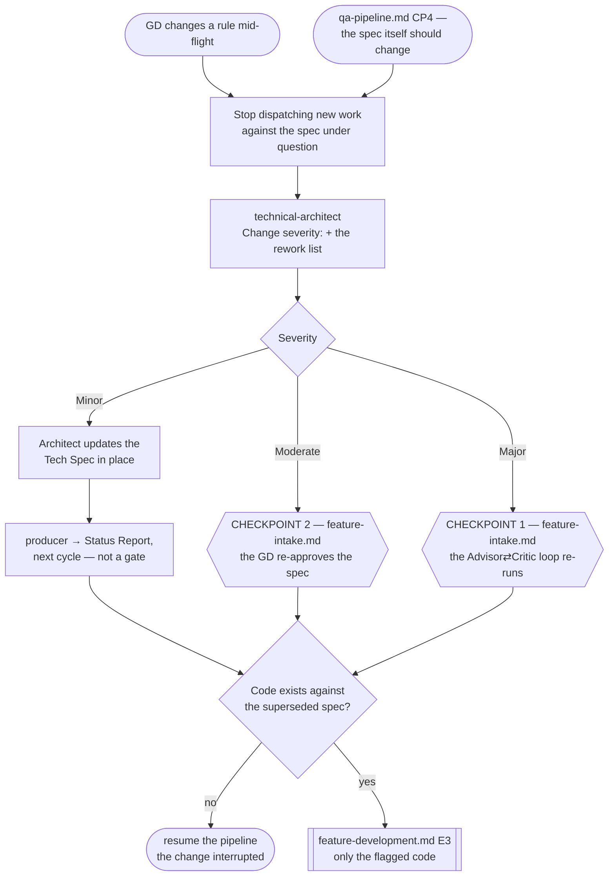

# Change Request Pipeline

> **Scope: a change to a Tech Spec the GD already approved, arriving while the feature is in flight or after
> it closed.** A change that arrives *before* CP2 is just a spec revision — `feature-intake.md` owns that.
> **This file owns the blast-radius classification** and the rollback target it implies.

Sequence, loops and checkpoints live here and never in an agent file — see `feature-intake.md` for the full
statement. Every `Routed to:` below is a recommendation this pipeline acts on, not an action the agent took.

## The agents this pipeline dispatches

| Agent | Tier | Produces | Owns |
|---|---|---|---|
| `technical-architect` | gate (opus) | **Change severity** + the rework list | The classification, and which checkpoint it reopens |
| `producer` | report (sonnet) | **Status Report** | Carrying a Minor change to the GD without a gate |

Everything downstream belongs to another file: `feature-intake.md` owns CP1 and CP2, `feature-development.md`
owns the rework, and `review-pipeline.md` and `qa-pipeline.md` own re-verifying whatever changed.

## Entry points

| | Enters when | Carried in |
|---|---|---|
| **E1** | The GD changes a rule, a GDD passage or a requirement mid-flight | The change **in the GD's own words**, the approved Tech Spec, and the track state |
| **E2** | `qa-pipeline.md` CP4 — the feature does what the spec said, and the GD now wants something else | The same, plus the QA reports that surfaced it |

`technical-architect` returns `Blocked` on a summary of a summary, and silently assumes client-only when track
state is missing. Both travel, or the classification is made against a project that does not exist.

## Pipeline at a glance

Shapes match the other pipelines: `([ ])` entry and stop · `[ ]` an agent or a pipeline action · `{ }` a
decision · `{{ }}` a GD checkpoint · `[[ ]]` another workflow file. Both checkpoints belong to
`feature-intake.md`; this pipeline reopens them, it does not own them.

### Step 1 — halt before classifying

Stop dispatching **new** work against the spec under question the moment the change arrives, before the
architect has said anything. Classification takes one round trip; a fan-out started during it is work built
against a spec that may no longer exist.

**Agents already running cannot be recalled.** Every agent here is isolated and stateless — it will finish and
return work written against the old spec, and no message reaches it mid-run. Anything that lands after the
change arrived is a candidate for the rework list, not a completed task.

### Step 2 — classify, and do not ask first

`technical-architect` is explicitly barred from asking the GD to confirm a classification before making it —
the same rule that governs Triage. The severity is stated, not negotiated. The GD still lands back in the loop
for Moderate and Major because those reopen checkpoints they own; that is the check, not a pre-approval.

Its envelope keeps the usual shape with `Change severity:` added, plus **the code now needing rework**. The
severity says which checkpoint reopens; the rework list is the half that costs money.

### Step 3 — the three severities

| Severity | Criterion | Reopens |
|---|---|---|
| **Minor** | Module boundaries and interfaces in the Tech Spec are unchanged | Nothing. The architect updates the spec in place and `producer` carries it in the next Status Report |
| **Moderate** | The Tech Spec's structure changes, but the original direction and the assumptions under it still hold | **CP2** — the architect revises the spec, the GD re-approves it |
| **Major** | It invalidates an assumption `critic` stress-tested, or a risk the GD accepted at CP1 | **CP1** — the Advisor⇄Critic loop re-runs on the new direction, inside its 3-round cap |

**Minor is the one to get wrong.** It is the only severity that never reaches a checkpoint, so a
misclassification here changes a spec the GD approved without them seeing it. If a boundary or an interface
moves at all, it is Moderate — the size of the diff is not the criterion, and neither is how obvious it looks.

### Step 4 — the code already written

The rework list re-enters `feature-development.md` at **E3**, the same door a review rejection uses, and takes
its place in that pipeline's serial order rather than jumping the queue. From there it is an ordinary
submission again: it goes back through both review gates, and back through whatever QA coverage it touched.

A change that lands after the feature closed at CP4 reopens nothing retroactively — the rework re-enters at E3
and runs the pipeline forward from there, with its own CP3 and CP4.

## Routing rules the pipeline owns

| Return | Action |
|---|---|
| `Change severity: Minor` | Record it, no checkpoint. `producer` carries it next cycle; the rework list still goes to E3 when code exists |
| `Change severity: Moderate` | Re-enter `feature-intake.md` at CP2 with the revised spec |
| `Change severity: Major` | Re-enter `feature-intake.md` at CP1 — and carry the options earlier rounds already ruled out, because `advisor` cannot remember them |
| `technical-architect` → `Blocked` | It was handed a summary, or track state was missing. Supply the GD's own words, unedited |
| `technical-architect` → `Needs-decision`, `Routed to: cto` | The change forces a strategic technology choice. Hand to `research-decision.md` at its `cto` step, then re-enter here |
| `producer` → `Blocked` | It was asked to report a change without the reports behind it. Never reconstruct status from inference |

- **A change request resets the strike count on every submission it invalidates.** Those submissions are now
  measured against a different spec, and a carried-over strike would charge the author for the GD's change.
  Submission identity and the counter are the caller's — no agent holds either.
- **A change arriving before CP2 is not a change request.** No approved spec exists yet, so there is nothing to
  classify a blast radius against; it belongs to `feature-intake.md` as an ordinary revision.
- **A Major does not restart the feature from zero.** It reopens CP1 for the *direction*; work already done
  that the new direction still needs stays, and only the flagged code is reworked.
- **This pipeline never decides whether the change is a good idea.** It classifies what the change costs. The
  design judgment is the GD's, and the technology judgment is `cto`'s.
