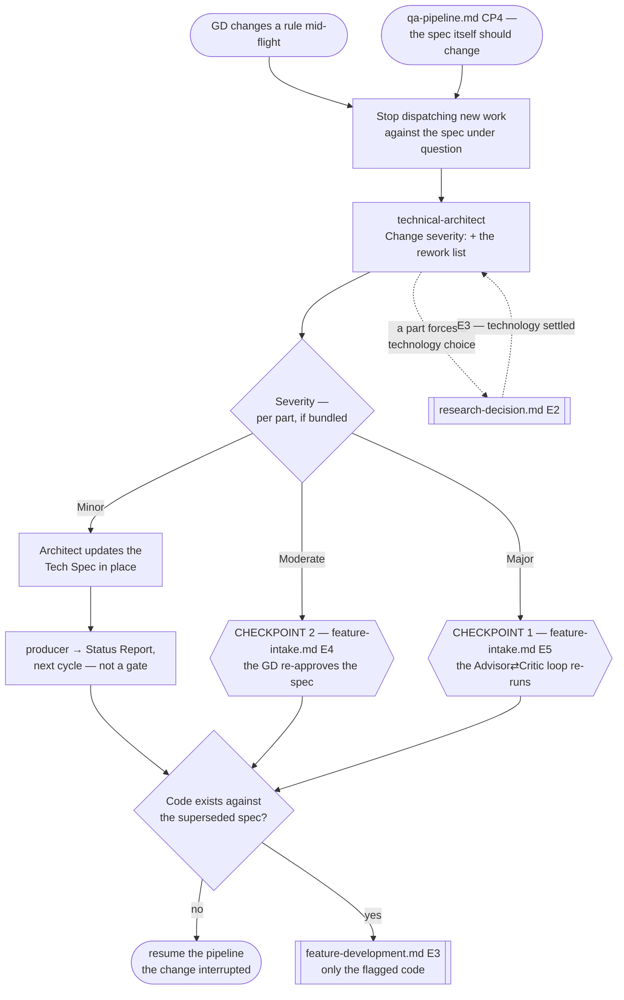

# Change Request Pipeline

> **Scope: a change to a Tech Spec the GD already approved, arriving while the feature is in flight or after
> it closed.** A change that arrives *before* CP2 is just a spec revision — `feature-intake.md` owns that.
> **This file owns the blast-radius classification** and the rollback target it implies.

Sequence, loops and checkpoints live here and never in an agent file — see `feature-intake.md` for the full
statement. Every `Routed to:` below is a recommendation this pipeline acts on, not an action the agent took.

## The agents this pipeline dispatches

| Agent | Tier | Produces | Owns |
|---|---|---|---|
| `technical-architect` | gate (opus) | **Change severity** + **the rework list** | The classification, and which checkpoint it reopens |
| `producer` | report (sonnet) | **Status Report** | Carrying a Minor change to the GD without a gate |

Everything downstream belongs to another file: `feature-intake.md` owns CP1 and CP2, `feature-development.md`
owns the rework, and `review-pipeline.md` and `qa-pipeline.md` own re-verifying whatever changed.

## Entry points

| Entry | Enters when | Carried in |
|---|---|---|
| **E1** | The GD changes a rule, a GDD passage or a requirement mid-flight — `orchestrator.md` step 0 sizes it here | The change **in the GD's own words**, the approved Tech Spec, the track state, and the feature's current tier and axes |
| **E2** | `qa-pipeline.md` CP4 — the feature does what the spec said, and the GD now wants something else | The same, plus the QA reports that surfaced it |
| **E3** | `research-decision.md` settled the technology half of a bundled change | Resumes at **step 2** — the Technical Decision, any `Standard set:`, the Research Report's `Picture taken:` date, and whichever severity the rest of the request already classified |

`technical-architect` returns `Blocked` on a summary of a summary, and silently assumes client-only when track
state is missing. Both travel, or the classification is made against a project that does not exist.

**Blast radius and the A-tier are different classifications, and neither derives the other.** Minor/Moderate/
Major says *which checkpoint reopens*; the A-tier says *how hard the reworked code is verified*. A Minor
change to a credential path is still A5 and still owes V4 evidence at review — the change was cheap to
classify, not cheap to get wrong.

**A change re-reads every axis, not just U.** It is the one re-entry that can genuinely move D, C, R and X:
new scope raises D, a newly touched economy path raises C. Reclassify at step 2, write the new tier into the
feature's ledger, and carry it into the rework brief — a rework dispatched at the old tier verifies to a
standard the change has already invalidated.

## Pipeline at a glance

Shapes match the other pipelines: `([ ])` entry and stop · `[ ]` an agent or a pipeline action · `{ }` a
decision · `{{ }}` a GD checkpoint · `[[ ]]` another workflow file. Both checkpoints belong to
`feature-intake.md`; this pipeline reopens them through **E4** and **E5**, it does not own them.

### Step 1 — halt before classifying

Stop dispatching **new** work against the spec under question the moment the change arrives, before the
architect has said anything. Classification takes one round trip; a fan-out started during it is work built
against a spec that may no longer exist.

**Agents already running cannot be recalled.** Every agent here is isolated and stateless — it will finish and
return work written against the old spec, and no message reaches it mid-run. Anything that lands after the
change arrived is a candidate for the rework list, not a completed task.

### Step 2 — classify, and do not ask first

`technical-architect` is explicitly barred from asking the GD to confirm a classification before making it —
the same rule that governs the feature's own tier. The severity is stated, not negotiated. The GD still lands back in the loop
for Moderate and Major because those reopen checkpoints they own; that is the check, not a pre-approval.

Its envelope keeps the usual shape with `Change severity:` added, plus **the code now needing rework**. The
severity says which checkpoint reopens; the rework list is the half that costs money.

### Step 3 — the three severities

| Severity | Criterion | Reopens |
|---|---|---|
| **Minor** | Module boundaries and interfaces in the Tech Spec are unchanged | Nothing. The architect updates the spec in place and `producer` carries it in the next Status Report |
| **Moderate** | The Tech Spec's structure changes, but the original direction and the assumptions under it still hold | **CP2** — the architect revises the spec, the GD re-approves it |
| **Major** | It invalidates an assumption `critic` stress-tested or a risk the GD accepted at CP1, **or** the reclassified axes now force CP1 for the first time (D4–D5, or U3) on a feature whose original D1–D3/U0–U1 shape never ran that loop | **CP1** — the Advisor⇄Critic loop re-runs, inside its 3-round cap. A feature reopening CP1 for the first time carries no prior round and no accepted risk to invalidate — a legitimate empty history, never an error to paper over |

**Minor is the one to get wrong.** It is the only severity that never reaches a checkpoint, so a
misclassification here changes a spec the GD approved without them seeing it. If a boundary or an interface
moves at all, it is Moderate — the size of the diff is not the criterion, and neither is how obvious it looks.

**A bundled request can outrun one `Change severity:` value.** When part of a change is `cto`'s call — a
netcode foundation, a vendor swap — that part gets no Minor/Moderate/Major label at all, and the ratable part
is classified independently of it. See `references/change-severity-and-custody.md` for the split, the
sequencing, and what each severity's envelope defers versus fills in now.

### Step 4 — the code already written

The rework list re-enters `feature-development.md` at **E3**, the same door a review rejection uses, and takes
its place in that pipeline's serial order rather than jumping the queue. From there it is an ordinary
submission again — which now means it gets its **own** gate offer, per `references/optional-gates.md`. A
gate the GD ran before the change is not a gate that ran on the change: ask again, because this is a new
boundary and a new artifact, not the nagging `loop-termination.md` forbids.

A change that lands after the feature closed at CP4 reopens nothing retroactively — the rework re-enters at E3
and runs the pipeline forward from there, with its own CP3 and CP4.

## Routing rules the pipeline owns

| Return | Action |
|---|---|
| `Change severity: Minor` | Record it, no checkpoint. `producer` carries it next cycle; the rework list still goes to E3 when code exists |
| `Change severity: Moderate` | Re-enter `feature-intake.md` at **E4** — CP2 — with the revised spec and the rework list |
| `Change severity: Major` | Re-enter `feature-intake.md` at **E5** — CP1 — carrying the options earlier rounds already ruled out **and which risks the GD accepted at the feature's own CP1**, read from the ledger's `## Decisions` half (`none` if this is the feature's first CP1, per Step 3) — `advisor` and `critic` cannot remember either |
| `technical-architect` → `Needs-decision`, `Routed to: cto` — alone, or beside a `Change severity:` for the rest of the request | The technology part is not a severity. Hand it to `research-decision.md` at **E2** — never straight to its `cto` step, which is barred from running without a candidate set — carrying the tier and its axes, attempt budget, verification floor and track per `references/entry-index.md`. This pipeline is now one of `research-decision.md`'s declared origins, returning to **E3** here, never straight into `feature-intake.md`. Finish classifying whatever severity remains in light of the answer, per `references/change-severity-and-custody.md` |
| `technical-architect` → `Blocked` | It was handed a summary, or track state was missing. Supply the GD's own words, unedited |
| `producer` → `Needs-decision`, `Routed to: technical-architect` | It will not adjudicate a conflict between reports. Re-dispatch the architect with both |
| `producer` → `Blocked` | It was asked to report a change without the reports behind it. Never reconstruct status from inference |
| The reclassification moves the tier | Record it in the feature's ledger before dispatching the rework, and re-derive the attempt budget and verification floor from it. Neither survives a run on its own |

- **A change request resets the strike count on every submission it invalidates**, and resets their attempt
  budgets, their CP2/CP3/CP4 rejection counts and their root-cause reset with it — every counter in
  `loop-termination.md` that was charged against a spec the GD has now moved. Those submissions are now measured against a different spec, and a carried-over strike or a
  half-spent budget would charge the author for the GD's change. Both counters are the caller's — no agent
  holds either.
- **A Major also resets the Advisor⇄Critic round count to zero**, and it is the only severity that does. Where
  a prior CP1 exists, its rounds were spent settling a *different* question, and carrying them forward hands
  the new direction whatever is left of the cap — a feature that used two rounds before would re-enter **E5**
  with one, and report non-convergence on a direction nobody had properly deliberated. Where this is the
  feature's **first** CP1 (Step 3's second Major case), there is no prior round to reset — resetting 0 to 0 is
  correct, not vacuous, and the full 3-round cap applies. What does **not** reset either way is the
  **ruled-out options list**: those were rejected on their own merits, and `advisor` still cannot remember them.
- **A decision the change overturns is superseded in the feature root's `LEDGER.md`, not deleted** — from
  **A3** upward, per `feature-documentation.md`. The superseded reasoning is what stops the next session
  re-litigating a direction the GD has already moved off.
- **A change arriving before CP2 is not a change request.** No approved spec exists yet, so there is nothing to
  classify a blast radius against; it belongs to `feature-intake.md` as an ordinary revision.
- **A Major does not restart the feature from zero.** It reopens CP1 for the *direction*; work already done
  that the new direction still needs stays, and only the flagged code is reworked.
- **This pipeline never decides whether the change is a good idea.** It classifies what the change costs. The
  design judgment is the GD's, and the technology judgment is `cto`'s.
