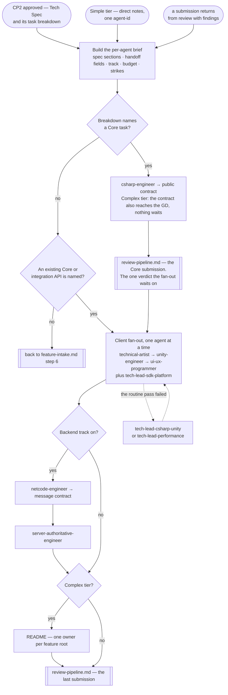

# Feature Development Pipeline

> **Scope: an approved Tech Spec, up to code standing at the review gate.** Everything before it belongs to
> `feature-intake.md`; the gates themselves belong to `review-pipeline.md`.

Sequence, loops and checkpoints live here and never in an agent file — see `feature-intake.md` for the full
statement. Every `Routed to:` below is a recommendation this pipeline acts on, not an action the agent took.

## The agents this pipeline dispatches

| Agent | Tier | Produces | Owns |
|---|---|---|---|
| `csharp-engineer` | executor (sonnet) | **Shared Core Implementation** | `Game.Core.*` — the rules, and the public contract every other layer builds against |
| `technical-artist` | executor (sonnet) | **Visual Effect** | Shaders, VFX, visual compute — authors the effect, never integrates it |
| `unity-engineer` | executor (sonnet) | **Client Integration** | Scenes, prefabs, physics, rendering, assets, input, the routine optimization pass |
| `ui-ux-programmer` | executor (sonnet) | **UI Implementation** | Screens, and their binding to state they read but never own |
| `tech-lead-sdk-platform` | lead (opus) | **SDK/Platform Integration** | Every third-party SDK and store integration |
| `netcode-engineer` | executor (sonnet) | **Netcode Protocol** | The sync protocol — backend track only |
| `server-authoritative-engineer` | executor (sonnet) | **Server Authority** | Validation wrapping the Core — backend track only |
| `tech-lead-csharp-unity` | lead (opus) | **Deep Technical Solution** | Architecture-level C#/Unity problems — escalation only |
| `tech-lead-performance` | lead (opus) | **Performance Report** | Deep memory, GPU and native work — escalation only |

## Entry points

| # | Comes from | Carries |
|---|---|---|
| **E1** | `feature-intake.md` CP2 approved — Medium or Complex | The Tech Spec, its per-`agent-id` task breakdown, and the tier |
| **E2** | `feature-intake.md` step 2 — Simple tier | The architect's direct notes, addressed to one `agent-id` |
| **E3** | A defect returns — from `review-pipeline.md`, from `qa-pipeline.md`, or reported by the GD | The findings, the original brief, and the strike count |

**E2 runs one agent and stops** — no fan-out, no ordering, no README. A Simple-tier change is one role by definition; the full shape over it is the overhead Triage exists to avoid.

**A GD-reported defect enters at E3 with zero strikes.** If the spec was right and the GD now wants
something else, that is `change-request.md` — a change request, not a defect.

## Pipeline at a glance

Shapes match `feature-intake.md`: `([ ])` entry and stop · `[ ]` an agent or a pipeline action · `{ }` a
decision · `[[ ]]` another workflow file, with the dotted edge the escalation lane. The GD-checkpoint shape
never appears — this pipeline holds none. CP2 is behind it, CP3 ahead of it.

Two edges are left undrawn. A `Blocked` return: always ask for exactly the input named, then resume from that
step. And **every agent box hands its own submission to `review-pipeline.md` the moment it returns** — only
the Core's verdict is waited on, so drawing the rest would bury the spine.

### Step 0 — the brief

An agent sees only this brief. Four things every one carries, each keyed to what happens when it is missing:

| Attach | If the pipeline omits it |
|---|---|
| That agent's task section, **plus `Module boundaries:` and `Client-server contract:`**, plus the tier | Four agents return `Blocked` on a missing task section. The two cross-cutting fields are a separate matter: `unity-engineer:92` and `ui-ux-programmer:81` are each forbidden to implement a game rule, and no agent can respect a boundary it was never shown. Only the *other* agents' task breakdowns are withheld |
| Track state, stated explicitly on or off | `netcode-engineer` and `server-authoritative-engineer` return `Blocked`; neither ever assumes the track is on |
| The per-platform performance budget | `unity-engineer` and `technical-artist` proceed against a guessed budget and only state the assumption |
| The strike count and prior findings, on an **E3** re-entry | Every implementing agent's Escalate criterion is "already came back rejected twice". It cannot count its own retries, so silence reads as a first attempt |

Plus what an earlier agent already produced for it. Agents cannot see each other's returns, so a field this
pipeline forgets to forward is a field that does not exist:

| Producer → field | Goes to | Why that agent needs it |
|---|---|---|
| `csharp-engineer` → `Public contract:` | `unity-engineer`, `ui-ux-programmer`, `netcode-engineer`, `server-authoritative-engineer` | all four return `Blocked` without the Core types |
| `csharp-engineer` → `Determinism:` | `netcode-engineer`, `server-authoritative-engineer` | netcode Escalates when the Core "is not deterministic enough to reconcile"; server authority assumes the strictest tolerance that determinism supports |
| `csharp-engineer` → `Assumptions and known limitations:` | every downstream agent | they build on the assumption too, and have no other way to see it |
| `technical-artist` → `Authored:` and `Pipeline:` | `unity-engineer` | it integrates that effect into the scene or prefab |
| `unity-engineer` → `Core calls used:` and `Changed:` | `ui-ux-programmer` | when the UI binds to state the integration exposes rather than to Core directly |
| `netcode-engineer` → `Message contract:` | `server-authoritative-engineer` | returns `Blocked` without it |

### Step 1 — Shared Core first, which is not a preference

Four agents return `Blocked` without it, so the ordering is forced rather than chosen. **When the breakdown
names no Core task**, the brief must name the existing Core type or integration exposing that state. If
neither exists, the spec has a gap this pipeline cannot fill: hand back to `technical-architect` rather than
let a downstream agent invent the rule — it refuses anyway, a round on.

**The fan-out waits for the Core submission's review verdict, and only that one.** Everything downstream is
built against the public contract, so a wrong contract is rebuilt by four agents rather than one. Review
costs no Editor time (step 2), so the verdict lands while the fan-out would still have been queuing. This is
an agent gate, not a checkpoint: the GD is not asked and does not wait.

**On Complex tier the contract also goes to the GD as a notice**, and the pipeline continues immediately —
review judges whether the code is correct, and only the GD can say it is not what they meant. Neither of the
two gates the other, and neither is a fifth checkpoint.

### Step 2 — the client fan-out, one agent at a time

Serial, for three compounding reasons: there is one Unity Editor and three of these agents hold
`mcp__unity-mcp__*` tools pointed at it; any `.cs` write triggers a domain reload that ends the Play Mode
session another is verifying in; and agents cannot coordinate, with no orchestrator to arbitrate.

**Settled, not deferred** — three ways out were tested and all fail. A worktree per agent splits files, not
the single Editor process. "Author now, verify later" fails because `unity-engineer:44`, `ui-ux-programmer:41`
and `technical-artist:40` are each *required* to verify in Play Mode. Extra Editor instances need an explicit
GD request routed to `build-run-engineer`. Review is the one thing that does run concurrently:
`code-reviewer` and `security-reviewer` hold no Unity tools and write nothing.

Order follows dependency, and the spec's own dependencies override it. Skip any row the breakdown omits.

| Order | Agent | Why here |
|---|---|---|
| 1 | `technical-artist` | It authors the effect; `unity-engineer` integrates it into the scene or prefab, so it must exist first |
| 2 | `unity-engineer` | It integrates the Core and those effects — and exposes the state the UI may bind to |
| 3 | `ui-ux-programmer` | It binds to a Core type or to the integration exposing it, so it goes last, when both exist |
| any | `tech-lead-sdk-platform` | It depends on nothing here — it assumes the gameplay hook exists and states that |

### Step 3 — the backend track

**The track is the caller's state.** Both agents return `Blocked` unless the brief confirms it is on; an
unstated track is never "probably off". **Protocol comes before authority**, since the message contract is
`netcode-engineer`'s output and `server-authoritative-engineer` blocks without it. The Core's shape
determines the wire format, never the reverse.

**This chain depends on step 1 only.** Sitting after the client fan-out is an artifact of serialization, not
a dependency — it may take any slot once the Core has returned. If the netcode foundation is unset,
`netcode-engineer` returns `Needs-decision`, `Routed to: cto` — a technology question, so it enters
`research-decision.md` step 0 rather than `cto` directly.

### Step 4 — the README, Complex tier only

Complex tier owes a `README.md` at each feature root before final review sign-off. It is dispatched as its
own task **after every implementation task in that root has returned**, to one named owner:

| Root | Owner |
|---|---|
| The `Game.Core.*` feature root | `csharp-engineer` — the only agent that writes there |
| The Unity `Assets/` feature root | `unity-engineer` when the breakdown names it, else `ui-ux-programmer`, else `technical-artist` |

The brief attaches every envelope returned for that root — one writer holding the whole picture beats several isolated agents appending to one file, and each root's README links the other instead of duplicating it.

### After every return — the submission

**One submission per agent return, not one per feature.** `code-reviewer` counts strikes against "the same
submission" and CP3 is what aggregates a feature's approvals, so a return goes to `review-pipeline.md` as
soon as it lands and the README is simply the last submission rather than a bundling step.

| Carried | Source |
|---|---|
| The code or diff in scope | The working tree. The pipeline supplies it — some envelopes report what now works rather than which paths changed |
| The spec section, or the Simple-tier direct notes | The same brief step 0 sent; the reviewer checks against what was actually asked |
| Which agent authored it | The dispatch record. Absent, the reviewer proceeds on a stated assumption that it did not write the code |
| The Implementation Note | Assembled here, per `.claude/rules/implementation-note.md` — which names each field's source, and the one field it can only approximate |

## The escalation lane

Never a first dispatch, and not drawn above — reachable from any step, returning to the step it left.
`tech-lead-performance` returns `Rejected`, `Routed to: unity-engineer` when the obvious fixes are still
open, and `tech-lead-csharp-unity` names a misrouted escalation as one. It is silent to the GD: a technical
loop they see only through a `Blocked` needing their input, or later at CP3.

`tech-lead-sdk-platform` is not on this lane — it is dispatched straight from the spec at step 2, because its scope has no routine owner beneath it and an SDK task has nowhere else to start.

## Routing rules the pipeline owns

| Return | Action |
|---|---|
| any agent → `Blocked` | Ask for exactly the input named — the GD when it is theirs, `technical-architect` when the spec has the gap |
| `csharp-engineer` → `Done` | Submit it for review, send the Complex-tier notice, and hold the fan-out for the verdict |
| `tech-lead-sdk-platform` → `Done` with `Config required:` or `Risks flagged:` | A `Done` can still carry what only the GD can act on — keys to supply, a store-rejection risk. Forward it; never let it pass as "continue" |
| any agent → `Rejected`, `Routed to: <peer>` | The task was misassigned. Re-dispatch to the named agent; never argue it back |
| implementing agent → `Needs-decision`, `Routed to: <tech lead>` | The escalation lane, then resume at the step it left |
| `netcode-engineer` → `Needs-decision`, `Routed to: cto` | Hand to `research-decision.md` step 0 — `cto` is never entered without a candidate set |
| `server-authoritative-engineer` → `Blocked`, `Routed to: csharp-engineer` | A rule is missing from the Core. Back to step 1, then resume |
| `tech-lead-*` → `Needs-decision`, `Routed to: technical-architect` or `cto` | Out of this pipeline: the architect re-enters at `feature-intake.md` step 6, `cto` at `research-decision.md` step 0 |

- **The strike ladder.** Strike 2 fires the agent's own Escalate criterion and routes to a tech lead; strike 3
  is `review-pipeline.md`'s three-strikes rule and routes to `technical-architect`. That pipeline counts —
  this one receives the count through **E3** and forwards it in the brief.
- **Nothing here reviews its own work.** Verification an agent runs on itself is evidence for the gate, not a
  substitute for it; the gates are `review-pipeline.md`'s.
