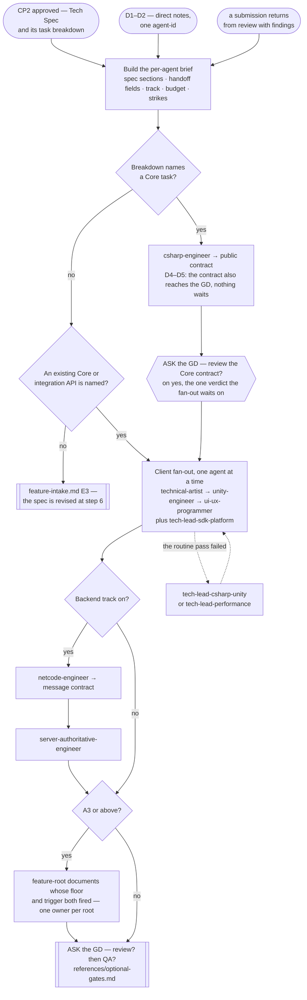

# Feature Development Pipeline

> **Scope: an approved Tech Spec, or direct notes, up to code standing at the gate offer.** Everything before
> it belongs to `feature-intake.md`; the gates themselves belong to `review-pipeline.md` and `qa-pipeline.md`,
> and **both are optional** — this pipeline ends by asking, per `references/optional-gates.md`, never by
> dispatching one on its own initiative.

Sequence, loops and checkpoints live here and never in an agent file — see `feature-intake.md` for the full
statement. Every `Routed to:` below is a recommendation this pipeline acts on, not an action the agent took.

**This pipeline spends two budgets it does not set.** `feature-intake.md` hands over an **A1–A5 tier with its
five axes**; from them come the **attempt budget** each agent iterates inside (`execution-loop.md`, keyed to
**D**) and the **verification floor** its evidence must reach (`effort-allocation.md`, keyed to **A**). The
retired Simple/Medium/Complex tier appears nowhere below — **D** decides the shape of the fan-out, **A**
decides how hard each return is checked.

## The agents this pipeline dispatches

| Agent | Tier | Produces | Owns |
|---|---|---|---|
| `csharp-engineer` | executor (sonnet) | **Shared Core Implementation** | `Game.Core.*` — the rules, and the public contract every other layer builds against |
| `technical-artist` | executor (sonnet) | **Visual Effect** | Shaders, VFX, visual compute — authors the effect, never integrates it |
| `unity-engineer` | executor (sonnet) | **Client Integration** | Scenes, prefabs, physics, rendering, assets, input, the routine optimization pass |
| `ui-ux-programmer` | executor (sonnet) | **UI Implementation** | Screens, and their binding to state they read but never own |
| `tech-lead-sdk-platform` | lead (opus) | **SDK/Platform Integration** | Every third-party SDK and store integration |
| `netcode-engineer` | executor (sonnet) | **Netcode Protocol** | The sync protocol — backend track only |
| `server-authoritative-engineer` | executor (sonnet) | **Server Authority** | Validation wrapping the Core — backend track only |
| `tech-lead-csharp-unity` | lead (opus) | **Deep Technical Solution** | Architecture-level C#/Unity problems — escalation only |
| `tech-lead-performance` | lead (opus) | **Performance Report** | Deep memory, GPU and native work — escalation only |

## Entry points

| Entry | Comes from | Carries |
|---|---|---|
| **E1** | `feature-intake.md` CP2 approved — **D3–D5** | The Tech Spec, its per-`agent-id` task breakdown, the tier and its axes |
| **E2** | `feature-intake.md` step 2 — **D1–D2** — or the GD naming the work directly, with no spec round | Direct notes addressed to one `agent-id`, and the tier. From the GD, per `references/standalone-runs.md` |
| **E3** | A defect returns — from `review-pipeline.md`, from `qa-pipeline.md`, or reported by the GD | The findings, the original brief, the strike count, and attempts already spent |

**E2 runs one agent and stops** — no fan-out, no ordering, no documents. D1–D2 is one role by definition, and
the full shape over it is the overhead `effort-allocation.md`'s artifact budget forbids. **A high A-tier does
not reopen it**: an A5 E2 dispatch buys a higher verification floor and a more careful target check, never a
second agent.

**A GD-reported defect enters at E3 with zero strikes.** If the spec was right and the GD now wants
something else, that is `change-request.md` — a change request, not a defect.

## Pipeline at a glance

Shapes match `feature-intake.md`: `([ ])` entry and stop · `[ ]` an agent or a pipeline action · `{ }` a
decision · `[[ ]]` another workflow file, with the dotted edge the escalation lane. The `{{ }}` shape appears
twice and neither is a checkpoint — both are the **gate ask**, which is a question, not an approval. This
pipeline still holds no checkpoint: CP2 is behind it, CP3 ahead of it and only if review runs.

Two edges are left undrawn. A `Blocked` return: always ask for exactly the input named, then resume from that
step. And **every agent's submission goes to whichever gates the GD authorised, the moment it returns** —
only the Core's verdict is waited on, so drawing the rest would bury the spine.

### Step 0 — the brief

Moved to **`references/development-brief.md`** — the six things every brief attaches (task section, module
boundaries and contract, **attempt budget**, **verification floor**, track state, performance budget, strikes
and attempts on an **E3** re-entry), each keyed to what breaks without it; plus the handoff matrix naming
which field an earlier agent produced that a later one cannot see without it.

### Step 1 — Shared Core first, which is not a preference

Four agents return `Blocked` without it, so the ordering is forced rather than chosen. **When the breakdown
names no Core task**, the brief must name the existing Core type or integration exposing that state. If
neither exists, the spec has a gap this pipeline cannot fill: hand back to `technical-architect` rather than
let a downstream agent invent the rule — it refuses anyway, a round on.

**Where review runs, the fan-out waits for the Core submission's verdict, and only that one.** Everything
downstream is built against the public contract, so a wrong contract is rebuilt by four agents rather than
one. Review costs no Editor time (step 2), so the verdict lands while the fan-out would still have been
queuing. It is an agent gate, not a checkpoint — nothing is put to the GD for approval.

**But review is optional, so the *offer* comes here, not at the end.** Ask when the Core returns, per
`references/optional-gates.md`, naming this specific cost: declining means four agents build against a
contract nothing has checked. A decline is recorded as review debt and the fan-out proceeds immediately.

**At D4–D5 the contract also goes to the GD as a notice**, and the pipeline continues immediately —
review judges whether the code is correct, and only the GD can say it is not what they meant. Neither of the
two gates the other, and neither is a fifth checkpoint.

### Step 2 — the client fan-out, one agent at a time

Serial, for three compounding reasons: there is one Unity Editor and three of these agents hold
`mcp__unity-mcp__*` tools pointed at it; any `.cs` write triggers a domain reload that ends the Play Mode
session another is verifying in; and agents cannot coordinate, with no orchestrator to arbitrate.

**Settled, not deferred** — three ways out were tested and all fail. A worktree per agent splits files, not
the single Editor process. "Author now, verify later" fails because each of the three is *required* to verify
in the Editor before returning: `unity-engineer` *"in Play Mode with a screenshot or console evidence"*,
`ui-ux-programmer` *"at more than one aspect ratio"*, `technical-artist` *"with a scene capture and a
frame-cost reading"*. Extra Editor instances need a GD request routed to `build-run-engineer`. Review is the one thing that does run concurrently:
`code-reviewer` and `security-reviewer` hold no Unity tools and write nothing.

Order follows dependency, and the spec's own dependencies override it. Skip any row the breakdown omits.

| Order | Agent | Why here |
|---|---|---|
| 1 | `technical-artist` | It authors the effect; `unity-engineer` integrates it into the scene or prefab, so it must exist first |
| 2 | `unity-engineer` | It integrates the Core and those effects — and exposes the state the UI may bind to |
| 3 | `ui-ux-programmer` | It binds to a Core type or to the integration exposing it, so it goes last, when both exist |
| any | `tech-lead-sdk-platform` | It depends on nothing here — it assumes the gameplay hook exists and states that |

### Step 3 — the backend track

**The track is the caller's state.** Both agents return `Blocked` unless the brief confirms it is on; an
unstated track is never "probably off". **Protocol comes before authority**, since the message contract is
`netcode-engineer`'s output and `server-authoritative-engineer` blocks without it. The Core's shape
determines the wire format, never the reverse.

**This chain depends on step 1 only.** Sitting after the client fan-out is an artifact of serialization, not
a dependency — it may take any slot once the Core has returned. If the netcode foundation is unset,
`netcode-engineer` returns `Needs-decision`, `Routed to: cto` — a technology question, so it enters
`research-decision.md` step 0 rather than `cto` directly.

### Step 4 — the feature-root documents, A3 and above

Moved to **`references/development-feature-documents.md`** — the **A4** floor for the full docset and the
**A3** floor for `LEDGER.md`/`DEBT.md`/`NOTES.md`, why both key to **A** rather than D, the one-owner-per-root
dispatch table, and the exception that `LEDGER.md` and `DEBT.md` are appended in the submission that produced
the decision or the limitation rather than written here.

### After every return — the submission

**One submission per agent return, not one per feature.** `code-reviewer` counts strikes against "the same
submission" and CP3 is what aggregates a feature's approvals, so a return goes to `review-pipeline.md` as
soon as it lands — **on the GD's yes** — and the README is simply the last submission rather than a bundling
step. Ask once for the feature, not once per submission: the answer is about the work, not the artifact.

| Carried | Source |
|---|---|
| The code or diff in scope | The working tree. The pipeline supplies it — some envelopes report what now works rather than which paths changed |
| The spec section, or the D1–D2 direct notes | The same brief step 0 sent; the reviewer checks against what was actually asked |
| Which agent authored it | The dispatch record. Absent, the reviewer proceeds on a stated assumption that it did not write the code |
| The tier and the verification floor it owes | The ledger. `code-reviewer` judges `Verification done:` against the floor, not against its own expectation |
| The Implementation Note | Assembled here, per `.claude/rules/implementation-note.md` — which names each field's source, and the one field it can only approximate |

## The escalation lane

Never a first dispatch, and not drawn above. Moved to **`references/development-escalation-lane.md`** — when
it opens, the two leads' refusal conditions, the **one round trip** bound before it becomes a routing
question for `technical-architect`, and why `tech-lead-sdk-platform` is not on it.

## Routing rules the pipeline owns

| Return | Action |
|---|---|
| any agent → `Blocked` | Ask for exactly the input named — the GD when it is theirs, `technical-architect` when the spec has the gap. **Twice on the same missing input is the bound**: past it the missing input is itself the finding, reported to the GD as unresolved |
| `csharp-engineer` → `Done` | Submit it for review, send the D4–D5 notice, and hold the fan-out for the verdict |
| `tech-lead-sdk-platform` → `Done` with `Config required:` or `Risks flagged:` | A `Done` can still carry what only the GD can act on — keys to supply, a store-rejection risk. Forward it; never let it pass as "continue" |
| any agent → `Rejected`, `Routed to: <peer>` | The task was misassigned. Re-dispatch to the named agent; never argue it back |
| implementing agent → `Needs-decision`, `Routed to: <tech lead>` | The escalation lane, then resume at the step it left |
| `netcode-engineer` → `Needs-decision`, `Routed to: cto` | Hand to `research-decision.md` step 0 — `cto` is never entered without a candidate set |
| `server-authoritative-engineer` → `Blocked`, `Routed to: csharp-engineer` | A rule is missing from the Core. Back to step 1, then resume |
| `tech-lead-*` → `Needs-decision`, `Routed to: technical-architect` or `cto` | Out of this pipeline: the architect re-enters at `feature-intake.md` **E3**, `cto` at `research-decision.md` **E2** |
| any agent returns a **Continuation Debt Record** — its attempt budget is exhausted | A legitimate outcome, not a failure to retry past. Record it whole in the feature's ledger — the known non-solutions and the safe resume point are what a future session cannot reconstruct — then treat the return as **one strike** at the review gate and re-dispatch only with its `Next best action:` attached. Never hand back the same brief for another cycle |

- **The strike ladder.** Strike 2 fires the agent's own Escalate criterion and routes to a tech lead; strike 3
  is `review-pipeline.md`'s three-strikes rule and routes to `technical-architect`. That pipeline counts —
  this one receives the count through **E3** and forwards it in the brief.
- **Two budgets, two scopes, one ledger.** The attempt budget bounds an agent's corrective cycles *inside one
  dispatch*; the strike count bounds round trips *between* agents. An exhausted budget becomes one strike, so
  the two compose rather than competing — and neither survives a run unless it is written down.
- **Nothing here reviews its own work.** Verification an agent runs on itself is evidence for the gate, not a
  substitute for it; the gates are `review-pipeline.md`'s.
