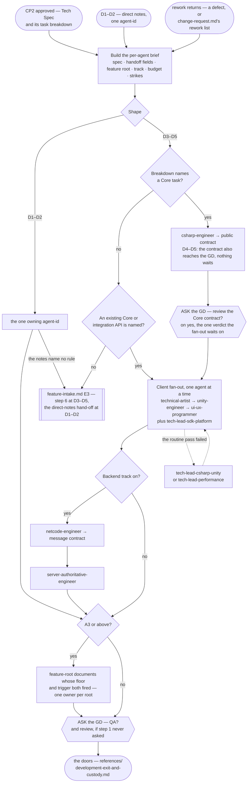

# Feature Development Pipeline

> **Scope: an approved Tech Spec, or direct notes, up to code standing at the gate offer.** Everything before
> it belongs to `feature-intake.md`; the gates themselves belong to `review-pipeline.md` and `qa-pipeline.md`,
> and **both are optional** — this pipeline ends by asking, per `references/optional-gates.md`, never by
> dispatching one on its own initiative.

Sequence, loops and checkpoints live here and never in an agent file — see `feature-intake.md` for the full
statement. Every `Routed to:` below is a recommendation this pipeline acts on, not an action the agent took.

**This pipeline spends two budgets it does not set.** `feature-intake.md` hands over an **A1–A5 tier with its
five axes**; from them come the **attempt budget** each agent iterates inside (`execution-loop.md`, keyed to
**D**) and the **verification floor** its evidence must reach (`effort-allocation.md`, keyed to **A**). **D**
sets the fan-out's shape, **A** how hard each return is checked; Simple/Medium/Complex appears nowhere below.

## The agents this pipeline dispatches

| Agent | Tier | Produces | Owns |
|---|---|---|---|
| `csharp-engineer` | executor (sonnet) | **Shared Core Implementation** | `Game.Core.*` — the rules, and the public contract every other layer builds against |
| `technical-artist` | executor (sonnet) | **Visual Effect** | Shaders, VFX, visual compute — authors the effect, never integrates it |
| `unity-engineer` | executor (sonnet) | **Client Integration** | Scenes, prefabs, physics, rendering, assets, input, the routine optimization pass |
| `ui-ux-programmer` | executor (sonnet) | **UI Implementation** | Screens, and their binding to state they read but never own |
| `tech-lead-sdk-platform` | lead (opus) | **SDK/Platform Integration** | Every third-party SDK and store integration |
| `netcode-engineer` | executor (sonnet) | **Netcode Protocol** | The sync protocol — backend track only |
| `server-authoritative-engineer` | executor (sonnet) | **Server Authority** | Validation wrapping the Core — backend track only |
| `tech-lead-csharp-unity` | lead (opus) | **Deep Technical Solution** | Architecture-level C#/Unity problems — escalation only |
| `tech-lead-performance` | lead (opus) | **Performance Report** | Deep memory, GPU and native work — escalation only |

## Entry points

| Entry | Comes from | Carries |
|---|---|---|
| **E1** | `feature-intake.md` CP2 approved — **D3–D5** | The Tech Spec, its per-`agent-id` task breakdown, the tier and its axes |
| **E2** | `feature-intake.md` step 2 — **D1–D2** — or the GD naming the work directly, with no spec round; `orchestrator.md` step 0 sizes that here | Direct notes addressed to one `agent-id`, and the tier. From the GD, per `references/standalone-runs.md` |
| **E3** | Rework returns — a defect from `review-pipeline.md`, from `qa-pipeline.md` or from the GD; a rejection from the gated-direct lane; or `change-request.md`'s rework list | The findings or the rework list, the original brief, the strike count, and attempts already spent |

Every row also carries the four values `references/entry-index.md` defines once — tier and axes, attempt
budget, verification floor, track — read from the ledger, never from memory of an earlier run.

**E2 runs one agent and stops** — no fan-out and no ordering. D1–D2 is one role by definition, and the full
shape over it is the overhead `effort-allocation.md`'s artifact budget forbids. **A high A-tier does not
reopen it**: an A5 E2 dispatch buys a higher verification floor and a more careful target check, never a
second agent. What it *does* reach is step 4 — **documents key to A, never to D** — so a D1 change on a
credential path is A5 and still owes `LEDGER.md`'s decisions and `DEBT.md`. **A GD-reported defect enters at
E3 with zero strikes**; if the spec was right and the GD now wants something else, that is
`change-request.md`, a change request rather than a defect.

## Pipeline at a glance

Shapes match `feature-intake.md`: `([ ])` entry and stop · `[ ]` an agent or a pipeline action · `{ }` a
decision · `[[ ]]` another workflow file; the dotted edge is the escalation lane. `{{ }}` appears twice and
both are the **gate ask**, never a checkpoint — none lives here: CP2 is behind it, CP3 ahead and optional.

Three edges are left undrawn. A `Blocked` return: ask for exactly the input named, then resume from that step.
**Every submission goes to whichever gates the GD authorised, the moment it returns** — only the Core's
verdict is waited on, so drawing the rest would bury the spine. And a **design flaw goes straight to the GD**
from any step, per invariant **I5**, never queuing behind the work that surfaced it.

### Step 0 — the brief

Moved to **`references/development-brief.md`** — the **nine** things every brief attaches, each keyed to what
breaks without it; the handoff matrix; and the three things the brief must ask the agent to state back,
because no envelope carries them. **The row most often missed is the track standards, by path**: they are no
longer auto-loaded, so naming the paths *is* the loading mechanism, per `rules/standards-index.md`.

### Step 1 — Shared Core first, which is not a preference

Four agents return `Blocked` without it, so the ordering is forced rather than chosen. **When the breakdown
names no Core task**, the brief must name the existing Core type or integration exposing that state; if
neither exists, the spec has a gap this pipeline cannot fill, and it hands back rather than letting a
downstream agent invent the rule — which it refuses to do anyway, a round on.

**Where review runs, the fan-out waits for the Core submission's verdict, and only that one.** A wrong
contract is otherwise rebuilt by four agents rather than one, and review costs no Editor time, so the verdict
lands while the fan-out would still have been queuing. It is an agent gate, not a checkpoint.

**But review is optional, so the *offer* comes here, not at the end.** Ask when the Core returns, per
`references/optional-gates.md`, naming this specific cost: four agents building against a contract nothing
has checked. **Carry the Core's own `Assumptions and known limitations:` into the ask** — a live run returned
*"the Core was not compiled; no .NET SDK was available"*, which is the most concrete form that cost will ever
take. A decline is recorded as review debt and the fan-out proceeds immediately. **This is the feature's one
review ask**, per that file's bound of one offer per boundary; where no Core task exists there is no step 1,
so it fires at the end instead — alongside the QA ask, which is also where QA is asked whenever review was
declined and `review-pipeline.md` step 6 therefore never runs.

**At D4–D5 the contract also goes to the GD as a notice** and the pipeline continues immediately: review
judges whether the code is correct, only the GD can say it is not what they meant, and neither gates the
other or counts as a fifth checkpoint.

### Step 2 — the client fan-out, one agent at a time

Serial, for three compounding reasons: one Unity Editor and three of these agents holding
`mcp__unity-mcp__*` against it; a domain reload on every `.cs` write, ending the Play Mode session another is
verifying in; and no way for isolated agents to coordinate. **Settled, not deferred** — the argument, the
three escapes tested and rejected, and what does run concurrently are in
**`references/development-fan-out.md`**, read when somebody proposes parallelising this or adding a fourth
agent to it.

Order follows dependency, and the spec's own dependencies override it. Skip any row the breakdown omits.

| Order | Agent | Why here |
|---|---|---|
| 1 | `technical-artist` | It authors the effect; `unity-engineer` integrates it into the scene or prefab, so it must exist first |
| 2 | `unity-engineer` | It integrates the Core and those effects — and exposes the state the UI may bind to |
| 3 | `ui-ux-programmer` | It binds to a Core type or to the integration exposing it, so it goes last, when both exist |
| any | `tech-lead-sdk-platform` | It depends on nothing here — it assumes the gameplay hook exists and states that |

### Step 3 — the backend track

**The track is the caller's state.** Both agents return `Blocked` unless the brief confirms it is on; an
unstated track is never "probably off". **Protocol comes before authority**, since the message contract is
`netcode-engineer`'s output and `server-authoritative-engineer` blocks without it. The Core's shape
determines the wire format, never the reverse.

**This chain depends on step 1 only** — sitting after the client fan-out is an artifact of drawing a
sequence, and it may take any slot once the Core has returned. A missing **netcode foundation** makes
`netcode-engineer` return `Needs-decision`, `Routed to: cto`; the routing table below says how to tell an
undecided foundation from one the brief merely failed to carry, which is what happened on the live run.

### Step 4 — the feature-root documents, A3 and above

Moved to **`references/development-feature-documents.md`** — the **A4** floor for the full docset and the
**A3** floor for `LEDGER.md`/`DEBT.md`/`NOTES.md`, why both key to **A** rather than D, the one-owner-per-root
dispatch table, and why `LEDGER.md` and `DEBT.md` are appended in the submission that produced the decision.

### Step 5 — the submission, and where it goes

**One submission per agent return, not one per feature.** `code-reviewer` counts strikes against "the same
submission" and CP3 is what aggregates a feature's approvals, so a return goes out as soon as it lands — **on
the GD's yes** — and the feature-root documents are simply the last submission, never a bundling step. Moved
to **`references/development-exit-and-custody.md`** — the five things every submission carries; the two
Implementation Note fields **no envelope here can source**, and how the brief closes them; the doors this
pipeline hands to; the custody table for every returned field that outlives its dispatch; and the three
returns that do not wait for an exit.

## The escalation lane

Never a first dispatch. The dotted edge above draws it off the fan-out, where it opens most often, but step 1
and step 3 reach it too. Moved to **`references/development-escalation-lane.md`** — the two leads' refusal
conditions, the **one round trip** bound before it becomes a routing question for `technical-architect`, why
`tech-lead-sdk-platform` is not on it, and why a lead's code is still a submission.

## Routing rules the pipeline owns

| Return | Action |
|---|---|
| any agent → `Blocked` | Ask for exactly the input named — the GD when it is theirs, `technical-architect` when the spec has the gap. **Twice on the same missing input is the bound**: past it the missing input is itself the finding, reported to the GD as unresolved |
| `csharp-engineer` → `Done` | Submit it for review, send the D4–D5 notice, and hold the fan-out for the verdict |
| `tech-lead-sdk-platform` → `Config required:` or `Risks flagged:`, **on any status** | Only the GD can act on these — keys to supply, a store-rejection risk, a compliance gap. Forward them whatever the status says. A live run returned them on a **`Blocked`**, where answering only the missing input drops the rest |
| any agent → a **design flaw** | Straight to the GD, immediately — invariant **I5**, whatever the status and whatever step it came from. Never folded into a later report and never re-filed as an ordinary defect. A live run raised one on its *first* dispatch |
| a return names **more than one** destination | `Routed to:` is single-valued, so every destination after the first is the one that gets dropped. Record them all and act in the order the return states — never match the first row here and stop. Live, one gate returned **three**, each owning a different finding set. `research-decision.md` carries the same rule for the same reason |
| a return says the **classification is wrong** — an axis moved, or was understated | Recompute it, do not argue it. Write the new tier and the axis that moved into the ledger's `Tier history:`, re-derive the attempt budget and the verification floor from it, and say so in one line to the GD. Work already verified to the *old* floor is verified to the old floor: name it rather than re-labelling it. This is not a change request — the spec did not move, the reading of it did |
| any agent returns a field no row here names — a `Message contract:` on a non-`Done`, a measured number, a `Pattern decision:` | **Route on the envelope, not on `Status:` alone.** In three live returns the highest-value content sat in a field no status row mentions. `references/development-exit-and-custody.md` gives each one a destination |
| any agent → `Rejected`, `Routed to: <peer>` | The task was misassigned. Re-dispatch to the named agent; never argue it back |
| implementing agent → `Needs-decision`, `Routed to: <tech lead>` | The escalation lane, then resume at the step it left |
| `netcode-engineer` → `Needs-decision`, `Routed to: cto` — the foundation is unset | **Check the ledger and ask the GD first.** Live, this fired because the brief carried no foundation, not because nobody had chosen one — and `research-decision.md` **E2** is a strategic-choice pipeline, not a lookup. Escalate there only when it is genuinely undecided; `cto` is never entered without a candidate set. Keep the `Message contract:` it returned alongside — `server-authoritative-engineer` blocks without it |
| `server-authoritative-engineer` → `Blocked`, `Routed to: csharp-engineer` | A rule is missing from the Core. Back to step 1, then resume |
| `tech-lead-*` → `Needs-decision`, `Routed to: technical-architect` or `cto` | Out of this pipeline: the architect re-enters at `feature-intake.md` **E3** — step 6 at D3–D5, the direct-notes hand-off at D1–D2 — and `cto` at `research-decision.md` **E2**, whose row names the architect only because it was that door's first caller |
| `tech-lead-*` → `Done` with a `Fix:` | It wrote code, so it is a submission like any other — invariant **I10**. Silent to the GD is not silent to the gates, and a `Scope of pattern: project-wide` is recorded before the step it left resumes |
| any agent returns a **Continuation Debt Record** — its attempt budget is exhausted | A legitimate outcome, not a failure to retry past. Record it whole in the feature's ledger — the known non-solutions and the safe resume point are what a future session cannot reconstruct — then treat the return as **one strike** at the review gate and re-dispatch only with its `Next best action:` attached. Never hand back the same brief for another cycle |

- **The strike ladder.** Strike 2 fires the agent's own Escalate criterion and routes to a tech lead; strike 3
  is `review-pipeline.md`'s three-strikes rule and routes to `technical-architect`. That pipeline counts — this
  one receives the count through **E3** and forwards it in the brief.
- **Two budgets, two scopes, one ledger.** The attempt budget bounds an agent's corrective cycles *inside one
  dispatch*; the strike count bounds round trips *between* agents. An exhausted budget becomes one strike, and
  neither survives a run unless it is written down.
- **Nothing here reviews its own work.** Verification an agent runs on itself is evidence for the gate, not a
  substitute for it; the gates are `review-pipeline.md`'s.
