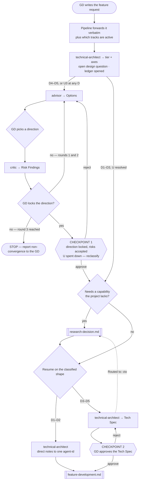

# Feature Intake Pipeline

> **Scope: a feature request arriving from the GD, up to an approved Tech Spec.** Everything after that
> belongs to `feature-development.md`. Technology questions branch out to `research-decision.md` and come
> back at **E2** or **E3**, `feature-development.md` returns a spec gap at **E3**, and a change after CP2
> re-enters *here* at **E4** or **E5**, sent by `change-request.md` — which declares no such doors itself.

Per `.claude/docs/agent-template.md`, sequence, parallelism, retry loops and checkpoints live here and
**never inside an agent file**. Agents are isolated, stateless and cannot dispatch each other — every
`Routed to:` value in a report is a recommendation this pipeline acts on, not an action the agent took.

**Classification is `.claude/rules/task-classification.md`'s, and this pipeline assigns it.** The retired
Simple/Medium/Complex tier appears nowhere below. Step 2 returns an **A1–A5 tier plus its five axes**, read
in two halves: **D sets the shape** — roles, Tech Spec, which checkpoints fire — while **C/R/X set the
depth** and **U3 fires CP1 at any D**. Never collapse the tier back into one number when writing a brief.

## The agents this pipeline dispatches

| Agent | Tier | Produces | Owns |
|---|---|---|---|
| `technical-architect` | gate (opus) | **Tech Spec** | Classification, module boundaries, client-server contract, task breakdown |
| `advisor` | consult (sonnet) | **Options** | Widening the option space — never recommends, never ranks |
| `critic` | consult (opus) | **Risk Findings** | Attacking a direction the GD leans toward, ranked by severity |

`researcher`, `rd-engineer` and `cto` are reachable from here but belong to `research-decision.md`.

## Pipeline at a glance

Shapes: `([ ])` start and stop · `[ ]` an agent or a pipeline action · `{ }` a decision ·
`{{ }}` a GD checkpoint · `[[ ]]` another workflow file. The dotted edge is the strategic-escalation exit.

`Blocked` returns are not drawn — always ask the GD for exactly the input named, then resume from that step.

## Entry points

| Entry | Enters when | Resumes at | Carried in |
|---|---|---|---|
| **E1** | `orchestrator.md` step 0 sized a GD request into this pipeline | step 1 | The GD's own words unedited, and which tracks are active |
| **E2** | `research-decision.md` settled what the Advisor loop was waiting on | step 3 — the loop, so **D4–D5 or U3** by definition | The Research Report, the options already ruled out, and the round already spent |
| **E3** | The research branch settled a capability, or `feature-development.md` found the breakdown names no API | **step 6 at D3–D5 · the direct-notes hand-off at D1–D2** — the diagram's `Resume` node branches on shape and this row is what did not | The tier and its axes, the track state, and what must now be incorporated: a Research Report, or the gap that pipeline named |
| **E4** | `change-request.md` classified the change **Moderate** | **CP2** | The revised Tech Spec and the rework list |
| **E5** | `change-request.md` classified the change **Major** | **step 3** — the loop re-runs and concludes at CP1, always at **D4–D5 or U3** by Major's own criterion, exactly as **E2**'s trigger does | The change in the GD's own words, the options already ruled out, and which risks the GD accepted — the last two are `none` on a feature reopening CP1 for the first time, a legitimate empty history |

Step 0 sizes the **input**; this pipeline classifies the **feature**. **E2–E5 exist so a re-entry has an
address**: each resumes mid-pipeline and none re-classifies from scratch, since the tier sits in that
feature's ledger — entering at **E1** would discard the round count and the ruled-out options, neither of
which `advisor` can remember. `references/entry-index.md` has which axes move; ordinarily only **U** does.

## Step order

| # | Step | Runs for | Produces |
|---|---|---|---|
| 1 | Forward the request **verbatim**, with track state attached | every request | — |
| 2 | `technical-architect` — classify + the open design question; open the feature's ledger | every request | **tier + axes + feature root** |
| 3 | `advisor` — widen the options | D4–D5, or U3 at any D | **Options** |
| 4 | `critic` — attack the leaning direction | same as step 3 | **Risk Findings** → **CP1** |
| 5 | Branch to `research-decision.md` | any tier, on demand | Research Report |
| 6 | `technical-architect` — write the Tech Spec | D3–D5 | **Tech Spec** → **CP2** |

**D1–D2 runs steps 1, 2 and (if needed) 5**, then hands the direct notes to the one owning agent — no Tech
Spec, no CP1, no CP2. A high A-tier does not change that: an A5 from C or X buys verification downstream,
never a step here. A Tech Spec for a one-line fix is `effort-allocation.md`'s named artifact-budget violation.

### Step 1 — what the pipeline must attach

Two inputs are the pipeline's to supply, and getting either wrong corrupts everything downstream. **The GD's
own words, unedited** — `technical-architect` refuses to classify a summary of a summary. And **which tracks
are active**: without it the architect assumes client-only, *says so*, and writes a spec a multiplayer feature
will not fit. Track state is cross-run state, so it is the caller's to hold, never the architect's.

### Step 2 — classification is unconditional and first

Classification runs on **every** request, and the GD is never asked to confirm the tier first — the tier
decides how many checkpoints apply, so it cannot itself sit behind one. The architect returns the A-tier,
**each of the five axes separately**, and the open design question step 3 needs.

**The axes travel, not just the tier**, because each consumer reads a different one: this pipeline reads **D**
and **U**, `feature-development.md` reads **D** for the attempt budget and **A** for the verification floor,
and both gate pipelines plus `feature-documentation.md` read **A**. Collapsed, every file downstream guesses.

**Open the feature's ledger here** — `<feature-root>/LEDGER.md`, from `state/templates/feature-ledger.md`,
before step 3 dispatches anything: the tier, the axes and the round count must survive a run, and step 2 is
the first moment any exists. Check `<state-root>/project-state.md` first — a feature already in flight has a
ledger, and a second slug splits its counters. **The architect's return names the feature root**, since the
ledger has nowhere to live until it does; at **U3** it is provisional, and CP1 moving it moves the ledger.

### Steps 3–4 — the Advisor⇄Critic loop

Moved to **`references/intake-advisor-critic-loop.md`** — the trigger (**D4–D5, or U3 at any D**), the
GD-in-the-middle shape, the 3-round hard cap, the ruled-out options the pipeline must carry, and why the cap
is not the attempt budget. Read it when the classification puts a feature into the loop; skip it otherwise.

### Step 5 — the research branch, and when to skip it

Any shape can need a capability the project does not have. When the request or the chosen direction names
one, dispatch `research-decision.md` **before** step 6 — a Tech Spec written on a guessed technology is
rework. Detecting it is the pipeline's job: read the architect's `Open design question:` lines and **route per
line** — a feature routinely carries one tagged `technology` beside two the loop owns, so the trigger and the
payload are not the same thing. At D3, where no loop runs, that tag is the only thing raising this branch. An
unnamed capability is also a **U2 the spec would inherit**, so resolving it here is the cheapest place the
tier ever drops.

**Skip it when the answer is already in the project — and name what covers it.** Research returning "you
already have this" burns a round, but a guess dressed as a skip costs a Tech Spec. If you cannot name the
package, API or existing system, you are guessing — branch. A skip is recorded, and travels to CP2.

### Step 6 — the Tech Spec

Moved to **`references/intake-tech-spec.md`** — everything the architect returns, the two fields QA and the
assurance gate block without (**acceptance criteria** and the **verification floor**), which feature-root
documents the tier makes owed, and the named downstream failure behind each omission.

## Checkpoints

**Checkpoints key to D, never to the A-tier** — a tier driven up by C, R or X adds verification at the gates
and nothing here. This is `task-classification.md` Step 4's shape table, restated where each one fires.
**CP1, CP2 and CP4 always fire at their shape. Only CP3 is conditional** — it is the gate on what review
found, so a declined review leaves nothing for it to judge. **CP4 is the GD closing the feature, which is not
QA signing it off**: a declined QA gate changes what CP4 rests on, never whether it happens. See
`references/optional-gates.md`.

| CP | Where | Fires at | The GD approves | Rejecting means |
|---|---|---|---|---|
| **1** | End of the Advisor⇄Critic loop | D4–D5, or U3 at any D | The locked direction, and which risks they accept and live with — and **`critic`'s remaining findings are not discarded here**: they travel to step 6, per `references/intake-tech-spec.md`, because several of them are usually acceptance-criteria gaps | Back into the loop, within the 3-round cap |
| **2** | After the Tech Spec | D3–D5 | The Tech Spec envelope from step 6 | Ask which it is, on the **first** rejection: the *spec* misread the request → back to `technical-architect`, bounded at 3; the *direction* is now wrong → that is CP1 at **E5**, never a redraft |
| **3** | `review-pipeline.md` | D3–D5, review authorised; merged into CP4 at D1–D2 | What was built, against the spec | Drift to its author — bounded at 2, per `loop-termination.md` |
| **4** | `qa-pipeline.md`, or the closure gate when QA was declined | **every shape, always** | Closing the feature, gaps and declined gates included | A defect — bounded at 2 — or a change request, which is not bounded |

**With both gates declined the feature still closes at CP4** — on the GD's own acceptance, with both debts
recorded. What never happens is closure reported as though a gate had passed, or a feature quietly dropped.

**CP1 spends down what CP1 actually settled — never the whole axis.** A locked direction with its risks
accepted is no longer a consequential unknown, so drop U for the `design` and `architecture` questions it
closed, recompute the tier, and append both to the ledger's `Tier history:`. **A `technology` line still open
holds U where it is** until step 5 settles it: dropping to U1 here would disarm `research-decision.md`'s
**E4** for exactly the D4–D5 shape that most needs it, since CP1 always precedes step 5 at that shape. A
feature that sat at A5 only on a settled U3 legitimately lands lower; one still holding an unknown does not.

## Routing rules the pipeline owns

| Return | Action |
|---|---|
| `advisor` → `Rejected`, `Routed to: gd` — it was asked to choose | Return to the GD; offer `critic` on whichever option they lean toward |
| `advisor` → `Needs-decision`, `Routed to: rd-engineer` or `cto` | Hand to `research-decision.md` at its **E3**, then resume the loop here at **E2** — step 3, not step 6 |
| `critic` → `Rejected`, `Routed to: gd` — it was asked to design the fix | Return to the GD, then re-enter at step 2 once the direction is settled |
| `technical-architect` → `Routed to: cto` **from step 2** — `Needs-decision`, the classification hit a strategic technology choice | To `research-decision.md` **E2**. It returns **before** the direction is locked, so re-enter at **E2** — step 3, the loop — at **D4–D5 or U3**, and at **E3** where no loop fires for that shape. Never step 6: CP1 has not happened yet |
| `technical-architect` → `Routed to: cto` **from step 6** — mid-spec, CP1 already locked | To `research-decision.md` **E2**, then re-enter here at **E3** — step 6 |
| any agent → `Blocked` | Ask the GD for exactly the input named. `Blocked` is a correct result, never a silent retry with a guess |
| Loop reaches round 3 with no lock | Stop and report non-convergence — do not start a fourth round |
| `technical-architect` exhausts its attempt budget | It returns a Continuation Debt Record per `execution-loop.md`, not a silent partial spec. Record it in the ledger, then take its `Next best action:` to the GD — never re-dispatch the same brief for a fourth try |

- **Round counts, the rejected-options list and track state are the caller's**, never an agent's, and every
  one is written to the feature's ledger **at the transition** — invariant I4: a round nobody recorded is a
  cap that never fires.
- **The three-strikes rule does not apply here.** It counts review rejections and belongs to
  `review-pipeline.md`; a request that fails classification is a `Blocked`, not a strike.

## What this pipeline hands on

| Shape | Handed to `feature-development.md` |
|---|---|
| **D1–D2** | The architect's direct notes, addressed to one `agent-id` — at **E2** |
| **D3–D5** | The approved Tech Spec and its task breakdown — at **E1** |

Either way the four values that travel with every dispatch go from the ledger alongside it — tier and axes,
attempt budget, verification floor, track — plus **which feature-root documents are owed**, per
`feature-documentation.md`. The four are defined once, in `references/entry-index.md`.
