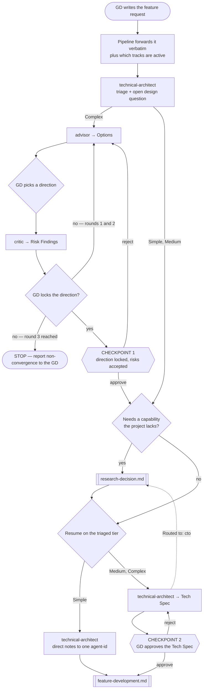

# Feature Intake Pipeline

> **Scope: a feature request arriving from the GD, up to an approved Tech Spec.** Everything after that
> belongs to `feature-development.md`. Technology questions branch out to `research-decision.md` and come
> back at **E2** or **E3**, `feature-development.md` returns a spec gap at **E3**, and a change after CP2
> comes back from `change-request.md` at **E4** or **E5**.

Per `.claude/docs/agent-template.md`, sequence, parallelism, retry loops and checkpoints live here and
**never inside an agent file**. Agents are isolated, stateless and cannot dispatch each other — every
`Routed to:` value in a report is a recommendation this pipeline acts on, not an action the agent took.

## The agents this pipeline dispatches

| Agent | Tier | Produces | Owns |
|---|---|---|---|
| `technical-architect` | gate (opus) | **Tech Spec** | Triage, module boundaries, client-server contract, task breakdown |
| `advisor` | consult (sonnet) | **Options** | Widening the option space — never recommends, never ranks |
| `critic` | consult (opus) | **Risk Findings** | Attacking a direction the GD leans toward, ranked by severity |

`researcher`, `rd-engineer` and `cto` are reachable from here but belong to `research-decision.md`.

## Pipeline at a glance



Shapes: `([ ])` start and stop · `[ ]` an agent or a pipeline action · `{ }` a decision ·
`{{ }}` a GD checkpoint · `[[ ]]` another workflow file. The dotted edge is the strategic-escalation exit.

`Blocked` returns are deliberately not drawn — any agent can return one at any step, and the action is always
the same: ask the GD for exactly the input named, then resume from that step.

## Entry points

| Entry | Enters when | Resumes at | Carried in |
|---|---|---|---|
| **E1** | `orchestrator.md` step 0 sized a GD request into this pipeline | step 1 | The GD's own words unedited, and which tracks are active |
| **E2** | `research-decision.md` settled what the Advisor loop was waiting on | step 3 | The Research Report, the options already ruled out, and the round already spent |
| **E3** | The Tech Spec must be written or revised — `research-decision.md` settled a capability, or `feature-development.md` found the breakdown names no API | step 6 | The tier, the track state, and what step 6 must now incorporate: a Research Report, or the gap that pipeline named |
| **E4** | `change-request.md` classified the change **Moderate** | **CP2** | The revised Tech Spec and the rework list |
| **E5** | `change-request.md` classified the change **Major** | **CP1** | The change in the GD's own words, the options already ruled out, and which risks the GD accepted |

Step 0 sizes the **input**; this pipeline triages the **feature**. Triage still runs on everything that
arrives here, including what looks trivial — sizing decides whether a request is a feature request, never
what tier it is.

**E2–E5 exist so that a re-entry has an address.** Each resumes mid-pipeline and none re-runs triage — the
tier was set at step 2 and is held in the ledger, not re-derived. Entering at **E1** instead would restart
the feature from zero and discard the round count and the ruled-out options, neither of which `advisor` can
remember on its own.

## Step order

| # | Step | Runs for | Produces |
|---|---|---|---|
| 1 | Forward the request **verbatim**, with track state attached | every request | — |
| 2 | `technical-architect` — triage + the open design question | every request | tier |
| 3 | `advisor` — widen the options | Complex only | **Options** |
| 4 | `critic` — attack the leaning direction | Complex only | **Risk Findings** → **CP1** |
| 5 | Branch to `research-decision.md` | any tier, on demand | Research Report |
| 6 | `technical-architect` — write the Tech Spec | Medium + Complex | **Tech Spec** → **CP2** |

Simple tier runs steps 1, 2 and (if needed) 5, then hands the architect's direct notes straight to the one
owning agent — no Tech Spec, no CP1, no CP2.

### Step 1 — what the pipeline must attach

Two inputs are the pipeline's to supply, and getting either wrong corrupts everything downstream:

- **The GD's own words, unedited.** `technical-architect` refuses to triage a summary of a summary. Forward
  the raw request; do not paraphrase, condense, or pre-classify it.
- **Which tracks are active** (client only, or client plus multiplayer/backend). Without it the architect
  silently assumes client-only and writes a spec that a multiplayer feature will not fit. Track state is
  cross-run state, so it is the caller's to hold, never the architect's.

### Step 2 — triage is unconditional and first

Triage runs on **every** request, including one that looks trivial, and the GD is never asked to confirm the
tier before it is assigned. The tier decides how many checkpoints apply, so the tier itself cannot sit behind
a checkpoint. The architect returns the tier plus the open design question that step 3 needs.

### Steps 3–4 — the Advisor⇄Critic loop

The loop is **GD-in-the-middle**, not agent-to-agent. One round is:

```
advisor → Options → GD picks a direction → critic → Risk Findings → GD decides
```

`advisor` never recommends and `critic` only attacks a direction the GD already leans toward, so the two can
never run in the same round — one exists because no direction exists yet, the other requires one.

| Loop rule | Detail |
|---|---|
| **Who ends it** | The GD, by locking a direction. Neither agent can end it; both explicitly disclaim owning the round count. |
| **Hard cap** | **3 rounds.** Reaching round 3 without a lock stops the pipeline and reports non-convergence to the GD — it is not a failure to retry past. |
| **Rejected options** | The pipeline carries the list of options earlier rounds already ruled out into the next `advisor` call. `advisor` cannot remember them. |
| **A clean critic** | `critic` returning `Done` with an empty findings list is a **pass**, not a missing result. Proceed to CP1. |
| **Escalation** | `critic` is a leaf — it reports to the GD and routes to nobody, at every level. |

### Step 5 — the research branch, and when to skip it

Any tier can need a capability the project does not have. When the request or the chosen direction names one,
dispatch `research-decision.md` **before** step 6 — a Tech Spec written on a guessed technology is rework.
This branch is the pipeline's to detect: on Complex tier `advisor` will name it, but Medium tier skips the
loop entirely and nothing else will raise it.

**Skip it when the answer is already in the project — and name what covers it.** That naming is the whole
test. Research that comes back "you already have this" burns a round to learn nothing, but a guess dressed up
as a skip costs a Tech Spec. If you cannot name the package, first-party API or existing system that covers
the capability, you are guessing: branch.

A skip is recorded, never silent. The named coverage travels to CP2, so a wrong call is caught while the
Tech Spec is still on the table rather than after code is written against it.

### Step 6 — the Tech Spec

The architect returns tier, module boundaries, the client-server contract, an architecture diagram, the
patterns chosen and a per-`agent-id` task breakdown, plus whether a feature-root `README.md` is owed.

## Checkpoints

| CP | Where | Applies to | The GD approves | Rejecting means |
|---|---|---|---|---|
| **1** | End of the Advisor⇄Critic loop | Complex | The locked direction, and which risks they accept and live with | Back into the loop, within the 3-round cap |
| **2** | After the Tech Spec | Medium + Complex | The Tech Spec envelope from step 6 | Back to `technical-architect` for revision — **not** back to CP1 |

| Tier | CP1 | CP2 | CP3 | CP4 |
|---|---|---|---|---|
| **Simple** | skip | skip | merged into the single final checkpoint | ✔ |
| **Medium** | skip | ✔ | ✔ | ✔ |
| **Complex** | ✔ | ✔ | ✔ | ✔ |

CP3 and CP4 sit outside this pipeline — see `review-pipeline.md` and `qa-pipeline.md`.

## Routing rules the pipeline owns

| Return | Action |
|---|---|
| `advisor` → `Rejected`, `Routed to: gd` — it was asked to choose | Return to the GD; offer `critic` on whichever option they lean toward |
| `advisor` → `Needs-decision`, `Routed to: rd-engineer` or `cto` | Hand to `research-decision.md` at its **E3**, then resume the loop here at **E2** — step 3, not step 6 |
| `critic` → `Rejected`, `Routed to: gd` — it was asked to design the fix | Return to the GD, then re-enter at step 2 once the direction is settled |
| `technical-architect` → `Rejected`, `Routed to: cto` | Hand to `research-decision.md` at its **E2**, then re-enter here at **E3** — step 6 |
| any agent → `Blocked` | Ask the GD for exactly the input named. `Blocked` is a correct result, never a silent retry with a guess |
| Loop reaches round 3 with no lock | Stop and report non-convergence — do not start a fourth round |

- **Round counts, the rejected-options list and track state are the caller's**, never an agent's. Every agent
  in this pipeline states it cannot hold them across runs.
- **The three-strikes rule does not apply here.** It counts review rejections and belongs to
  `review-pipeline.md`; a request that fails triage is a `Blocked`, not a strike.

## What this pipeline hands on

| Tier | Handed to `feature-development.md` |
|---|---|
| Simple | The architect's direct notes, addressed to one `agent-id` |
| Medium, Complex | The approved Tech Spec, its task breakdown, and the tier |
