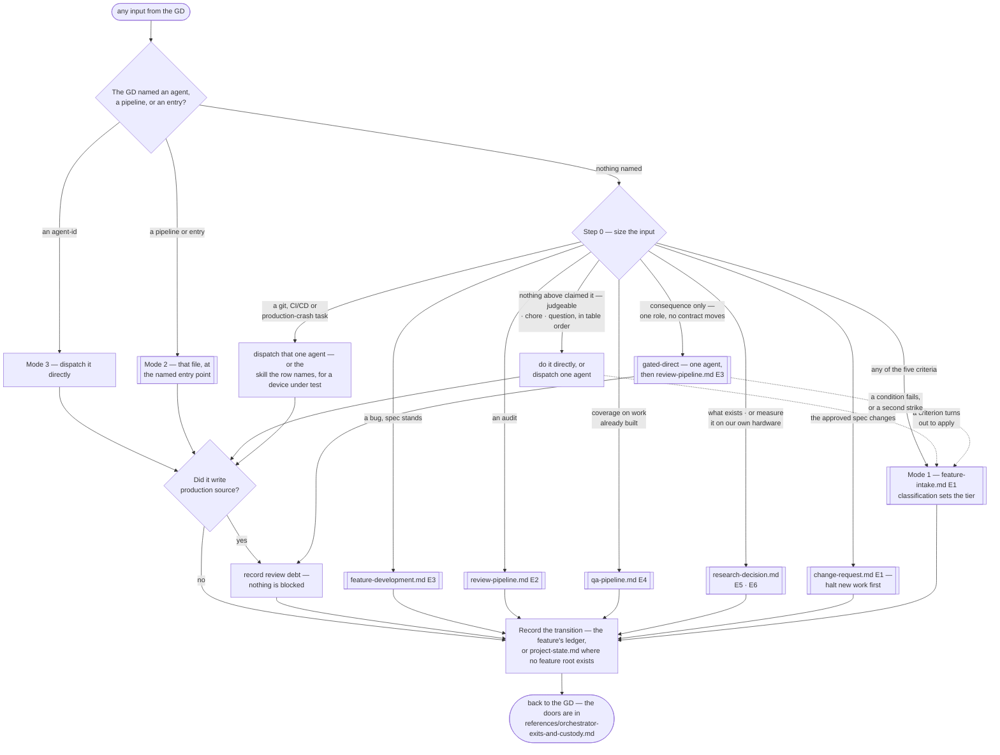

# Orchestrator

> **Scope: every input the GD sends, before any pipeline is chosen — and the state that outlives a single
> run.** The six pipeline files own sequence, retry loops and checkpoints. This one owns **which of them is
> entered, whether one is entered at all, and what travels between runs.** It owns no agent and no step.

`.claude/rules/orchestration.md` carries the invariants and is loaded automatically; this file is the router
those invariants point at; which of the ten it acts on is in
`references/orchestrator-exits-and-custody.md`. Read both before dispatching anything. **Sizing is
`task-classification.md` at its cheapest**: the lane an input takes and the tier it runs at are independent
decisions, this file owns only the first, and both are made from the request itself before any agent call.

## What lives here, and what does not

| Owned here | Owned by a pipeline file |
|---|---|
| Sizing an input, and picking the lane | The steps inside whichever lane was picked |
| Cross-run state — every counter, tier, track and baseline | Acting on that state within one run |
| Acting on `Routed to:` when **no pipeline is running** | Acting on it inside a run, per that file's own routing table |
| The Editor and device locks, across concurrent runs | Serialising within one run |
| Opening and closing a feature's ledger | Writing to it at each of its own transitions |

## Step 0 — size the input

Runs on every input the GD did **not** address to an agent or a pipeline — those are modes 3 and 2, and the
diagram's first decision is that question, not this table. No agent call, and stated out loud so the GD can
redirect immediately.

**Read top-down, first match wins — and the table is ordered specific before general.** Every row naming a
destination precedes every catch-all, so a catch-all takes only what nothing more specific claimed. Ordered
the other way, cheapest first, it inverted its own safety gradient: a `Game.Core.*` cooldown is "a tuned
value", so it matched the judgeable row four rows above the gated-direct row written for that exact change.

**Read a row against the work the input asks for, never against the words it uses.** A question *about* a
damage formula touches no rule; changing it does. That is what lets the three residue rows sit at the bottom.

| Input | Handling | Calls |
|---|---|---|
| **A git or version-control task** — history, recovery, a conflicted scene, a forensic question | `git-expert` | 1 |
| **A CI/CD task** — authoring a pipeline, or diagnosing a failed run from its log | `ci-cd-engineer` | 1 |
| **A crash or ANR from released production telemetry** — Play Console, Crashlytics, App Store Connect | `crash-anr-investigator`. A crash on a device *under test* is `/investigate-device-crash` instead, and never this agent | 1 |
| **A change to a spec the GD already approved** — a rule, a GDD passage, a requirement. **Decidable**: the feature has a ledger, in flight or closed. No ledger and nothing stating the behaviour means no approved spec, and it is not a change | `change-request.md` **E1**, which classifies the blast radius. **Halt new work against that spec first** | 1–3 |
| A bug **in something the pipeline built**, where its approved spec still stands | `feature-development.md` **E3**; its own end-of-work boundary makes the gate offer | 1–3 |
| An audit of code already in the repo — **read, never run** | `review-pipeline.md` **E2** | 1–2 |
| **Coverage or evidence on work already built** — **run, never only read**: shipped code, or work no pipeline built. **Decidable**: no ledger holds it; a feature that has one re-enters at `qa-pipeline.md` **E1**, or E4 discards its tier, floor and counters | `qa-pipeline.md` **E4** | 2–5 |
| **What exists today for a capability the project lacks**, no feature attached | `research-decision.md` **E5** | 1–4 |
| **Measure it on our own hardware before deciding** — a spike, no feature attached | `research-decision.md` **E6**. Asking is itself the explicit summon `rd-engineer` requires | 2–4 |
| **Consequence only** — trips a **C2+** criterion below, but one role, no contract moves, behaviour already stated. **Row 4 outranks this one wherever an approved spec exists** — the blast radius is classified before code is touched, and the rework re-enters at `feature-development.md` **E3** | **Gated-direct** — the agent, then both gates at `review-pipeline.md` **E3**. No pipeline, no checkpoint | 3 |
| **Any escalation criterion below** | `feature-intake.md` **E1** — classification sets the tier | 8+ |
| **Judgeable by looking** — UI, layout, a tuned value, an asset, one local single-role behaviour | Directly, or one agent; **no fan-out and no checkpoint**. One agent building from notes *is* `feature-development.md` **E2**, which runs one agent and stops | 0–1 |
| A chore — rename, comment, format, config | Directly | 0–1 |
| A question, or an ask to explain | Answer it, or one read-only agent | 0–1 |

**The first three rows are mode 1, not mode 3** — mode 3 is the GD naming an `agent-id`, defined below as what
*replaces* this table. **And each yields to the criteria** where the work itself touches a consequence path —
the one place first-match-wins is not the whole rule: a history rewrite around a leaked credential is C4 and
`cto`'s, never `git-expert`'s.

**The five escalation criteria**, each answerable by a grep or one read of the request — and each is one of
`task-classification.md`'s axes at the only resolution available before an agent has looked:

| Criterion | Axis | Why looking at it is not enough |
|---|---|---|
| Touches `Game.Core.*` — a game rule, economy, state machine, cooldown | **C2+** | A determinism or authority error stays invisible until it diverges |
| Touches a **consequence path** — a credential or signing config, real-money IAP or billing, a store submission, player PII, save-data migration, published git history, a released build or a shipped performance budget | **C3+** | `task-classification.md`'s own C3/C4 list. **Eight of its ten categories are neither `Game.Core.*` nor multiplayer** — only *an economy or progression path* and *server authority* were already covered — so before this row a signing-config edit tripped nothing and matched the **chore** row, while this file's own prose called it A5 |
| Needs more than one role | **D3+** | Coordination is what the fan-out and the handoff matrix exist for |
| Multiplayer-relevant | **C2+** | Client/server disagreement does not show on one screen |
| Rests on something the GD has not decided yet | **U3** | CP1 exists for exactly this, and nothing else provides it. **A standalone row 8–9 input does not trip it**, so escaping upward below is not owed there: CP1 settles a *feature's* direction, and neither row carries a feature |

**Route by the cost of being wrong, not by whether behaviour changed** — a Settings button changes behaviour
and the GD can see it is right; a damage formula cannot. That is the C axis deciding the lane, and why a cheap
default is safe rather than reckless. **But C buys the gates, never the pipeline**:
`task-classification.md` Step 4 is explicit that C, R and X buy depth and never a checkpoint, a document or an
extra agent, so a criterion tripped for **consequence alone** takes the **gated-direct** row, not the 8-call
lane — its conditions and two-strike bound are in **`references/gated-direct-lane.md`**, read before picking it. A criterion tripped for **D3+** or **U3** is
different in kind: that input needs coordination or a direction, which is shape, and shape is
`feature-intake.md`'s.

**The lane is not the tier, and a cheap lane never buys a low tier.** Step 0 decides only whether an input is
a feature request in `feature-intake.md`'s sense. Directly-handled work is still classified — silently at
A1/A2, stated at A3 and above — and a direct-lane task at **C3/C4, R2/R3 or X2/X3** runs at that tier's
verification floor with `execution-loop.md`'s safe-retry checks. A signing-config edit is one line, one lane,
one agent, and A5.

**Escape upward the moment a criterion turns out to apply** — `feature-intake.md` **E1**, little built so little lost. Reaching for a Tech Spec is the same signal, later: escalate rather than improvise one here.

## Pipeline at a glance

Shapes match the other pipelines: `([ ])` entry and stop · `[ ]` an agent or a pipeline action · `{ }` a
decision · `[[ ]]` another workflow file. The dotted edge is the escape upward. No `{{ }}` appears — this
file holds no checkpoint; all four belong to the pipelines it routes into. **The `Size` edges are in table
order**, so the diagram reads specific-before-general exactly as step 0 does.

## The three modes

| Mode | The GD says | What runs | What it costs |
|---|---|---|---|
| **1 — routed** | A feature request, nothing named | Step 0 picks a lane; that lane runs, and each optional gate is offered at its own boundary | Whatever the lane costs |
| **2 — a named pipeline** | Names a pipeline, or an entry in one | That file, from that entry, returning **to the GD** rather than handing on. `references/standalone-runs.md` says what each one is worth alone and what the GD must supply in place of the upstream | One pipeline's worth |
| **3 — direct agent** | Names one or more `agent-id`s | Exactly those, in the order given, serialised where the Editor lock applies | One call each |

**The router never asks which mode.** It infers from what the GD named — an `agent-id` is mode 3, a filename
or a door is mode 2, anything else is step 0 — then states what it picked, as the tier is assigned rather
than put to them. **Ambiguous wording reads as mode 1**: step 0 can still land on one agent, and its rows
yield to the criteria, which neither other mode does. Modes decide *when* an invariant is satisfied,
never *whether* it is owed — a dispatch that writes source still owes the gate offer, and the ledger counts.

**Mode 3 is the GD's cost override, and the only one.** Naming an `agent-id` replaces step 0's gradient
outright — a Core change the router would send down the 8-call lane runs in one call. The debt is recorded,
nothing is blocked, the judgement was theirs, and sizing is a proposal stated out loud so it can be overruled
this cheaply. What a named-agent dispatch must still carry is in `references/orchestrator-exits-and-custody.md`.

## Promoted out of this file — each read where its row says

| Reference | Read it |
|---|---|
| **`entry-index.md`** | Before any **mode-2** dispatch. Every addressable door, what each carries, and the four values that travel with all of them — mode 2's whole vocabulary, and a "cluster" is one of its rows, never a grouping invented beside them |
| **`orchestrator-direct-dispatch.md`** | Before any **mode-2 or mode-3** dispatch, and when one returns. The two agent classes derived from `tools:`, which of them accrue review debt, and the `Routed to:` fallback for when no pipeline is running |
| **`orchestrator-exits-and-custody.md`** | When a lane **ends**, and whenever a dispatch has **no ledger** behind it. The exits, closing a ledger, where the four values come from with no ledger, the **I9** lock reclaim, which invariant each rule here is, and what a direct lane must never produce |

## The ledgers — one per feature

**Each feature owns its own ledger** — `LEDGER.md` **at its own feature root**, opened at `feature-intake.md`
step 2, written **at each transition** rather than at a run's end because a counter surviving only in context
is not a safety mechanism, and **closed by the four steps in `references/orchestrator-exits-and-custody.md`**
— gaps into `DEBT.md` first, then `Closed`, then `calibration.md`, then the in-flight row. `state/README.md`
holds the layout and the templates. Check `<state-root>/project-state.md` before opening one: a feature
already in flight has a ledger, and a second slug splits its counters silently.

**`<state-root>/project-state.md` holds only what cannot be per-feature**: the in-flight index, **open gate
debt** (a mode-3 dispatch may have no feature at all), the gated-direct counters, and both global locks. A
per-feature copy of a global lock is not a lock. `<state-root>` is `.workflow/` at the project root unless
this project's `CLAUDE.md` says otherwise.

**Never write state under `.claude/`.** That directory is the framework every project copies; state written
into it becomes one project's history in the next project's template, and `tools/verify-workflow-layer.ps1`
fails when it finds any.

## The two optional gates

**`review-pipeline.md` and `qa-pipeline.md` are separate, optional processes, and neither runs unasked.** Ask
about each separately when implementation returns; **`references/optional-gates.md`** owns the ask's shape,
what a decline costs, and the two things never optional — **the ask itself** and **recording the answer** in
`<state-root>/project-state.md`. **CP4 still fires either way**: closing a feature is the GD's decision, not
QA's verdict. **One `LEDGER.md`, two halves, two owners** — `## Run state` is yours, written at every
transition; `## Decisions` is the feature's decision history, read per `feature-context-reading.md`.

## Rules

- Size every input the GD did not address to an agent or a pipeline, and say which lane was picked.
- Step 0 reads **specific before general**; a catch-all takes only what nothing above it claimed.
- A design flaw goes to the GD immediately — **I5** — from any step, whatever the status says.
- Never block. State the cost, then do what the GD asked — they override at will.
- Consequence buys the gates, never the pipeline — `references/gated-direct-lane.md` before taking that row.
- Every cap composes into a stop, never into another round — `references/loop-termination.md`.
- Run `tools/verify-workflow-layer.ps1` after any change under `.claude/`; a number this layer states about
  itself is a claim, and an unchecked claim is E0 evidence by `effort-allocation.md`'s own scale.
- Mode changes *when* an invariant is met, never *whether* it is owed.
- A cluster is an entry-index row. Never invent a grouping beside it.
- Every counter goes in the ledger at the transition, not at the end.
- Two holders of the same lock — Editor or device — never run at once, whatever mode started each.
