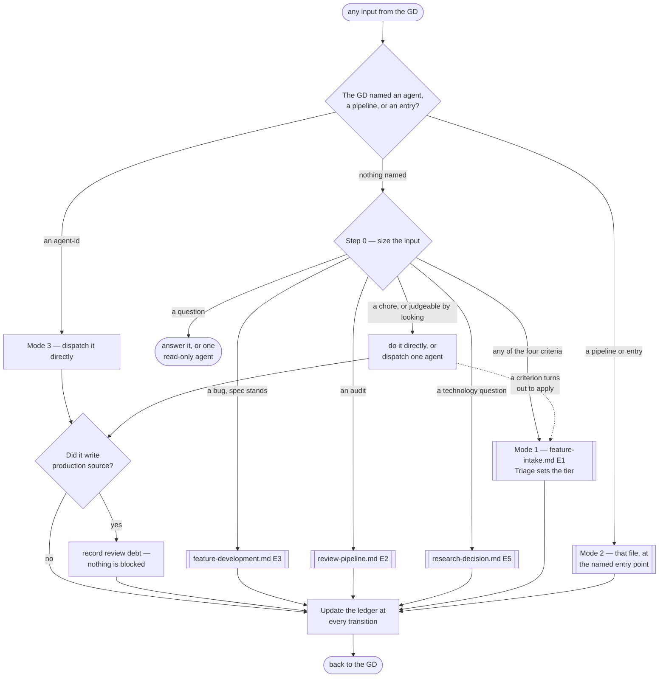

# Orchestrator

> **Scope: every input the GD sends, before any pipeline is chosen — and the state that outlives a single
> run.** The six pipeline files own sequence, retry loops and checkpoints. This one owns **which of them is
> entered, whether one is entered at all, and what travels between runs.** It owns no agent and no step.

`.claude/rules/orchestration.md` carries the invariants and is loaded automatically; this file is the router
those invariants point at. Read both before dispatching anything.

## What lives here, and what does not

| Owned here | Owned by a pipeline file |
|---|---|
| Sizing an input, and picking the lane | The steps inside whichever lane was picked |
| Cross-run state — every counter, tier, track and baseline | Acting on that state within one run |
| Acting on `Routed to:` when **no pipeline is running** | Acting on it inside a run, per that file's own routing table |
| The single-Editor lock, across concurrent runs | Serialising within one run |

## Step 0 — size the input

Runs on every input, costs no agent call, and is stated out loud so the GD can redirect immediately.
**Read top-down, first match wins** — several rows can describe one input, and the cheaper row is listed
first on purpose.

| Input | Handling | Calls |
|---|---|---|
| A question, or an ask to explain | Answer it, or one read-only agent | 0–1 |
| A chore — rename, comment, format, config | Directly | 0–1 |
| **Judgeable by looking** — UI, layout, a tuned value, an asset, one local single-role behaviour | Directly, or one agent. **No pipeline** | 0–1 |
| A bug **in something the pipeline built**, where its approved spec still stands | `feature-development.md` **E3** → review | 3 |
| An audit of code already in the repo | `review-pipeline.md` **E2** | 1–2 |
| A technology question, no feature attached | `research-decision.md` **E5** | 1–4 |
| **Any escalation criterion below** | `feature-intake.md` **E1** — Triage sets the tier | 8+ |

**A bug in something the direct lane built is more direct work, not an E3 defect.** E3 exists to measure a
submission against an approved spec and to count strikes against it; where no such spec exists there is
nothing to measure and nobody to charge. Fixing it costs what building it cost.

**The four escalation criteria**, each answerable by a grep or one read of the request:

| Criterion | Why looking at it is not enough |
|---|---|
| Touches `Game.Core.*` — a game rule, economy, state machine, cooldown | A determinism or authority error stays invisible until it diverges |
| Needs more than one role | Coordination is what the fan-out and the handoff matrix exist for |
| Multiplayer-relevant | Client/server disagreement does not show on one screen |
| Rests on something the GD has not decided yet | CP1 exists for exactly this, and nothing else provides it |

**Route by the cost of being wrong, not by whether behaviour changed.** A Settings button changes behaviour
and the GD can see it is right; a damage formula cannot be judged by looking. The direct lane therefore
covers what Triage would call **Simple** — the same class of work, at a much lower price.

**This sizes the input, never a feature's tier.** Tier is `technical-architect`'s and is never pre-empted:
`feature-intake.md` triages everything that reaches it. Step 0 only decides whether an input is a feature
request in that file's sense, which is what its own scope line asks.

**Escape upward the moment a criterion turns out to apply** — stop and enter `feature-intake.md`. Little was
built, so little is lost. That is what makes the cheap default safe rather than reckless.

## Pipeline at a glance

Shapes match the other pipelines: `([ ])` entry and stop · `[ ]` an agent or a pipeline action · `{ }` a
decision · `[[ ]]` another workflow file. The dotted edge is the escape upward. No `{{ }}` appears — this
file holds no checkpoint; all four belong to the pipelines it routes into.

## The three modes

| Mode | The GD says | What runs | What it costs |
|---|---|---|---|
| **1 — full run** | A feature request, nothing named | Step 0 sends it to a lane; a pipeline lane runs end to end | Whatever that lane costs |
| **2 — entry point** | Names a pipeline, or an entry in one | That file, from that entry, with the inputs its own entry table names | One pipeline's worth |
| **3 — direct agent** | Names one or more `agent-id`s | Exactly those, in the order given, serialised where the Editor lock applies | One call each |

**The router never asks which mode.** It infers, then states what it picked — the same way Triage is
assigned rather than put to the GD. Modes decide *when* an invariant is satisfied, never *whether* it is
owed: a mode-3 dispatch that writes source still owes review, and the ledger still counts.

**Mode 3 is the GD's cost override, and the only one.** Step 0 gives a default gradient; naming an
`agent-id` replaces it outright. A Core change the router would send down the 8-call lane runs in one call
if the GD asks for one agent — the debt is recorded, nothing is blocked, and the judgement was theirs.
Sizing is a proposal stated out loud precisely so it can be overruled this cheaply.

## Entry index — the addressable entries

Mode 2's whole vocabulary. A "cluster" is one of these rows, never a new grouping invented beside them.

| File | Entry | Enters when |
|---|---|---|
| `feature-intake.md` | **E1** | The GD writes a feature request |
| | **E2** | `research-decision.md` settled what the Advisor loop waited on — resumes at step 3 |
| | **E3** | The Tech Spec is written or revised at step 6 — research settled, or a breakdown gap returned |
| | **E4** | `change-request.md` classified **Moderate** — reopens CP2 |
| | **E5** | `change-request.md` classified **Major** — reopens CP1 |
| `research-decision.md` | **E1** | `feature-intake.md` step 5 — a capability the project lacks |
| | **E2** | `technical-architect` returned `Routed to: cto` |
| | **E3** | `advisor` returned `Needs-decision` on an option |
| | **E4** | Triage returned Complex on a technology unknown |
| | **E5** | The GD asks for research directly, no feature attached |
| | **E6** | The GD summons a spike, no feature attached — enters at step 3 |
| `feature-development.md` | **E1** | CP2 approved — Medium or Complex |
| | **E2** | Simple tier — direct notes to one `agent-id` |
| | **E3** | A defect returns: from review, from QA, or reported by the GD |
| `review-pipeline.md` | **E1** | One submission from `feature-development.md` |
| | **E2** | A standalone audit of code already in the repo |
| `qa-pipeline.md` | **E1** | `review-pipeline.md` step 6 — planning only, execution locked |
| | **E2** | CP3 approved, or the gates cleared on Simple tier |
| | **E3** | A defect fix came back through review |
| `change-request.md` | **E1** | The GD changes a rule mid-flight |
| | **E2** | `qa-pipeline.md` CP4 — the spec itself should change |

Each row's own file names what it carries; supply that from the ledger. An entry missing its inputs returns `Blocked` — or worse, assumes silently.

## Direct dispatch — the two classes

Derived from each agent's `tools:` frontmatter, the hard sandbox — the same source `feature-development.md`
step 2 and `qa-pipeline.md` step 2 already use for their serialisation rules.

| Class | Who | Rule |
|---|---|---|
| **A — leaves no source** (13) | No `Write`/`Edit`. Reports, measurements, verdicts, build artifacts | Direct dispatch is their **normal** mode. No debt, nothing owed |
| **B — writes source** (14) | Holds `Write`/`Edit` | `technical-architect` writes specs, gated at CP2 rather than by review; `rd-engineer` marks its output disposable. The other **12 accrue review debt** |

**Review debt is recorded, never enforced.** It settles in batch at the next natural gate. Recording costs
nothing and blocks nothing — it is the difference between knowing what is unreviewed and not knowing.

**The Editor lock is global.** Ten agents hold `mcp__<server>__*` Editor tools against one process. Two must
never run at once, even when one was started in mode 2 and the other in mode 3 — the case no single pipeline
can see, and the gap `feature-development.md` names as *"no orchestrator to arbitrate"*.

## The ledger

`.claude/workflows/state/ledger.md`, written **at each transition** rather than at the end of a run — a
counter that survives only in context is not a safety mechanism.

| State | Protects |
|---|---|
| Feature · tier · track | `technical-architect` assuming client-only; `qa-lead` assuming Medium |
| Checkpoint position | Which CP `change-request.md` reopens |
| Submission id · strikes · QA-fails | Three strikes; the two-round passes-review/fails-QA bound |
| Advisor⇄Critic round · options ruled out | The 3-round cap; `advisor` re-proposing what was already rejected |
| Verdicts landed | Acting on one verdict and paying two round trips for one submission |
| Performance baseline | A run silently becoming the baseline |
| **Open review debt** | Unreviewed source shipping, indistinguishable from reviewed source |
| Reporting period | `producer` duplicating or missing status |

## Acting on `Routed to:` with no pipeline running

Inside a run, that pipeline's own routing table governs. These are the fallbacks for modes 2 and 3.

| Return | Action |
|---|---|
| `Blocked` | Supply exactly the input named. Never retry with a guess — `Blocked` is a correct result |
| `Rejected`, `Routed to: <peer>` | Misdispatched. Re-dispatch to the named agent; never argue it back |
| `Needs-decision`, `Routed to: gd` | To the GD now. A `playtest-tester` design flaw is I5 — immediately, never held |
| `Needs-decision`, `Routed to: cto` | `research-decision.md` step 0 first. `cto` is barred from returning open options, so entering it without a candidate set leaves it nothing to decide |
| `Needs-decision`, `Routed to: rd-engineer` | Ask the GD. The spike needs an explicit summon; a recommendation is never converted into a dispatch |
| `Needs-decision`, `Routed to: technical-architect` | The spec has the gap. If no spec exists, the input was mis-sized — escalate to `feature-intake.md` **E1** |
| `Needs-decision`, `Routed to: git-expert` or `ci-cd-engineer` | Dispatch in mode 3. Neither is reached by sizing — a git or CI/CD task the router sees is a chore lane row until the GD names the agent |
| `Done` carrying `Config required:` or `Risks flagged:` | A `Done` can still need the GD. Forward it; never read it as "continue" |
| Anything with a `Verdict:` | Read `Verdict:`, never `Status:` — a review requesting changes still returns `Status: Done` |

## Rules

- Size every input first, and say which lane was picked.
- Never block. State the cost, then do what the GD asked — they override at will.
- Mode changes *when* an invariant is met, never *whether* it is owed.
- A cluster is an entry-index row. Never invent a grouping beside it.
- Every counter goes in the ledger at the transition, not at the end.
- Two Editor-holding agents never run at once, whatever mode started each.
