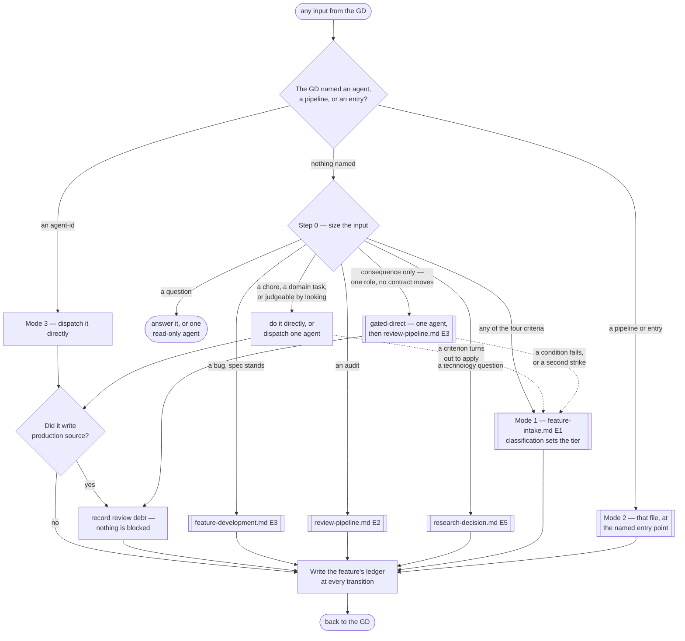

# Orchestrator

> **Scope: every input the GD sends, before any pipeline is chosen — and the state that outlives a single
> run.** The six pipeline files own sequence, retry loops and checkpoints. This one owns **which of them is
> entered, whether one is entered at all, and what travels between runs.** It owns no agent and no step.

`.claude/rules/orchestration.md` carries the invariants and is loaded automatically; this file is the router
those invariants point at. Read both before dispatching anything.

**Sizing here is `.claude/rules/task-classification.md` applied at its cheapest.** The lane an input takes and
the tier it runs at are two independent decisions, and this file owns only the first — but both are made from
the request itself, before any agent call. The retired Simple/Medium/Complex tier appears nowhere below.

## What lives here, and what does not

| Owned here | Owned by a pipeline file |
|---|---|
| Sizing an input, and picking the lane | The steps inside whichever lane was picked |
| Cross-run state — every counter, tier, track and baseline | Acting on that state within one run |
| Acting on `Routed to:` when **no pipeline is running** | Acting on it inside a run, per that file's own routing table |
| The Editor and device locks, across concurrent runs | Serialising within one run |
| Opening and closing a feature's ledger | Writing to it at each of its own transitions |

## Step 0 — size the input

Runs on every input, costs no agent call, and is stated out loud so the GD can redirect immediately.
**Read top-down, first match wins** — several rows can describe one input, and the cheaper row is listed
first on purpose.

| Input | Handling | Calls |
|---|---|---|
| A question, or an ask to explain | Answer it, or one read-only agent | 0–1 |
| A chore — rename, comment, format, config | Directly | 0–1 |
| **A git or version-control task** — history, recovery, a conflicted scene, a forensic question | `git-expert`, mode 3 | 1 |
| **A CI/CD task** — authoring a pipeline, or diagnosing a failed run from its log | `ci-cd-engineer`, mode 3 | 1 |
| **A crash or ANR from released production telemetry** — Play Console, Crashlytics, App Store Connect | `crash-anr-investigator`, mode 3. A crash on a device *under test* is `/investigate-device-crash` instead, and never this agent | 1 |
| **Judgeable by looking** — UI, layout, a tuned value, an asset, one local single-role behaviour | Directly, or one agent. **No pipeline** | 0–1 |
| A bug **in something the pipeline built**, where its approved spec still stands | `feature-development.md` **E3**, then the gate offer | 1–3 |
| An audit of code already in the repo | `review-pipeline.md` **E2** | 1–2 |
| A technology question, no feature attached | `research-decision.md` **E5** | 1–4 |
| **Consequence only** — trips a **C2+** criterion below, but one role, no contract moves, behaviour already stated | **Gated-direct** — the agent, then both gates at `review-pipeline.md` **E3**. No pipeline, no checkpoint | 3 |
| **Any escalation criterion below** | `feature-intake.md` **E1** — classification sets the tier | 8+ |

**A bug in something the direct lane built is more direct work, not an E3 defect.** E3 exists to measure a
submission against an approved spec and to count strikes against it; where no such spec exists there is
nothing to measure and nobody to charge. Fixing it costs what building it cost.

**The four escalation criteria**, each answerable by a grep or one read of the request — and each is one of
`task-classification.md`'s axes at the only resolution available before an agent has looked:

| Criterion | Axis | Why looking at it is not enough |
|---|---|---|
| Touches `Game.Core.*` — a game rule, economy, state machine, cooldown | **C2+** | A determinism or authority error stays invisible until it diverges |
| Needs more than one role | **D3+** | Coordination is what the fan-out and the handoff matrix exist for |
| Multiplayer-relevant | **C2+** | Client/server disagreement does not show on one screen |
| Rests on something the GD has not decided yet | **U3** | CP1 exists for exactly this, and nothing else provides it |

**Route by the cost of being wrong, not by whether behaviour changed.** A Settings button changes behaviour
and the GD can see it is right; a damage formula cannot be judged by looking. That is the C axis deciding the
lane, and it is why the cheap default is safe rather than reckless.

**But C buys the gates, never the pipeline.** `task-classification.md` Step 4 is explicit that C, R and X buy
depth and never a checkpoint, a document or an extra agent — so a criterion tripped for **consequence alone**
takes the **gated-direct** row above, not the 8-call lane. Detail, the four qualifying conditions and the
two-strike bound are in **`references/gated-direct-lane.md`**; read it before picking that row. A criterion
tripped for **D3+** or **U3** is different in kind — that input needs coordination or a direction, which is
shape, and shape is what `feature-intake.md` supplies.

**The lane is not the tier, and a cheap lane never buys a low tier.** Step 0 decides only whether an input is
a feature request in `feature-intake.md`'s sense. Work handled directly is still classified — silently at
A1/A2, stated at A3 and above — and a direct-lane task that classifies **C3/C4, R2/R3 or X2/X3** runs at that
tier's verification floor with the safe-retry checks `execution-loop.md` requires, even though no pipeline
and no checkpoint is involved. A signing-config edit is one line, one lane and one agent, and it is A5.

**What the direct lane must not produce.** `effort-allocation.md`'s artifact budget is a hard limit here, not
a style note: A1/A2 work produces no plan document, no acceptance contract, no traceability table, no risk
review, no self-score, and no report longer than the change. A high tier on a direct-lane input buys
verification and evidence — never paperwork, never a checkpoint, never a second agent. Reaching for a Tech
Spec is the signal that the input belonged in `feature-intake.md` all along; escalate rather than improvise
one here.

**Escape upward the moment a criterion turns out to apply** — stop and enter `feature-intake.md`. Little was
built, so little is lost.

**Direct-lane work carries an attempt budget too.** `execution-loop.md` bounds it at 2 for D1–D2 and 3 for
D3 — a ceiling, never a target. Two failures from the same cause force a change of method rather than a third
variation of the same one, and an exhausted budget produces a **Continuation Debt Record** in the reply to
the GD, stated as unfinished work with its resume point. Never folded into a summary that reads as closure.

## Pipeline at a glance

Shapes match the other pipelines: `([ ])` entry and stop · `[ ]` an agent or a pipeline action · `{ }` a
decision · `[[ ]]` another workflow file. The dotted edge is the escape upward. No `{{ }}` appears — this
file holds no checkpoint; all four belong to the pipelines it routes into.

## The three modes

| Mode | The GD says | What runs | What it costs |
|---|---|---|---|
| **1 — routed** | A feature request, nothing named | Step 0 picks a lane; that lane runs, and each optional gate is offered at its own boundary | Whatever the lane costs |
| **2 — a named pipeline** | Names a pipeline, or an entry in one | That file, from that entry, returning **to the GD** rather than handing on. `references/standalone-runs.md` says what each one is worth alone and what the GD must supply in place of the upstream | One pipeline's worth |
| **3 — direct agent** | Names one or more `agent-id`s | Exactly those, in the order given, serialised where the Editor lock applies | One call each |

**The router never asks which mode.** It infers, then states what it picked — the same way the tier is
assigned rather than put to the GD. Modes decide *when* an invariant is satisfied, never *whether* it is
owed: a mode-3 dispatch that writes source still owes the gate offer, and the ledger still counts.

**Mode 3 is the GD's cost override, and the only one.** Naming an `agent-id` replaces Step 0's gradient
outright — a Core change the router would send down the 8-call lane runs in one call. The debt is recorded,
nothing is blocked, and the judgement was theirs. Sizing is a proposal stated out loud precisely so it can be
overruled this cheaply.

## Entry index

Moved to **`references/entry-index.md`** — every addressable door, what each carries, and the four
values that travel with all of them. It is mode 2's whole vocabulary, and a "cluster" is one of its rows and
never a new grouping invented beside them. Read it before any mode-2 dispatch.

## Direct dispatch, and acting on a return

Both moved to **`references/orchestrator-direct-dispatch.md`** — the two agent classes derived from `tools:`,
which of them accrue review debt, the two global locks, and the `Routed to:` fallback table for when no
pipeline is running. Read it before any mode-2 or mode-3 dispatch, and when one returns.

## The ledgers — one per feature

**Each feature owns its own ledger** at `.claude/workflows/state/<feature-slug>/ledger.md`, opened at
`feature-intake.md` step 2 and written **at each transition** rather than at the end of a run — a counter that
survives only in context is not a safety mechanism. `state/README.md` holds the layout and the template.

A single shared file forced every concurrent feature through one document, so one feature's strike count sat
beside an identically-named counter belonging to another. Check `state/project-state.md` before opening one:
a feature already in flight has a ledger, and a second slug splits its counters silently.

**What each row of the ledger protects is in `state/README.md`**, beside the template it belongs to — one
fact, one home. Read it when opening or writing one.

**`state/project-state.md` holds only what cannot be per-feature**: the in-flight index, **open gate debt**
(a mode-3 dispatch may have no feature at all), and both global locks. A per-feature copy of a global lock is
not a lock.

## The two optional gates

**`review-pipeline.md` and `qa-pipeline.md` are separate, optional processes, and neither runs unasked.** Ask
about each separately when implementation returns. **`references/optional-gates.md`** owns the shape of the
ask, what a decline costs, and the two things that are never optional: **the ask itself**, and **recording
the answer** in `state/project-state.md`. **CP4 still fires either way** — closing a feature is the GD's
decision, not QA's verdict.

**Two files are named for a ledger and they are unrelated.** Lowercase under `.claude/workflows/state/` is
run state; uppercase `LEDGER.md` beside a feature's code is its decision history, read per
`feature-context-reading.md`. Reading one for the other wastes a dispatch.

## Rules

- Size every input first, and say which lane was picked.
- Never block. State the cost, then do what the GD asked — they override at will.
- Consequence buys the gates, never the pipeline — `references/gated-direct-lane.md` before taking that row.
- Every cap composes into a stop, never into another round — `references/loop-termination.md`.
- Run `tools/verify-workflow-layer.ps1` after any change under `.claude/`; a number this layer states about
  itself is a claim, and an unchecked claim is E0 evidence by `effort-allocation.md`'s own scale.
- Mode changes *when* an invariant is met, never *whether* it is owed.
- A cluster is an entry-index row. Never invent a grouping beside it.
- Every counter goes in the ledger at the transition, not at the end.
- Two holders of the same lock — Editor or device — never run at once, whatever mode started each.
