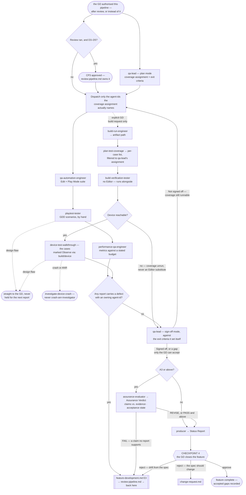

# QA Pipeline

> **Scope: one feature, from the QA plan through Checkpoint 4.** **This file owns CP4** — the last gate, and
> the only one where a feature closes carrying a gap the GD chose to accept.

**This pipeline is optional, and separate from review.** It never runs on its own initiative: the
orchestrator asks the GD whether to run it, states the cost of skipping, and dispatches only on a yes — per
`references/optional-gates.md`. **It does not require review to have run.** Where it did not, the review
verdicts are supplied as explicitly absent and every consumer is told so, rather than left to infer. It is
equally callable alone, on a feature no pipeline built, per `references/standalone-runs.md`.

Sequence, loops and checkpoints live here and never in an agent file (`feature-intake.md` states it in full).
Every `Routed to:` below is a recommendation this pipeline acts on, not an action the agent took.

**The A-tier sets the evidence this pipeline produces; D sets almost nothing here.** Coverage depth, the
verification floor, and whether `assurance-evaluator` runs are read from **A** — a feature is worth testing
hard because it is costly to get wrong (C, R, X), not because it was hard to build.

## The agents this pipeline dispatches

| Agent | Tier | Runs in | Owns |
|---|---|---|---|
| `qa-lead` | gate (opus) | — | QA scope, exit criteria, and the sign-off verdict |
| `qa-automation-engineer` | executor (sonnet) | Unity Editor | Edit Mode + Play Mode tests, network-condition cases |
| `playtest-tester` | executor (sonnet) | Unity Editor | GDD scenarios played by hand, design-flaw detection |
| `performance-qa-engineer` | executor (sonnet) | Dev build on device, or Editor (indicative) | Frame time, GC, memory, draw calls vs. budget |
| `build-verification-tester` | executor (sonnet) | Real build; a real device where one is attached | Startup, critical paths, the suite on the standalone Player, and the supplied case list walked on the device |
| `assurance-evaluator` | gate (opus) | **Assurance Verdict** | The acceptance state — whether claimed verification is evidenced, and whether effort matched the tier. **A3 and above only** |
| `producer` | report (sonnet) | — | The end-of-feature report CP4 rests on |

Reachable but owned elsewhere: `code-reviewer` and `security-reviewer` belong to `review-pipeline.md` — QA
consumes their verdicts as given and never re-decides them; `build-run-engineer` produces artifacts on an
explicit GD request only; `crash-anr-investigator` handles released-production telemetry **and only that**.

## Entry points

| Entry | Enters when | Carried in |
|---|---|---|
| **E1** | The GD authorised QA — from `review-pipeline.md` step 6, or straight from `feature-development.md` where review was declined | Enough for `qa-lead` to plan; execution stays locked |
| **E2** | CP3 approved; or the gates cleared at D1–D2; or review was declined, in which case nothing gates execution but the plan | The coverage assignment from E1. Execution unlocks |
| **E3** | A defect fix came back — through review where it ran, straight from the author where it did not | The original report and the plan; only the coverage that fix touched is re-run — and for device coverage, a **rebuilt** artifact, because the old one still contains the defect |
| **E4** | The GD asks for QA directly — on shipped code, on work no pipeline built, or after declining the gate earlier | The behaviour to test and its source, the platform target, and the budget if performance is to be judged. No ledger is assumed: classify the run itself, and mark the review verdicts absent |

Every row is keyed to an agent's own `If absent` behaviour — omit one and you get a `Blocked`, or worse, a
silent assumption. **Moved to `references/qa-entry-inputs.md`**, which also holds what to supply in place of
the review verdicts when the GD declined that gate.

## Pipeline at a glance

Shapes and dotted edges as in the other pipelines. `Blocked` returns are not drawn — ask for exactly the
input named at Entry, then resume there.

### Step 1 — the plan, which does not wait for CP3

`qa-lead` in plan mode needs only the Tech Spec, the tier and the verification floor, and no submission's
verdict changes any of them — so it runs alongside review where review ran, ready the moment CP3 clears.
Depth scales with A. What it returns is the contract for everything below: a **coverage assignment** naming
which `agent-id` covers what, and the **exit criteria** its own sign-off is judged against.

**The exit criteria state the evidence level, not just the behaviour.** V2 is a targeted direct test; V3
adds edge and failure cases, a dependency pass and a regression check; V4 adds validation against the
acceptance criteria and a separate final pass. A criterion without one is one two agents will read apart.

### Step 2 — execution, and the two locks

Moved to **`references/qa-execution-order.md`** — the three Editor-bound executors that serialise and the one
that does not, why their internal order is the pipeline's choice, both global locks and when each is claimed,
and the rule against dispatching an agent the coverage assignment did not name.

### Step 2b — the device lane, which exists only when a build does

Moved to **`references/qa-device-lane.md`** — deriving the per-case list rather than improvising it,
confirming the device *before* the artifact is touched, and stopping a case's path on a crash. It also holds
the device lock (invariant **I7**) as it applies here, and the rule that a stale artifact cannot re-verify a
fix it still contains.

### Step 3 — what comes back

`Status: Done` carrying defects is a **completed job**, not a failure — every executor says so in its own file. Read the body, never the status alone.

| What landed | Where it goes |
|---|---|
| A defect with a named owning `agent-id` | `feature-development.md` **E3** → review → back here at E3 |
| A **design flaw**, from `playtest-tester` or a device walkthrough | The GD, immediately. Never folded into the next report, never re-filed as an ordinary bug |
| An Editor-only performance number | Onward, but labelled indicative every time it is quoted. It never satisfies a device claim |
| A device walkthrough result | The only device claim this project can make. Its absence is a gap, never a pass |
| `Not covered` / `Not measured` on any report | Straight into `qa-lead`'s gap list at step 4 — the field is mandatory and is never `none` unless coverage genuinely was exhaustive |

### Step 3b — the test code this pipeline wrote

`qa-automation-engineer` is the only agent here holding `Write`/`Edit`, and its `.cs` is source like any
other. Moved to **`references/qa-test-code-gate.md`** — the **E3** route into `review-pipeline.md`, the
two-strike cap, and why invariant **I10** made this a hole rather than debt.

### Step 4 — sign-off

`qa-lead` judges the reports against the exit criteria **it wrote itself** at step 1 and never returns
`Signed off` while a gap remains. That refusal is the point of the role, so the pipeline acts on the gap:
coverage never run → re-dispatch those agent-ids at step 2; a gap that cannot be closed → on to step 4b,
and to CP4 where only the GD can accept it.

### Step 4b — the assurance gate, A3 and above

Moved to **`references/qa-assurance-gate.md`** — what `assurance-evaluator` is dispatched with (every verdict,
the Implementation Notes, the H/M/Q list, the tier, and **attempts used**), the acceptance states and where
each routes, and why a false verification claim is beyond any GD waiver rather than a score to average away.

## Checkpoints

CP1 and CP2 belong to `feature-intake.md`, CP3 to `review-pipeline.md` and only when review ran. **This
pipeline owns CP4's mechanics** — but **CP4 itself always fires**, because closing a feature is the GD's
decision and not QA's verdict. Where QA was declined the same gate runs from `references/optional-gates.md`
on whatever exists. What this pipeline supplies is the evidence under it, never the permission to hold it.

### Checkpoint 4 — the last gate

`producer` compiles the end-of-feature report and the GD closes the feature. Three outcomes: **approve**
(the feature closes, accepted gaps recorded); **reject as a defect** (it does not do what the approved spec
said → `feature-development.md` **E3**); **reject as a change request** (it does what the spec said and the
GD now wants something else → `technical-architect` for `Change severity:`).

The detail is in **`references/qa-checkpoint-4.md`** — `producer`'s exact input, why an accepted gap must
land in the known limitations and the feature root's `DEBT.md` **before** closure is reported, and the full
rejection split. Read it before closing any feature.

**A declined gate is an accepted gap like any other**, and lands in the same two places before closure is
reported. "Review was not run on this" and "no device ever ran this" are the same kind of fact, and I6 covers
both.

**Rejections as a defect are bounded on repetition, never on the GD.** The second sends
`technical-architect` for root cause before the fix is dispatched; a third stops and goes back as a
feature-level Continuation Debt Record — **`references/loop-termination.md`**. A rejection classified as a
change request never counts here; `change-request.md` resets that counter with the strikes.

## Routing rules the pipeline owns

| Return | Action |
|---|---|
| `qa-lead` `Verdict: Planned` | Hold the coverage assignment until E2 unlocks execution |
| `qa-lead` `Not signed off`, gaps name coverage never run | Re-dispatch exactly those agent-ids at step 2. Not a defect, and not a strike — but **bounded at 2**: a third means more of the same coverage cannot meet the criteria, so the gap goes to CP4. `references/loop-termination.md` |
| `qa-lead` `Not signed off`, the gap cannot be closed | To `producer` and CP4 — accepting an unmet criterion is the GD's call alone |
| `qa-lead` → `Needs-decision`, `Routed to: technical-architect` | The spec states no testable behaviour, or two reports contradict each other. A spec problem, not a QA one |
| any executor `Done` with `Defects:` | Route each defect to its named owner at E3. `Done` is correct — do not re-dispatch the executor |
| `playtest-tester` → `Needs-decision`, `Routed to: gd` | A design flaw. Straight to the GD, now |
| `performance-qa-engineer` → `Needs-decision` | A native, GPU or leak cause → `tech-lead-performance`; a budget unachievable for the design → `technical-architect`. Neither is this pipeline's to settle |
| anything returning from the **device lane** | Its own routing table, in `references/qa-device-lane.md` — six rows covering a missing artifact, no device reachable, a stale build at **E3**, a design flaw, a crash, and a refused build request |
| `assurance-evaluator` → `Acceptance: FAIL` | To the named owner at **E3**. An unsupported verification claim is an integrity failure, not a quality score — no GD waiver reaches it. The **first** `FAIL` is not a QA round; a **second** on the same submission is one, and spends that counter |
| `assurance-evaluator` → `Rejected` on A1/A2 work | Correct refusal. Skip step 4b and go to `producer`; never argue it back or re-dispatch at a raised tier |
| any executor returns a **Continuation Debt Record** | Its coverage is unrun, not failed. Record it in the feature's ledger and put it on `qa-lead`'s gap list — never report the partial run as coverage |
| any agent → `Blocked` | Supply exactly the input named at Entry, then resume from that step |

- **A submission that keeps passing and failing QA is not a code problem.** Two rounds is the bound —
  `technical-architect` for root cause, not a third fix. It spends the same single root-cause reset review
  does, and a second breach stops: **`references/loop-termination.md`**. Three strikes itself belongs to
  `review-pipeline.md`; QA counts only its own two rounds and attempts used, both in the ledger.
- **A design flaw never re-enters the engineering loop**, from the Editor or a device, at any point.
- **Retry counts, "same submission" identity, which reports landed and which baseline is current are the
  caller's** — no agent here can hold them across runs.
