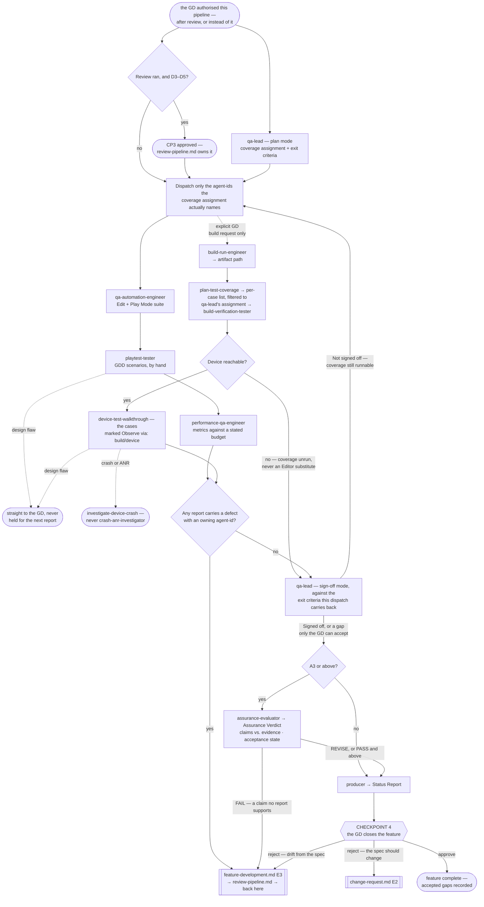

# QA Pipeline

> **Scope: one feature, from the QA plan through Checkpoint 4.** **This file owns CP4** — the last gate, and
> the only one where a feature closes carrying a gap the GD chose to accept.

**This pipeline is optional, and separate from review.** It never runs on its own initiative: **whichever
party reached the boundary asks** — `review-pipeline.md` step 6, or `feature-development.md`'s end-of-work ask
where review was declined — and it is dispatched only on a yes, per `references/optional-gates.md`, which owns
the ask's shape. **It does not require review to have run.** Where it did not, the review verdicts are supplied
as **explicitly absent** and every consumer is told so rather than left to infer — including
`qa-automation-engineer`, whose contract makes one a precondition. It is callable alone, per `references/standalone-runs.md`.

Sequence, loops and checkpoints live here and never in an agent file (`feature-intake.md` states it in full).
Every `Routed to:` below is a recommendation this pipeline acts on, not an action the agent took.
**The A-tier sets the evidence this pipeline produces; D sets almost nothing here** — coverage depth, the
verification floor and whether `assurance-evaluator` runs are all read from **A**, because a feature is worth
testing hard when it is costly to get wrong (C, R, X), not when it was hard to build.

## The agents this pipeline dispatches

| Agent | Tier | Produces | Owns |
|---|---|---|---|
| `qa-lead` | gate (opus) | **QA Plan**, **QA Verdict** | QA scope, the exit criteria, and the sign-off verdict |
| `qa-automation-engineer` | executor (sonnet) | **Test Report** | Edit Mode + Play Mode tests, network-condition cases |
| `playtest-tester` | executor (sonnet) | **Playtest Report** | GDD scenarios played by hand, design-flaw detection |
| `performance-qa-engineer` | executor (sonnet) | **Performance Verification** | Frame time, GC, memory, draw calls vs. budget |
| `build-verification-tester` | executor (sonnet) | **Build Verification** | Startup, critical paths, the suite on the standalone Player, and the supplied case list walked on the device |
| `assurance-evaluator` | gate (opus) | **Assurance Verdict** | The acceptance state — whether claimed verification is evidenced, and whether effort matched the tier. **A3 and above only** |
| `producer` | report (sonnet) | **Status Report** | The end-of-feature report CP4 rests on |

Which of them runs in the Editor, which on a device and which lock each holds is in
`references/qa-execution-order.md`. Reachable but owned elsewhere: `code-reviewer` and `security-reviewer`
belong to `review-pipeline.md` — QA consumes their verdicts as given and never re-decides them;
`build-run-engineer` produces artifacts on an explicit GD request only; `crash-anr-investigator` handles
released-production telemetry **and only that**, never a device under test.

## Entry points

| Entry | Enters when | Carried in |
|---|---|---|
| **E1** | The GD authorised QA — from `review-pipeline.md` step 6, or straight from `feature-development.md` where review was declined | Enough for `qa-lead` to plan; execution stays locked |
| **E2** | CP3 approved; or the gates cleared at D1–D2; or review was declined, in which case nothing gates execution but the plan | The coverage assignment from E1. Execution unlocks |
| **E3** | A defect fix came back — through review where it ran, straight from the author where it did not | The original report and the plan; only the coverage that fix touched is re-run — and for device coverage, a **rebuilt** artifact, because the old one still contains the defect |
| **E4** | The GD asks for QA directly, and **no ledger holds this work** — shipped code, or work no pipeline built; `orchestrator.md` step 0 sizes it here | The behaviour to test and its source, the platform target, and the budget if performance is to be judged. No ledger is assumed: classify the run itself, and mark the review verdicts absent |

**E1 and E4 are told apart by the ledger, not by who asked.** A gate declined earlier and opted into later
enters at **E1**, reopening that feature's ledger rather than opening a second slug, per
`references/optional-gates.md`; **E4** is for work no ledger holds, which is why it alone classifies itself,
and why taking it on a feature that has one discards the tier, the floor and every counter already spent.
Every carried row is keyed to an agent's own `If absent` behaviour — omit one and you get a `Blocked`, or
worse, a silent assumption. **Moved to `references/qa-entry-inputs.md`**, which also holds what to supply in
place of the review verdicts when the GD declined that gate.

## Pipeline at a glance

Shapes and dotted edges as in the other pipelines. `Blocked` is not drawn — ask for the input named at Entry,
then resume there. **Every door out is in `references/qa-exit-and-custody.md`**, with the eight deliverables
and the custody table for every returned field no `Status:` row names.

### Step 1 — the plan, which does not wait for CP3

`qa-lead` in plan mode needs only the Tech Spec, the tier and the verification floor, and no submission's
verdict changes any of them — so it runs alongside review where review ran, ready the moment CP3 clears.
Depth scales with A. What it returns is the contract for everything below: a **coverage assignment** naming
which `agent-id` covers what, and the **exit criteria** the sign-off is judged against.

**The exit criteria state the evidence level, not just the behaviour** — V2 a targeted direct test, V3 adding
edge cases, a dependency pass and a regression check, V4 adding the acceptance criteria and a separate final
pass. A criterion without one is a criterion two agents will read apart.

**Both go into the ledger at this transition, and both travel back into the sign-off dispatch** — `qa-lead` is
stateless and has no `If absent` row for either, so a sign-off dispatched without them re-derives the bar in
silence, which is what a live run of this pipeline did. `references/qa-exit-and-custody.md`.

### Step 2 — execution, the two locks, and the device lane

Moved to **`references/qa-execution-order.md`** — the three Editor-bound executors that serialise and the one
that does not, both global locks and when each is claimed, the rule against dispatching an agent the coverage
assignment did not name, and the rule that device coverage the plan assigned is **asked for before it is
dispatched** rather than discovered by burning a `Blocked`. Step **2b**, the device lane, exists only when a
build does: **`references/qa-device-lane.md`** holds the per-case derivation, confirming the device before the
artifact is touched, a crash stopping that case's path, a stale artifact's inability to re-verify a fix, and
a build-only fault's three possible owners.

### Step 3 — what comes back

`Status: Done` carrying defects is a **completed job**, not a failure. **Read the body, never the status
alone**, and route on the field: in a live run of this pipeline, three returns each carried their
highest-value content in a field no status row mentions. A **design flaw** from **any** agent here goes to the
GD immediately, not only from `playtest-tester` and the device lane. Which door every other result takes, the
custody of each field that outlives its dispatch, and what an Editor-only number may never be quoted as are
all in **`references/qa-exit-and-custody.md`**.

**Step 3b — the test code this pipeline wrote.** `qa-automation-engineer` is the only agent here holding
`Write`/`Edit`, and its `.cs` is source like any other. Moved to **`references/qa-test-code-gate.md`** — the
**E3** route into `review-pipeline.md`, the two-strike cap, why invariant **I10** made this a hole rather than
debt, and the offer a suite that never ran is still owed.

### Step 4 — sign-off

`qa-lead` judges the reports against the exit criteria **it set at step 1 and this dispatch carried back to
it**, and never returns `Signed off` while a gap remains. That refusal is the point of the role, so the
pipeline acts on the gap: coverage **not yet run** → re-dispatch those agent-ids at step 2, bounded at 2;
**unrunnable** coverage → straight to the gap list, since a second dispatch buys the same return; a gap that
cannot be closed → step 4b, then CP4. **A contradicted verification claim is none of the three** — it goes to
the GD now, per `references/qa-exit-and-custody.md`.

**Step 4b — the assurance gate, A3 and above.**
Moved to **`references/qa-assurance-gate.md`** — what `assurance-evaluator` is dispatched with (every verdict,
the Implementation Notes, the H/M/Q list, the tier, **attempts used and what a retry improved**), the
acceptance states and where each routes, and why a false verification claim is beyond any GD waiver.

## Checkpoint 4 — the last gate

CP1 and CP2 belong to `feature-intake.md`, CP3 to `review-pipeline.md` and only when review ran. **This
pipeline owns CP4's mechanics** — but **CP4 itself always fires**, because closing a feature is the GD's
decision and not QA's verdict. Where QA was declined the same gate runs from `references/optional-gates.md`
on whatever exists: this pipeline supplies the evidence under it, never the permission to hold it.

`producer` compiles the end-of-feature report and the GD closes the feature, approving it or rejecting it as
a **defect** (→ `feature-development.md` **E3**) or as a **change request** (→ `change-request.md` **E2**,
which declares that door and names this checkpoint as its origin). The detail is in
**`references/qa-checkpoint-4.md`** — `producer`'s exact input, **why the Assurance Verdict is owed at A3 and
above and its absence is stated rather than omitted**, why an accepted gap must land in the known limitations
and the feature root's `DEBT.md` **before** closure is reported, and the rejection split.

**A declined gate is an accepted gap like any other** and lands in those same two places before closure is
reported — "review was not run on this" and "no device ever ran this" are the same kind of fact, and I6 covers
both. **A contradicted verification claim is not one**, and no version of this gate may absorb one.

**Rejections as a defect are bounded on repetition, never on the GD** — the second sends `technical-architect`
for root cause first, a third stops as a feature-level Continuation Debt Record, per
**`references/loop-termination.md`**. A rejection classified as a change request never counts here.

## Routing rules the pipeline owns

| Return | Action |
|---|---|
| `qa-lead` `Verdict: Planned` | Hold the coverage assignment **and the exit criteria** until E2 unlocks execution. Both go to the ledger now, and both travel back into the step 4 dispatch |
| `qa-lead` → `Routed to: gd`, **in either mode** | Act on it at the step it arrived at, not at the one that would normally reach the GD. Live, **plan mode** returned it carrying a contradicted verification claim — four steps before the gate that owns it. No `Verdict:` row consumes a `Routed to: gd` |
| `qa-lead` `Not signed off`, gaps name coverage **not yet run** | Re-dispatch exactly those agent-ids at step 2. Not a defect, and not a strike — but **bounded at 2**: a third means more of the same coverage cannot meet the criteria, so the gap goes to CP4. `references/loop-termination.md` |
| `qa-lead` `Not signed off`, the coverage is **unrunnable** — and the return *says so*: an environment check it ran, `Results: 0 / 0`, or a `Not covered:` naming the missing toolchain, build, device or seam | Straight to the gap list. Never a re-dispatch: it would buy the same return twice before the bound stopped it. **Read off the report, never judged** — absent that statement the coverage is merely not yet run, and the row above applies |
| `qa-lead` `Not signed off`, the gap cannot be closed | **At A3 and above, through step 4b first**, then `producer` and CP4. Accepting an unmet criterion is the GD's call alone — accepting an unevidenced claim is nobody's, which is why this row may not skip the gate that checks them |
| `qa-lead` → `Needs-decision`, `Routed to: technical-architect` | The spec states no testable behaviour, or two reports contradict each other. A spec problem, not a QA one |
| any executor `Done` with `Defects:`, `Regressions:` **or `Classification: Technical defect`** | Route each to its named owner at E3. `Done` is correct — do not re-dispatch the executor. **The three envelopes do not share a field**: `performance-qa-engineer` names owners inside `Regressions:` and has no `Defects:` at all, and `playtest-tester` has neither — its finding is classified, not listed. A row naming one field drops the other two |
| any executor `Done` with **`Results: 0 / 0`**, or findings labelled inspection rather than a run | Coverage that could not be executed. Real, owned, worth fixing — and **never recorded as coverage that ran**. Every case it names joins the gap list, and it is not a Continuation Debt Record. `references/qa-exit-and-custody.md` |
| `playtest-tester` → `Needs-decision`, `Routed to: gd` | A design flaw. Straight to the GD, now |
| `performance-qa-engineer` → `Needs-decision` | A native, GPU or leak cause → `tech-lead-performance`; a budget unachievable for the design → `technical-architect`. Neither is this pipeline's to settle |
| anything returning from the **device lane** | Its own routing table, in `references/qa-device-lane.md` — a missing artifact, no device reachable, a stale build at **E3**, a design flaw, a crash, a refused build request, and a build-only fault's three possible owners |
| `assurance-evaluator` → `Acceptance: FAIL` | To the named owner at **E3** — **or to the GD where the failed claim is the Implementation Note's own**, which is pipeline-assembled and names no author. Live, the gate returned exactly that and said so. An unsupported verification claim is an integrity failure, not a quality score, and no GD waiver reaches it. The **first** `FAIL` is not a QA round; a **second** on the same submission is one, and spends that counter |
| `assurance-evaluator` → `Rejected` on A1/A2 work | Correct refusal. Skip step 4b and go to `producer`; never argue it back or re-dispatch at a raised tier |
| a return names **more than one** destination | `Routed to:` is single-valued, so every one after the first is what gets dropped. Record them all and act in the order the return states. Live, one executor returned **three**, each owning a different finding set. Three other pipelines carry this rule for the same reason |
| any executor returns a **Continuation Debt Record** | Its coverage is unrun, not failed. Record it in the feature's ledger and put it on `qa-lead`'s gap list — never report the partial run as coverage |
| any agent → `Blocked` | Supply exactly the input named at Entry, then resume from that step |

- **A submission that keeps passing and failing QA is not a code problem.** Two rounds is the bound —
  `technical-architect` for root cause, not a third fix. It spends the same single root-cause reset review
  does, and a second breach stops: **`references/loop-termination.md`**. Three strikes belongs to
  `review-pipeline.md`; QA counts only its own two rounds and attempts used, both in the ledger.
- **A design flaw never re-enters the engineering loop**, from the Editor or a device, at any point.
- **Retry counts, "same submission" identity, the coverage assignment, the exit criteria, which reports landed
  and which baseline is current are all the caller's** — no agent here holds one across runs.
