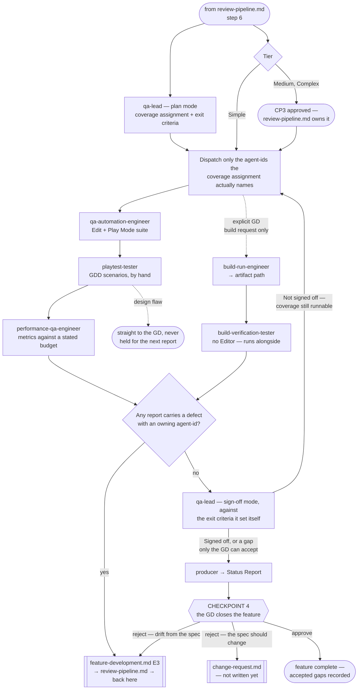

# QA Pipeline

> **Scope: one feature that cleared review, from the QA plan through Checkpoint 4.** Everything up to CP3
> belongs to `review-pipeline.md`. **This file owns CP4** — the last gate, and the only one where a feature
> can close carrying a gap the GD chose to accept.

Sequence, loops and checkpoints live here and never in an agent file — see `feature-intake.md` for the full
statement. Every `Routed to:` below is a recommendation this pipeline acts on, not an action the agent took.

## The agents this pipeline dispatches

| Agent | Tier | Runs in | Owns |
|---|---|---|---|
| `qa-lead` | gate (opus) | — | QA scope, exit criteria, and the sign-off verdict |
| `qa-automation-engineer` | executor (sonnet) | Unity Editor | Edit Mode + Play Mode tests, network-condition cases |
| `playtest-tester` | executor (sonnet) | Unity Editor | GDD scenarios played by hand, design-flaw detection |
| `performance-qa-engineer` | executor (sonnet) | Dev build on device, or Editor (indicative) | Frame time, GC, memory, draw calls vs. budget |
| `build-verification-tester` | executor (sonnet) | Real platform build only | Artifact startup, critical paths, the suite on the standalone Player |
| `producer` | report (sonnet) | — | The end-of-feature report CP4 rests on |

Reachable but owned elsewhere: `code-reviewer` and `security-reviewer` belong to `review-pipeline.md` — QA
consumes their verdicts as given and never re-decides them; `build-run-engineer` (devops) produces artifacts
on an explicit GD request only; `crash-anr-investigator` (live-ops) handles released-production telemetry.

## Entry points

| | Enters when | Carried in |
|---|---|---|
| **E1** | `review-pipeline.md` step 6 — the feature's submissions are clearing | Enough for `qa-lead` to plan; execution stays locked |
| **E2** | CP3 approved — or the gates cleared, on Simple tier | The coverage assignment from E1. Execution unlocks |
| **E3** | A defect fix came back through review | The original report and the plan; only the coverage that fix touched is re-run |

Each row below is keyed to an agent's own `If absent` behaviour — omit one and you get a `Blocked`, or worse,
a silent assumption:

| Carried in | Why |
|---|---|
| The Tech Spec, or the Simple-tier direct notes | `qa-lead` and `qa-automation-engineer` both return `Blocked` — with no stated intent there is nothing to derive coverage from, and an assertion would be arbitrary |
| The Triage tier | `qa-lead` otherwise assumes Medium and plans at the wrong depth |
| Whether the multiplayer track is active | Both agents above assume it is not, and silently drop every network-condition case |
| The GDD scenario, and the expected behaviour or feel | `playtest-tester` returns `Blocked` — without the intent there is nothing to compare against |
| The performance budget, and the baseline | Without a budget there is no verdict, only numbers; without a baseline the run *becomes* the baseline |
| Both review verdicts | `qa-lead` consumes them at sign-off, and on Simple tier the GD sees them at CP4 |

## Pipeline at a glance

Shapes match the other pipelines: `([ ])` entry and stop · `[ ]` an agent or a pipeline action · `{ }` a
decision · `{{ }}` a GD checkpoint · `[[ ]]` another workflow file. Dotted edges fire only on their own
trigger. `Blocked` returns are not drawn — ask for exactly the input named at Entry, then resume there.

### Step 1 — the plan, which does not wait for CP3

`qa-lead` in plan mode needs only the Tech Spec and the tier, and no submission's verdict can change either.
So it runs alongside review and its coverage assignment is ready the moment CP3 clears — the thinking is
already done when the GD answers. Depth scales with tier: Simple earns a few lines, not a document.

What it returns is the contract for everything below — a **coverage assignment** naming which `agent-id` must
cover what, and the **exit criteria** its own sign-off is later judged against. Dispatch only the agent-ids
that assignment names, never all four by default; unasked-for coverage is the same waste as speculative code.

### Step 2 — execution, and the one Editor

**Three of the four executors are serial, and the tools frontmatter is what forces it.**
`qa-automation-engineer`, `playtest-tester` and `performance-qa-engineer` all hold `mcp__unity-mcp__*` against
one Editor process, and each is separately barred from starting a second instance. Same constraint as
`feature-development.md` step 2, from the same source — the hard sandbox, not guardrail prose.

`build-verification-tester` is given **no Editor tooling at all**, which is exactly why it is the one QA agent
that genuinely runs alongside the rest. Its branch exists only when the GD explicitly asked for a build:
without that request `build-run-engineer` correctly refuses, and there is no artifact to verify.

**The order within the three is the pipeline's choice, not a contract.** `qa-automation-engineer` goes first
because it is the only one that writes `.cs`, so its domain reload lands before anyone enters Play Mode.
`performance-qa-engineer` goes last because it needs a quiet Editor to report a run-to-run spread — and a
design flaw found in playtest would make measuring this build pointless anyway.

### Step 3 — what comes back

`Status: Done` carrying defects is a **completed job**, not a failure; every executor says so in its own file.
Read the body, never the status alone.

| What landed | Where it goes |
|---|---|
| A defect with a named owning `agent-id` | `feature-development.md` **E3** → review → back here at E3 |
| A **design flaw** from `playtest-tester` | The GD, immediately. Never folded into the next report, never re-filed as an ordinary bug |
| An Editor-only performance number | Onward, but labelled indicative every time it is quoted. It never satisfies a device claim |
| `Not covered` / `Not measured` on any report | Straight into `qa-lead`'s gap list at step 4 — the field is mandatory and is never `none` unless coverage genuinely was exhaustive |

### Step 4 — sign-off

`qa-lead` judges the reports against the exit criteria **it wrote itself** at step 1, and never returns
`Signed off` while a gap remains. That refusal is the whole point of the role, so the pipeline never argues
with it — it acts on the gap:

- Coverage that was simply never run → re-dispatch exactly those agent-ids at step 2.
- A gap that cannot be closed → carry it to `producer` and CP4, where only the GD can accept it.

## Checkpoints

Three of the four belong to other files and are named here so a reader can find them. **This pipeline owns
CP4** and is the only place it is defined. Which tiers each applies to is `feature-intake.md`'s tier table.

| CP | Owned by | What the GD approves |
|---|---|---|
| **1** | `feature-intake.md` | The locked direction, and which risks they accept and live with |
| **2** | `feature-intake.md` | The Tech Spec |
| **3** | `review-pipeline.md` | What was built, once every submission cleared both gates |
| **4** | **this file** | Whether the feature is done, given what QA actually found |

### Checkpoint 4 — the last gate

`producer` compiles the end-of-feature report and the GD closes the feature. Its input is every QA report,
`qa-lead`'s verdict quoted as stated, and — on Simple tier, where CP3 merged into this gate — both review
verdicts as well. `producer` orders and attributes; it never adjudicates.

**Simple tier gets no Implementation Summary here.** The merge means the GD sees the review outcome at CP4,
not that a formal summary appears. `technical-architect`'s Direct tier exists precisely to skip that document,
and its own Objective calls over-specifying a trivial change a failure of the role.

**Accepting a gap is a decision, not a shortcut.** `qa-lead` is barred from signing off an unmet criterion
*because that judgment is the GD's* — so the override is legitimate by design. But the gap must land somewhere
durable, or CP4 becomes the exact failure `qa-lead` exists to prevent: "nobody checked" recorded as "QA
passed". Write every accepted gap into the feature's known limitations **before** reporting closure; on
Complex tier that means updating its `README.md`, per `.claude/rules/client/feature-documentation.md`.

**A rejection is one of two things, and they route differently:**

| The GD's objection | It is | Route |
|---|---|---|
| It does not do what the approved spec said | A defect | `feature-development.md` **E3**, then back through review and whatever coverage it touched. The spec still stands |
| It does what the spec said, and the GD now wants something else | A change request | `technical-architect` for `Change severity:` — Minor updates the spec in place, Moderate rolls back to CP2, Major to CP1 |

The GD names what is wrong; `technical-architect` classifies what it costs. `producer` cannot — it is barred
from technical judgment — and `qa-lead` has already returned its verdict. The Minor/Moderate/Major mechanics
belong to `change-request.md`, not yet written; the split above is what this file owns.

## Routing rules the pipeline owns

| Return | Action |
|---|---|
| `qa-lead` `Verdict: Planned` | Hold the coverage assignment until E2 unlocks execution |
| `qa-lead` `Not signed off`, gaps name coverage never run | Re-dispatch exactly those agent-ids at step 2. Not a defect, and not a strike |
| `qa-lead` `Not signed off`, the gap cannot be closed | To `producer` and CP4 — accepting an unmet criterion is the GD's call alone |
| `qa-lead` → `Needs-decision`, `Routed to: technical-architect` | The spec states no testable behaviour, or two reports contradict each other. A spec problem, not a QA one |
| any executor `Done` with `Defects:` | Route each defect to its named owner at E3. `Done` is correct — do not re-dispatch the executor |
| `playtest-tester` → `Needs-decision`, `Routed to: gd` | A design flaw. Straight to the GD, now |
| `performance-qa-engineer` → `Needs-decision` | A native, GPU or leak cause → `tech-lead-performance`; a budget unachievable for the design → `technical-architect`. Neither is this pipeline's to settle |
| `build-verification-tester` → `Blocked`, `Routed to: build-run-engineer` | No artifact exists. Ask the **GD** for the build — never dispatch one off pipeline state |
| `build-run-engineer` → `Rejected`, `Routed to: gd` | It was handed pipeline state instead of a GD request. A correct refusal; get the request or drop the branch |
| any agent → `Blocked` | Supply exactly the input named at Entry, then resume from that step |

- **Three strikes belongs to `review-pipeline.md`, not here.** Every QA-found defect re-enters through review,
  so that pipeline's counter already picks up the churn. QA counts nothing.
- **A submission that keeps passing review and failing QA is not a code problem.** Two rounds is the bound:
  send it to `technical-architect` for root cause rather than a third fix. No agent contract states this — it
  is a pipeline decision, made because an unbounded loop is the exact failure three strikes exists to stop.
- **A design flaw never re-enters the engineering loop**, at any point, however convenient the timing.
- **Retry counts, "same submission" identity, which reports have landed and which baseline is current are the
  caller's.** Every agent here states it cannot hold them across runs.
