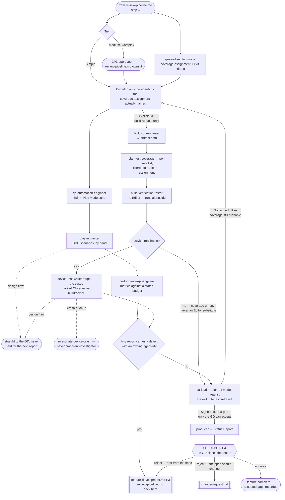

# QA Pipeline

> **Scope: one feature that cleared review, from the QA plan through Checkpoint 4.** Everything up to CP3
> belongs to `review-pipeline.md`. **This file owns CP4** — the last gate, and the only one where a feature
> closes carrying a gap the GD chose to accept.

Sequence, loops and checkpoints live here and never in an agent file (`feature-intake.md` states it in full).
Every `Routed to:` below is a recommendation this pipeline acts on, not an action the agent took.

## The agents this pipeline dispatches

| Agent | Tier | Runs in | Owns |
|---|---|---|---|
| `qa-lead` | gate (opus) | — | QA scope, exit criteria, and the sign-off verdict |
| `qa-automation-engineer` | executor (sonnet) | Unity Editor | Edit Mode + Play Mode tests, network-condition cases |
| `playtest-tester` | executor (sonnet) | Unity Editor | GDD scenarios played by hand, design-flaw detection |
| `performance-qa-engineer` | executor (sonnet) | Dev build on device, or Editor (indicative) | Frame time, GC, memory, draw calls vs. budget |
| `build-verification-tester` | executor (sonnet) | Real build; a real device where one is attached | Startup, critical paths, the suite on the standalone Player, and the supplied case list walked on the device |
| `producer` | report (sonnet) | — | The end-of-feature report CP4 rests on |

Reachable but owned elsewhere: `code-reviewer` and `security-reviewer` belong to `review-pipeline.md` — QA
consumes their verdicts as given, never re-decides them; `build-run-engineer` (devops) produces artifacts on
an explicit GD request only; `crash-anr-investigator` (live-ops) handles released-production telemetry **and
only that** — its three skills are gated to it and decline a local device trace by contract.

## Entry points

| Entry | Enters when | Carried in |
|---|---|---|
| **E1** | `review-pipeline.md` step 6 — the feature's submissions are clearing | Enough for `qa-lead` to plan; execution stays locked |
| **E2** | CP3 approved — or the gates cleared, on Simple tier | The coverage assignment from E1. Execution unlocks |
| **E3** | A defect fix came back through review | The original report and the plan; only the coverage that fix touched is re-run |

Each row below is keyed to an agent's own `If absent` behaviour — omit one and you get a `Blocked`, or worse, a silent assumption:

| Carried in | Why |
|---|---|
| The Tech Spec, or the Simple-tier direct notes | `qa-lead` and `qa-automation-engineer` both return `Blocked` — with no stated intent there is nothing to derive coverage from, and an assertion would be arbitrary |
| The Triage tier | `qa-lead` otherwise assumes Medium and plans at the wrong depth |
| Whether the multiplayer track is active | Both agents above assume it is not, and silently drop every network-condition case |
| The GDD scenario, and the expected behaviour or feel | `playtest-tester` returns `Blocked` — without the intent there is nothing to compare against |
| The performance budget, and the baseline | Without a budget there is no verdict, only numbers; without a baseline the run *becomes* the baseline |
| Both review verdicts | `qa-lead` consumes them at sign-off, and on Simple tier the GD sees them at CP4 |
| The target platform(s) | `qa-lead` otherwise assumes the Editor is the only target and plans no device coverage. It states that assumption, so the omission is visible — but a mobile feature still signs off having never run as a real build |
| The test-case list, in `plan-test-coverage`'s per-case format | Build branch only. Without it `build-verification-tester` runs startup plus the suite and files every scenario under `Not covered`, which reads downstream as "the build was verified" |
| Whether a device is expected, for a mobile artifact | The agent confirms one itself before touching the artifact; carrying the expectation is what makes a missing device a stated gap rather than silence |

## Pipeline at a glance

Shapes and dotted edges as in the other pipelines. `Blocked` returns are not drawn — ask for exactly the
input named at Entry, then resume there.

### Step 1 — the plan, which does not wait for CP3

`qa-lead` in plan mode needs only the Tech Spec and the tier, and no submission's verdict changes either — so
it runs alongside review and its assignment is ready the moment CP3 clears. Depth scales with tier. What it
returns is the contract for everything below: a **coverage assignment** naming which `agent-id` covers what,
and the **exit criteria** its own sign-off is judged against. Dispatch only the agent-ids it names, never all
four by default — unasked-for coverage is the same waste as speculative code.

### Step 2 — execution, and the two locks

**Three of the four executors are serial, and the tools frontmatter forces it** — `qa-automation-engineer`,
`playtest-tester` and `performance-qa-engineer` all hold `mcp__<server>__*` against one Editor process, each
barred from starting a second. Same hard sandbox as `feature-development.md` step 2, stated there.

`build-verification-tester` holds **no Editor tooling at all**, which is why it runs alongside those three.
That freedom is about the Editor and nothing else: it **serialises with `performance-qa-engineer` whenever
both target the same physical device** — a walkthrough over adb and a Development Build profiled over adb are
the same wire. That is invariant I7, as hard as the Editor lock.

**The order within the three is the pipeline's choice, not a contract.** `qa-automation-engineer` goes first
because it alone writes `.cs`, so its domain reload lands before anyone enters Play Mode;
`performance-qa-engineer` goes last because it needs a quiet Editor for a run-to-run spread — and a design flaw found in playtest would make measuring this build pointless anyway.

### Step 2b — the device lane, which exists only when a build does

`build-run-engineer` refuses anything but an explicit GD request, so no build means no device lane. When there is one, its `Result:` — the artifact path plus the platform and configuration it was built at — is what the verifier is dispatched with, and three things then happen in this order, the order being the contract:

1. **The cases are derived, not improvised.** `/plan-test-coverage` turns the spec into per-case
   `Starting state / Actions / Expected`; hand over only those marked `Observe via: build/device` that
   `qa-lead` already named. The command produces cases; it never decides which are owed.
2. **The device is confirmed before the artifact is touched.** No device is `Blocked` on that coverage — not
   a licence to substitute an Editor run. The artifact-only checks still run; the rest becomes a gap.
3. **A crash stops that case's path** — logs pulled, nothing silently relaunched past it, trace to `/investigate-device-crash`.

This lane is the only thing in the project that can satisfy `verification-standards.md`'s *"it works on the target platform"* row; everything else here is Editor-bound and never more than indicative.

### Step 3 — what comes back

`Status: Done` carrying defects is a **completed job**, not a failure — every executor says so in its own file. Read the body, never the status alone.

| What landed | Where it goes |
|---|---|
| A defect with a named owning `agent-id` | `feature-development.md` **E3** → review → back here at E3 |
| A **design flaw**, from `playtest-tester` or a device walkthrough | The GD, immediately. Never folded into the next report, never re-filed as an ordinary bug |
| An Editor-only performance number | Onward, but labelled indicative every time it is quoted. It never satisfies a device claim |
| A device walkthrough result | The only device claim this project can make. Its absence is a gap, never a pass |
| A crash or ANR mid-walkthrough | `/investigate-device-crash`, with the logs the walkthrough already pulled. Never `crash-anr-investigator` |
| `Not covered` / `Not measured` on any report | Straight into `qa-lead`'s gap list at step 4 — the field is mandatory and is never `none` unless coverage genuinely was exhaustive |

### Step 4 — sign-off

`qa-lead` judges the reports against the exit criteria **it wrote itself** at step 1 and never returns
`Signed off` while a gap remains. That refusal is the point of the role, so the pipeline acts on the gap:
coverage never run → re-dispatch those agent-ids at step 2; a gap that cannot be closed → to `producer` and
CP4, where only the GD can accept it.

## Checkpoints

CP1 and CP2 belong to `feature-intake.md`, CP3 to `review-pipeline.md`, and its tier table says which tiers
each applies to. **This pipeline owns CP4** — whether the feature is done, given what QA actually found.

### Checkpoint 4 — the last gate

`producer` compiles the end-of-feature report and the GD closes the feature. Its input is every QA report,
`qa-lead`'s verdict quoted as stated, and — on Simple tier, where CP3 merged into this gate — both review
verdicts. It orders and attributes; it never adjudicates, and no Implementation Summary appears here: the
merge means the GD *sees* the review outcome, and `technical-architect`'s Direct tier exists to skip it.

**Accepting a gap is a decision, not a shortcut.** `qa-lead` is barred from signing off an unmet criterion
*because that judgment is the GD's*, so the override is legitimate by design — but the gap must land
somewhere durable, or CP4 becomes the failure `qa-lead` exists to prevent: "nobody checked" recorded as "QA
passed". **A mobile feature that never ran on a device is the canonical case.** Write every accepted gap into
the known limitations **before** reporting closure; on Complex tier into its `README.md`, per
`.claude/rules/client/feature-documentation.md`.

**A rejection is one of two things, and they route differently:**

| The GD's objection | It is | Route |
|---|---|---|
| It does not do what the approved spec said | A defect | `feature-development.md` **E3**, then back through review and whatever coverage it touched. The spec still stands |
| It does what the spec said, and the GD now wants something else | A change request | `technical-architect` for `Change severity:` — Minor updates the spec in place, Moderate rolls back to CP2, Major to CP1 |

The GD names what is wrong; `technical-architect` classifies what it costs — `producer` is barred from
technical judgment and `qa-lead` has already returned its verdict. The Minor/Moderate/Major mechanics belong
to `change-request.md`; the split above is what this file owns.

## Routing rules the pipeline owns

| Return | Action |
|---|---|
| `qa-lead` `Verdict: Planned` | Hold the coverage assignment until E2 unlocks execution |
| `qa-lead` `Not signed off`, gaps name coverage never run | Re-dispatch exactly those agent-ids at step 2. Not a defect, and not a strike |
| `qa-lead` `Not signed off`, the gap cannot be closed | To `producer` and CP4 — accepting an unmet criterion is the GD's call alone |
| `qa-lead` → `Needs-decision`, `Routed to: technical-architect` | The spec states no testable behaviour, or two reports contradict each other. A spec problem, not a QA one |
| any executor `Done` with `Defects:` | Route each defect to its named owner at E3. `Done` is correct — do not re-dispatch the executor |
| `playtest-tester` → `Needs-decision`, `Routed to: gd` | A design flaw. Straight to the GD, now |
| `performance-qa-engineer` → `Needs-decision` | A native, GPU or leak cause → `tech-lead-performance`; a budget unachievable for the design → `technical-architect`. Neither is this pipeline's to settle |
| `build-verification-tester` → `Blocked`, `Routed to: build-run-engineer` | No artifact exists. Ask the **GD** for the build — never dispatch one off pipeline state |
| `build-verification-tester` reports no device reachable | That coverage is unrun. It goes to `qa-lead`'s gap list at step 4, and on to CP4 if it cannot be closed. Never an Editor substitute |
| A device walkthrough classified a **design flaw** | The GD, immediately — same as `playtest-tester`. I5 is not limited to the Editor |
| A crash or ANR on the device under test | `/investigate-device-crash`. Never `crash-anr-investigator`, which declines a local trace by contract |
| `build-run-engineer` → `Rejected`, `Routed to: gd` | It was handed pipeline state instead of a GD request. A correct refusal; get the request or drop the branch |
| any agent → `Blocked` | Supply exactly the input named at Entry, then resume from that step |

- **Three strikes belongs to `review-pipeline.md`.** Every QA-found defect re-enters through review, so that
  pipeline's counter already picks up the churn. QA counts nothing.
- **A submission that keeps passing review and failing QA is not a code problem.** Two rounds is the bound —
  `technical-architect` for root cause, not a third fix. A pipeline decision no agent contract states, made
  because an unbounded loop is the exact failure three strikes exists to stop.
- **A design flaw never re-enters the engineering loop** — from the Editor or from a device, at any point.
- **Retry counts, "same submission" identity, which reports landed and which baseline is current are the
  caller's** — every agent here states it cannot hold them across runs.
