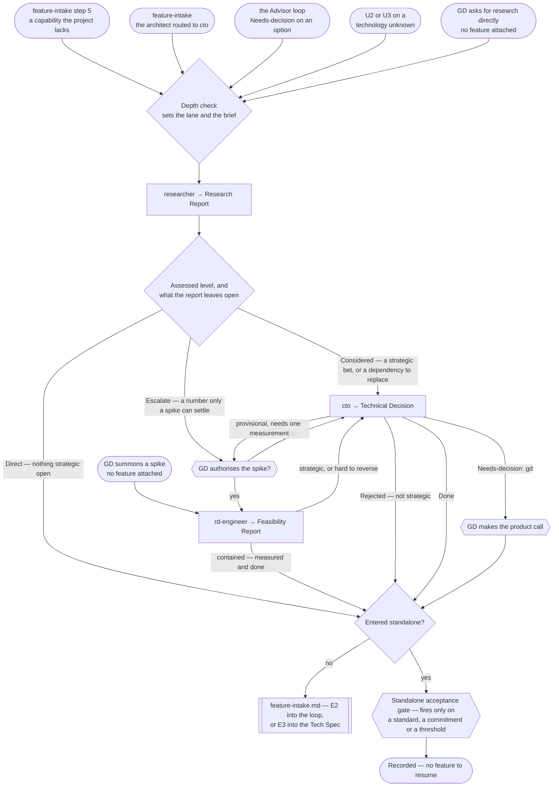

# Research & Decision Pipeline

> **Scope: a technology, package or technique the project does not yet have, up to a settled decision.**
> Usually a branch of `feature-intake.md`; it also runs standalone when the GD asks for research or summons
> a spike with no feature attached.

Sequence, loops and checkpoints live here and never in an agent file — see `feature-intake.md` for the full
statement. Every `Routed to:` below is a recommendation this pipeline acts on, not an action the agent took.

## The agents this pipeline dispatches

| Agent | Tier | Produces | Owns |
|---|---|---|---|
| `researcher` | consult (sonnet) | **Research Report** | Grading what exists today, sourced and dated — recommends, never decides |
| `rd-engineer` | consult (sonnet) | **Feasibility Report** | Disposable spikes and measured numbers — evidence, never a verdict |
| `cto` | gate (opus) | **Technical Decision** | The strategic, hard-to-reverse call, and the standard it sets |

`advisor` is not dispatched here. Both it and `researcher` surface options, so the boundary is load-bearing:

| The question | Owner |
|---|---|
| How have comparable games solved this **design** problem? | `advisor` — `feature-intake.md` steps 3–4 |
| What **technology** exists today for a capability we lack? | `researcher` — this pipeline |

## Entry points

| Entry | Comes from | Enters at |
|---|---|---|
| **E1** | `feature-intake.md` step 5 — the request names a capability the project lacks | step 0 |
| **E2** | `technical-architect` returns `Routed to: cto` — `Needs-decision` when it hit one part-way through its own work, `Rejected` when the whole request was one. **Which of its steps it escalated from sets the return address**, per `references/research-exit-and-custody.md` | step 0 |
| **E3** | `advisor` returns `Needs-decision`, `Routed to: cto` or `rd-engineer` | step 0 |
| **E4** | Classification at `feature-intake.md` **step 2** returns **U2 or U3** on a technology unknown — *before* its loop, which is what separates this from **E1** | step 0 |
| **E5** | The GD asks for research directly, no feature attached | step 0 |
| **E6** | The GD summons a spike on a foundational question, no feature attached | step 3 |

**E2 and E3 do not jump to `cto`.** It is barred from returning another round of open options, so entering it
without a candidate set leaves it nothing to decide between. Research runs first; only the spike needs a gate.

**E4 is the U axis, and nothing else.** **U2 or U3 on a technology question is the trigger**, at any D: a D5
system built entirely from what the project already has is U0 and needs no research; a D1 change resting on
an API whose shape nobody has verified is U3 and does. Read the architect's `Open design question:` lines and
route **per line** — `design` and `architecture` go to `advisor` in `feature-intake.md`, `technology` here.

**This pipeline exists to spend U down.** Research or a spike resolves the unknown, the tier is recomputed on
the way back, and a feature that classified A5 on U3 alone legitimately lands lower — recorded in the ledger
at the hand-back. What a result may *also* do is move another axis; `research-exit-and-custody.md` owns that.

**E5 and E6 are the standalone paths.** They return to the GD, not into a Tech Spec. E6 is the only entry
that skips research: the GD summoning it has already given the authorisation a spike needs.

E1–E4 are filtered upstream: `feature-intake.md` step 5 skips this pipeline outright when it can name the
package or first-party API already covering the capability. Step 0 below sizes what survives that filter.

## Pipeline at a glance

Shapes match `feature-intake.md`: `([ ])` entry and stop · `[ ]` an agent · `{ }` a decision · `{{ }}` a GD
gate · `[[ ]]` another workflow file. `Blocked` is not drawn — always ask the GD for the input named, then resume.

## Step order

| # | Step | Runs for | Produces |
|---|---|---|---|
| 0 | The depth check — pick the lane, write the brief | E1–E5 | the lane |
| 1 | `researcher` — sweep and screen against this project's constraints | E1–E5 | **Research Report** |
| 2 | The spike gate — the GD authorises or declines | only when a number is the blocker | — |
| 3 | `rd-engineer` — build the disposable harness and measure | E6, or an authorised step 2 | **Feasibility Report** |
| 4 | `cto` — make the call and set the standard | a strategic or hard-to-reverse choice | **Technical Decision** |
| 5 | Hand back, or gate to the GD on a standalone path | every run | — |

### Step 0 — the depth check

Moved to **`references/research-depth-lanes.md`** — the Direct / Considered / Escalate lanes, what each is
observable by at entry, how the lane sets the brief rather than only the step list, and the upward-only rule
that lets `researcher`'s returned `Assessed:` raise a lane but never lower it.

### Step 1 — what the pipeline must attach

- **The capability stated as behaviour**, never a topic. "Research physics" is rejected as unactionable.
- **Whether a paid or closed-source option is acceptable.** Left unsaid, the agent assumes paid is allowed
  and ranks a free maintained option first at equal fit — usually right, occasionally not.

### Step 2 — the spike gate

`rd-engineer` activates only on an explicit GD summon, yet `researcher`, `advisor` and `cto` can all
recommend it. The pipeline never converts a recommendation into a dispatch — it asks the GD, carrying
everything step 3 below says the dispatch needs, so they are authorising something specific rather than "a
spike". **Where the measurement is on a device, the ask includes the build**, because that is a second agent
and the device lock, not a detail. A gate the GD has answered is not re-asked in the same run, per
`references/loop-termination.md`.

A declined spike is not a dead end: step 4 proceeds, and `cto` makes an explicitly provisional call naming
the number it hinges on.

### Step 3 — the spike, and the half `rd-engineer` is barred from doing

**E6 has no step 0 to size it and no upstream to inherit from**, so the dispatch carries these — each keyed
to what `rd-engineer` actually does without it, per `references/standalone-runs.md`:

| Attach | If absent |
|---|---|
| The feasibility question, **and the decision waiting on it** | `Blocked` — an unfocused spike measures nothing |
| The pass/fail threshold | It proposes one from the project's budgets and states it explicitly |
| The target hardware | It assumes the lowest-spec target and says which |
| The **current baseline** — what the number is today | The threshold gets inferred from a general budget instead of the real shortfall |

**A measurement on a device is not R0/R1, and `rd-engineer` may not take it.** Its guardrail forbids
producing a platform build, and a Development Build on the one device is **R2 and X2**. So an on-device spike
splits: `rd-engineer` writes the disposable harness, **`build-run-engineer` produces the build on an explicit
GD request**, and the device lock is claimed before either reaches it and released on return — invariant
**I7**. Omitting that half leaves the harness written and the question unanswered.

### Step 4 — the decision, and the only loop here

**What the dispatch carries**: the candidate set from step 1 whole, plus the decision to be made **and what
depends on it** (`Blocked` without it — `cto` will not manufacture a scope), the cost, timeline and scale
constraints (absent, it fetches vendor pricing itself and decides provisionally), and the spike's evidence —
**or the fact the gate was declined**, which is what stops it naming a measurement nobody will take.

| Rule | Detail |
|---|---|
| **Provisional, then confirm** | `cto` may decide provisionally and name the one measurement that would falsify it. That runs the step 2 gate — **unless the GD already declined it this run**, in which case the threshold is recorded and the decision stands provisional. Re-asking a gate already answered is the nagging `references/loop-termination.md` forbids. |
| **Hard cap** | **One** measure-and-confirm cycle, recorded in the ledger as `Measure-and-confirm: 0/1` — a cap nobody counted is a cap that never fires. Still unresolved after it, `cto` returns `Needs-decision`, `Routed to: gd`; it never commissions a second spike. |
| **A standard is owed an ADR** | A non-empty `Standard set:` binds roles that were never in this run. Record it in the ledger's `Standards set:` row and dispatch `cto`'s own `engineering-standard-adr-authoring` skill — `cto` names the standard, and does not author the ADR unasked, so nobody making that second dispatch means the rule survives only in this conversation. |
| **Not strategic** | `cto` returning `Rejected`, `Routed to: technical-architect` is a correct result, not a failed run. It usually means step 0 aimed a lane too high. |
| **A working dependency** | `researcher` refuses to justify replacing one and returns `Needs-decision`. It goes to `cto`, which owns the keep/mitigate/replace verdict and bounces it back if it proves contained. |

### Step 5 — the exit

Moved to **`references/research-exit-and-custody.md`** — which door each entry hands back to and the **E1**
vs **E4** discriminator, the five things this pipeline produces and where each is recorded, the rule for a
research result that moves an axis the re-entry contract freezes, and the standalone acceptance gate: what
makes it fire, why a Direct lane does not, and what each of its two rejections means.

**Nothing leaves this pipeline unrecorded.** The Technical Decision, any `Standard set:`, the `Picture taken:`
staleness date and a provisional decision's re-open threshold are written at the transition, never at closure.

## Routing rules the pipeline owns

| Return | Action |
|---|---|
| `researcher` → `Done`, nothing strategic open | Exit — hand back at the entry step 5 names, or to the GD if standalone |
| `researcher` → `Assessed:` above the entry lane | Raise the lane and continue; never lower it |
| `researcher` → `Needs-decision`, an existing dependency already covers it | To `cto`; it bounces to `technical-architect` if contained |
| `researcher` or `advisor` → `Routed to: rd-engineer` | Run the step 2 gate. Never dispatch the spike directly |
| `researcher` or `advisor` → `Routed to: cto` | Proceed to step 4 with the candidate set attached |
| `rd-engineer` → `Done` — the spike measured it | To step 4 where the choice is strategic or hard to reverse; otherwise to step 5 directly. A measured answer to a contained question needs no `cto`, and the diagram's edge is that conditional, not an always |
| `rd-engineer` → `Needs-decision`, `Routed to: cto` or `gd` | Follow it — the spike found the question is not answerable at that scale |
| `cto` → `Rejected`, `Routed to: technical-architect` | Hand back; the problem is contained, not strategic |
| `cto` → `Needs-decision`, `Routed to: gd` | The GD makes the product call, then step 5 |
| any agent → `Blocked` | Ask the GD for exactly the input named. `Blocked` is a correct result, never a silent retry |
| any agent names **two** destinations in one return | `Routed to:` is single-valued, so the second is the one that gets dropped. Both are correct and they are sequential: record both, then act on them in the order the return states — never match the first row in this table and stop |
| `researcher` or `rd-engineer` returns a **Continuation Debt Record** | The question is not answerable within its budget. Record it, and carry the *known non-solutions* into whatever runs next — `cto` deciding against an unmeasured option needs to know which measurements were already attempted and failed |

- **`cto` is never entered without a candidate set.** No path skips step 1 except E6, which reaches it
  through a Feasibility Report instead.
- **Nothing here writes to the project except a spike, and a spike is not free.** `researcher` has no write
  tools and `cto` executes nothing, so a Direct or Considered lane is R0/R1. An Escalate lane is not: the
  harness is R1, and measuring it on a device is **R2 and X2**, through step 3's split and the device lock.
- **Every exit recomputes U and records the tier.** A research result that leaves the unknown standing is
  reported as unresolved, per `effort-allocation.md` — never as settled because the round is over.

## Upstream this pipeline depends on

| Where | What it must carry |
|---|---|
| `feature-intake.md` routing table | The `advisor` → `Needs-decision`, `Routed to: rd-engineer \| cto` row — entry point **E3** |
| `technical-architect`'s `Open design question:` | A technology unknown as well as a design one — entry point **E4** reads it to decide which pipeline the question belongs to |
