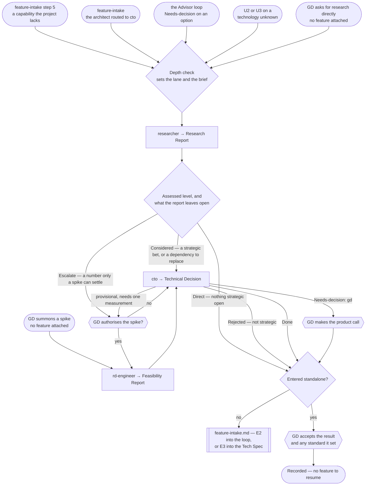

# Research & Decision Pipeline

> **Scope: a technology, package or technique the project does not yet have, up to a settled decision.**
> Usually a branch of `feature-intake.md`; it also runs standalone when the GD asks for research or summons
> a spike with no feature attached.

Sequence, loops and checkpoints live here and never in an agent file — see `feature-intake.md` for the full
statement. Every `Routed to:` below is a recommendation this pipeline acts on, not an action the agent took.

## The agents this pipeline dispatches

| Agent | Tier | Produces | Owns |
|---|---|---|---|
| `researcher` | consult (sonnet) | **Research Report** | Grading what exists today, sourced and dated — recommends, never decides |
| `rd-engineer` | consult (sonnet) | **Feasibility Report** | Disposable spikes and measured numbers — evidence, never a verdict |
| `cto` | gate (opus) | **Technical Decision** | The strategic, hard-to-reverse call, and the standard it sets |

`advisor` is not dispatched here. Both it and `researcher` surface options, so the boundary is load-bearing:

| The question | Owner |
|---|---|
| How have comparable games solved this **design** problem? | `advisor` — `feature-intake.md` steps 3–4 |
| What **technology** exists today for a capability we lack? | `researcher` — this pipeline |

## Entry points

| Entry | Comes from | Enters at |
|---|---|---|
| **E1** | `feature-intake.md` step 5 — the request names a capability the project lacks | step 0 |
| **E2** | `technical-architect` returns `Routed to: cto` — a strategic technology choice | step 0 |
| **E3** | `advisor` returns `Needs-decision`, `Routed to: cto` or `rd-engineer` | step 0 |
| **E4** | Classification returns **U2 or U3** and the open question is a technology unknown | step 0 |
| **E5** | The GD asks for research directly, no feature attached | step 0 |
| **E6** | The GD summons a spike on a foundational question, no feature attached | step 3 |

**E2 and E3 do not jump to `cto`.** It is barred from returning another round of open options, so entering it
without a candidate set leaves it nothing to decide between. Research runs first and needs no gate of its own
— only the spike does.

**E4 is the U axis, and nothing else.** `task-classification.md` gives uncertainty its own axis precisely so
this entry stops guessing at it: **U2 or U3 on a technology question is the trigger**, at any D. A D5 system
built entirely from what the project already has is U0 and needs no research; a D1 change resting on an API
whose current shape nobody has verified is U3 and does. Read the architect's `Open design question:` to split
the two — a *design* question goes to `advisor` in `feature-intake.md`, a *technology* question comes here.

**This pipeline exists to spend U down.** That is what its result is worth: research or a spike resolves the
unknown, the tier is recomputed on the way back, and a feature that classified A5 on U3 alone legitimately
lands lower. Recording the new tier in the feature's ledger is part of the hand-back, not an afterthought.

**E5 and E6 are the standalone paths.** They return to the GD, not into a Tech Spec. E6 is the only entry
that skips research: the GD summoning it has already given the authorisation a spike needs.

E1–E4 are filtered upstream: `feature-intake.md` step 5 skips this pipeline outright when it can name the
package or first-party API already covering the capability. Step 0 below sizes what survives that filter.

## Pipeline at a glance

Shapes match `feature-intake.md`: `([ ])` entry and stop · `[ ]` an agent · `{ }` a decision · `{{ }}` a GD
gate · `[[ ]]` another workflow file. `Blocked` returns are not drawn — the action is always to ask the GD
for exactly the input named, then resume from that step.

## Step order

| # | Step | Runs for | Produces |
|---|---|---|---|
| 0 | The depth check — pick the lane, write the brief | E1–E5 | the lane |
| 1 | `researcher` — sweep and screen against this project's constraints | E1–E5 | **Research Report** |
| 2 | The spike gate — the GD authorises or declines | only when a number is the blocker | — |
| 3 | `rd-engineer` — build the disposable harness and measure | E6, or an authorised step 2 | **Feasibility Report** |
| 4 | `cto` — make the call and set the standard | a strategic or hard-to-reverse choice | **Technical Decision** |
| 5 | Hand back, or gate to the GD on a standalone path | every run | — |

### Step 0 — the depth check

Moved to **`references/research-depth-lanes.md`** — the Direct / Considered / Escalate lanes, what each is
observable by at entry, how the lane sets the brief rather than only the step list, and the upward-only rule
that lets `researcher`'s returned `Assessed:` raise a lane but never lower it.

### Step 1 — what the pipeline must attach

- **The capability stated as behaviour**, never a topic. "Research physics" is rejected as unactionable.
- **Whether a paid or closed-source option is acceptable.** Left unsaid, the agent assumes paid is allowed
  and ranks a free maintained option first at equal fit — usually right, occasionally not.
- The report carries a `Picture taken:` date and what would make it stale. Both are forwarded into the Tech
  Spec; a later re-entry for the same capability re-checks rather than reuses.

### Step 2 — the spike gate

`rd-engineer` activates only on an explicit GD summon, yet `researcher`, `advisor` and `cto` can all
recommend it. The pipeline never converts a recommendation into a dispatch. It asks the GD, carrying:

| Carried to the GD | Why |
|---|---|
| The feasibility question, and the decision waiting on it | Without the second, the agent returns `Blocked` |
| The pass/fail threshold that would settle it | Absent, the agent proposes one from the project's budgets |
| The target hardware | Absent, it assumes the lowest-spec target and says which |

A declined spike is not a dead end: step 4 proceeds, and `cto` makes an explicitly provisional call naming
the number it hinges on.

### Step 4 — the decision, and the only loop here

| Rule | Detail |
|---|---|
| **Provisional, then confirm** | `cto` may decide provisionally and name one measurement. That runs the step 2 gate, then returns here. |
| **Hard cap** | **One** measure-and-confirm cycle. Still unresolved after it, `cto` returns `Needs-decision`, `Routed to: gd` — it never commissions a second spike. |
| **Not strategic** | `cto` returning `Rejected`, `Routed to: technical-architect` is a correct result, not a failed run. It usually means step 0 aimed a lane too high. |
| **A working dependency** | `researcher` refuses to justify replacing one and returns `Needs-decision`. It goes to `cto`, which owns the keep/mitigate/replace verdict and bounces it back if it proves contained. |

### Step 5 — the exit

As a branch of `feature-intake.md`, the result rides into the checkpoint that pipeline already has — no extra
gate, no extra wait. **Which entry it hands back to is set by the entry it left from, not by the tier:**

| Left from | Hands back at | Reaches |
|---|---|---|
| **E3**, **E4** — mid-loop, or a technology unknown at U2/U3 | `feature-intake.md` **E2** — step 3 | CP1 |
| **E1**, **E2** — step 5, or the architect mid-spec | `feature-intake.md` **E3** — step 6 at **D3–D5**, the direct-notes hand-off at **D1–D2** | CP2 at D3–D5; nothing at D1–D2 |

Handing **E3** or **E4** back at step 6 would skip the Advisor⇄Critic loop the feature reached CP1 *because*
it needs — the research settled a technology question, never the direction.

**The second row branches on shape, and one direction of getting it wrong is expensive.** `feature-intake.md`
lets **D1–D2** take its step 5 as well — a one-role change can still need a package the project does not
have — and that feature has no step 6 to return to and no CP2 to reach. Its return is the direct notes,
exactly as if this pipeline had never run. Handing it back at step 6 instead produces a Tech Spec for a
D1–D2 change, which is `effort-allocation.md`'s own named example of what the artifact budget forbids. That
pipeline's diagram already branches here, at its `Resume` node; its entry table is what did not.

On a standalone path (**E5**, **E6**) there is no such checkpoint, and a hard-to-reverse bet would otherwise
pass unseen. So it ends at its own GD gate: the GD accepts the result and any standard it set, and the run
stops — there is no feature to resume.

## Routing rules the pipeline owns

| Return | Action |
|---|---|
| `researcher` → `Done`, nothing strategic open | Exit — hand back at the entry step 5 names, or to the GD if standalone |
| `researcher` → `Assessed:` above the entry lane | Raise the lane and continue; never lower it |
| `researcher` → `Needs-decision`, an existing dependency already covers it | To `cto`; it bounces to `technical-architect` if contained |
| `researcher` or `advisor` → `Routed to: rd-engineer` | Run the step 2 gate. Never dispatch the spike directly |
| `researcher` or `advisor` → `Routed to: cto` | Proceed to step 4 with the candidate set attached |
| `rd-engineer` → `Needs-decision`, `Routed to: cto` or `gd` | Follow it — the spike found the question is not answerable at that scale |
| `cto` → `Rejected`, `Routed to: technical-architect` | Hand back; the problem is contained, not strategic |
| `cto` → `Needs-decision`, `Routed to: gd` | The GD makes the product call, then step 5 |
| any agent → `Blocked` | Ask the GD for exactly the input named. `Blocked` is a correct result, never a silent retry |
| `researcher` or `rd-engineer` returns a **Continuation Debt Record** | The question is not answerable within its budget. Record it, and carry the *known non-solutions* into whatever runs next — `cto` deciding against an unmeasured option needs to know which measurements were already attempted and failed |

- **`cto` is never entered without a candidate set.** No path skips step 1 except E6, which reaches it
  through a Feasibility Report instead.
- **Nothing here writes to the project.** `researcher` has no write tools, `cto` executes nothing, and
  `rd-engineer` marks its output disposable in both the code and the report. R0/R1 throughout, which is why
  an Escalate lane can afford a spike the feature pipeline could not.
- **Every exit recomputes U and records the tier.** A research result that leaves the unknown standing is
  reported as unresolved, per `effort-allocation.md` — never as settled because the round is over.

## Upstream this pipeline depends on

| Where | What it must carry |
|---|---|
| `feature-intake.md` routing table | The `advisor` → `Needs-decision`, `Routed to: rd-engineer \| cto` row — entry point **E3** |
| `technical-architect`'s `Open design question:` | A technology unknown as well as a design one — entry point **E4** reads it to decide which pipeline the question belongs to |
