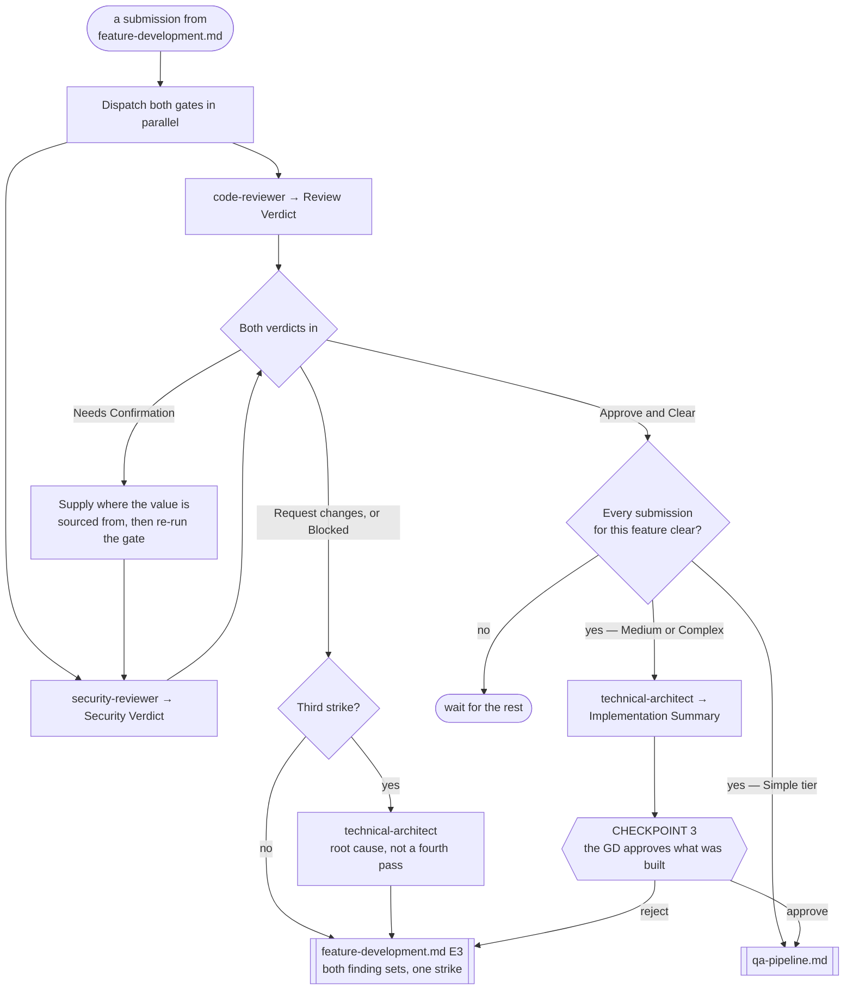

# Review Pipeline

> **Scope: one submission from `feature-development.md`, through both gates, up to Checkpoint 3.** Everything
> past CP3 belongs to `qa-pipeline.md`. **This file owns the two review gates**; the QA pipeline references
> them rather than describing them a second time.

Sequence, loops and checkpoints live here and never in an agent file — see `feature-intake.md` for the full
statement. Every `Routed to:` below is a recommendation this pipeline acts on, not an action the agent took.

## The agents this pipeline dispatches

| Agent | Tier | Produces | Owns |
|---|---|---|---|
| `code-reviewer` | gate (opus) | **Review Verdict** | Correctness against the spec, bugs, and Shared-Core duplication |
| `security-reviewer` | gate (opus) | **Security Verdict** | Leaked secrets, dangerous files, fraudulent logic |
| `technical-architect` | gate (opus) | **Implementation Summary** | Root cause after three strikes, and the CP3 summary |

`cto` and `tech-lead-sdk-platform` are reachable from here but owned elsewhere.

## Entry

**One submission per entry.** A feature produces several — the Shared Core, each client agent, each backend
agent, and the README — and each is reviewed on its own. Only the checkpoint aggregates.

| Carried in | Why |
|---|---|
| The code or diff in scope | Both gates return `Blocked` without it; neither judges from a description or a filename |
| The Tech Spec section, or the Simple-tier direct notes | `code-reviewer` returns `Blocked` — without the intended behaviour there is no "correct" to check against |
| Which agent authored it | Absent, `code-reviewer` proceeds on a stated assumption that it did not write the code itself |
| The Implementation Note | Per `.claude/rules/implementation-note.md`, assembled by the dispatching pipeline |
| The strike count and every prior verdict | This pipeline holds both; no gate can count its own rounds |

## Pipeline at a glance

Shapes match `feature-intake.md`: `([ ])` entry and stop · `[ ]` an agent or a pipeline action · `{ }` a
decision · `{{ }}` a GD checkpoint · `[[ ]]` another workflow file. `Blocked` returns are not drawn — ask for
exactly the input named, then resume from that step.

### Step 1 — the two gates, in parallel

Both agent files state the parallelism from their own side, so it is forced rather than chosen:
`code-reviewer` is told `security-reviewer` runs alongside it as an independent gate and must not be waited
on, and `security-reviewer` is triggered by any submission "reviewed in parallel with `code-reviewer`".
Neither duplicates the other's lens, and neither may edit a file — both return findings for the author.

**Read `Verdict:`, never `Status:`.** A completed review that requests changes returns `Status: Done` — the
review finished, and it is the verdict that failed. `Status: Rejected` means something else entirely: the
submission was not that gate's to review, which is a mis-dispatch, not a strike.

`feature-development.md` holds its client fan-out for the **Core submission's** verdict and nothing else, so
that one submission's turnaround is on this pipeline's critical path.

### Step 2 — one decision from two verdicts

The gates do not wait on each other. **This pipeline does wait for both before it acts.** Returning the
correctness findings the moment they land means the author fixes them, resubmits, and only then learns of the
security finding — two round trips and two strikes for one submission's worth of work.

A submission is clear only when `code-reviewer` returns `Approve` **and** `security-reviewer` returns
`Clear`. Anything else goes back as one combined dispatch.

### Step 3 — the return, and what counts as a strike

The submission goes back to its owning agent through `feature-development.md` at **E3**, carrying both finding
sets and the strike count. That pipeline places the fix in its serial order; it does not jump the queue.

**One round trip is one strike, whichever gate caused it.** `technical-architect`'s input for a three-strikes
run is the pattern across rejections, and a pattern spanning both gates is still a pattern — arguably a
sharper one than three of the same kind.

A `Needs Confirmation` is **not** a strike, and neither is a `Needs-decision`. Both mean the gate is missing
an input, not that the code is wrong.

### Step 4 — three strikes

At the third strike the submission goes to `technical-architect` for root cause instead of a fourth review
pass. It requires **the rejection history and the submitted code**, or it returns `Blocked` — so carry every
prior verdict in full, never just the count. What comes back is a cause, not a verdict; the fix still
re-enters at E3.

When the stalled submission is the Shared Core, the whole feature stalls with it. That is correct: everything
downstream would otherwise be built against a contract three reviews could not approve.

### Step 5 — Checkpoint 3

Fires **once per feature**, when every submission for it is clear — not once per submission.
`technical-architect` compiles the Implementation Summary in its usual envelope with the body replaced by
`Built:`, `Matches spec intent:` (with any drift named), and `Known limitations:`. Its input is every cleared
submission's Implementation Note plus both verdicts.

| Tier | CP3 |
|---|---|
| Simple | none — `feature-intake.md`'s tier table merges it into the single final checkpoint |
| Medium, Complex | ✔ |

**Rejecting CP3 sends the named drift back to its owning agent at E3** — not back to CP2. CP2 is the rollback
target for a *spec* change; a CP3 rejection says the code drifted from a spec that still stands.

### Step 6 — the handoff to QA

**CP3 gates QA execution, not QA planning.** `qa-lead` in plan mode needs only the Tech Spec and the tier, so
it runs as soon as the gates clear — nothing it produces is invalidated by a CP3 rejection, and the thinking
is done by the time the GD answers. Simple tier has no CP3 and hands straight on.

## The `Needs Confirmation` ladder

`security-reviewer` returns this when it cannot tell a real secret from a public identifier, and its own
required-input table names exactly what is missing: **where the value is actually sourced from**. So this is
an input to supply and re-run, never a verdict to escalate. Ask in this order:

| Ask | When |
|---|---|
| `tech-lead-sdk-platform` | The submission is an SDK or platform integration — it owns the config source and already reports `Config required:` naming which ids and keys come from where |
| The authoring agent | Anything else — it put the value there and can name its source |
| `gd` | Neither can name a documented source. A credential-shaped value with no known origin is theirs to resolve, and only they can say whether a real key exists |

Then re-run the security gate with the answer. Never resolve it by guessing in either direction — the agent
refuses to, and so does this pipeline.

## Routing rules the pipeline owns

| Return | Action |
|---|---|
| `code-reviewer` `Approve` **and** `security-reviewer` `Clear` | The submission is clear. Check whether the feature's others are too |
| `code-reviewer` `Request changes`, or `security-reviewer` `Blocked` | Combine both finding sets, return to the author at E3, +1 strike |
| `security-reviewer` `Needs Confirmation` | The ladder above, then re-run that gate. Not a strike |
| `code-reviewer` → `Needs-decision`, `Routed to: technical-architect` | The spec is ambiguous about what "correct" means. A spec problem, not a code one — and not a strike |
| `security-reviewer` → `Needs-decision`, `Routed to: cto` | A secret may be exposed in git history. Straight to `cto`: rotation and history rewrite are the candidates, and the finding already supplies them — this is **not** a `research-decision.md` entry |
| either gate → `Rejected` | Not that gate's submission. Re-dispatch to the right one; never a strike |
| either gate → `Blocked` | Supply exactly the input named. Both block on missing code; `code-reviewer` also blocks on a missing spec |
| third strike on one submission | `technical-architect`, with the full rejection history and the code |

- **Rejections are silent to the GD.** This is the technical loop; they see it at CP3, or through a `Blocked`
  that needs their input.
- **Neither gate edits code, ever** — both are explicitly barred, and the fix belongs to whoever wrote it.
- **Submission identity, the strike count and which verdicts have already landed are the caller's.** Every
  agent here states it cannot hold them across runs.
