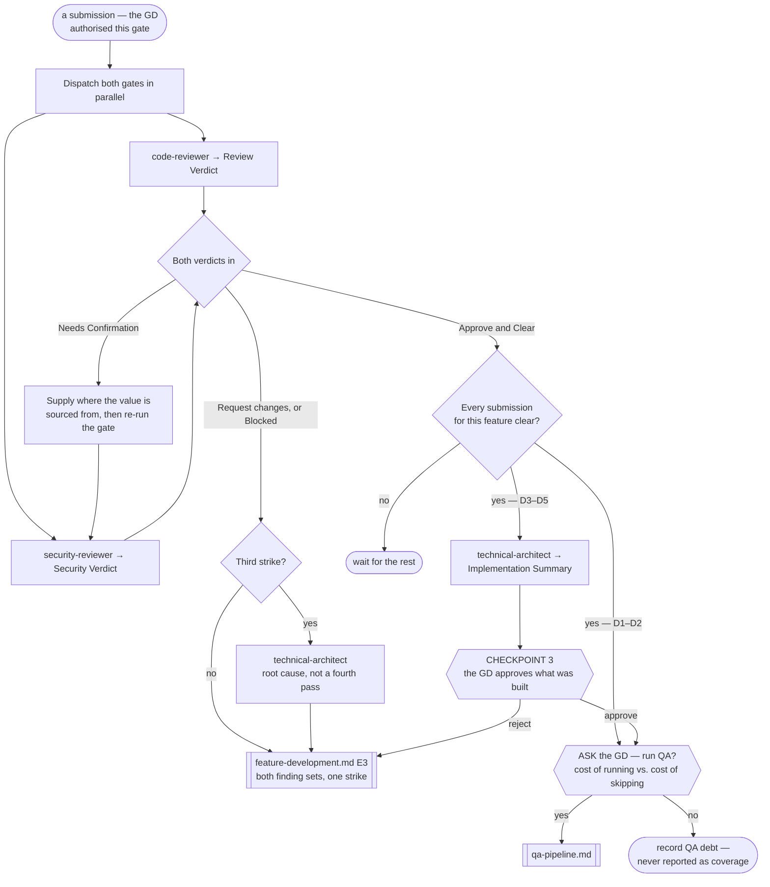

# Review Pipeline

> **Scope: one submission, through both gates, up to Checkpoint 3.** **This file owns the two review gates**;
> the QA pipeline references them rather than describing them a second time.

**This pipeline is optional, and separate from QA.** It never runs on its own initiative: the orchestrator
asks the GD whether to run it, states the cost of skipping, and dispatches only on a yes — per
`references/optional-gates.md`. QA is a separate question with a separate answer; neither gates the other.
It is equally callable alone, on code no pipeline built, per `references/standalone-runs.md`.

Sequence, loops and checkpoints live here and never in an agent file — see `feature-intake.md` for the full
statement. Every `Routed to:` below is a recommendation this pipeline acts on, not an action the agent took.

**The A-tier reaches this pipeline as a standard of evidence, never as a standard of correctness.** A bug is
a bug at A1 and at A5. What the tier changes is the **verification floor** the submission's `Verification
done:` is measured against — V1 at A1–A2, V2 at A3, V3 at A4, V4 at A5, per `effort-allocation.md` — and
whether a claimed check had to be evidenced at all. The retired Simple/Medium/Complex tier appears nowhere
below; **D** decides which checkpoints fire, **A** decides how hard a claim is pressed.

## The agents this pipeline dispatches

| Agent | Tier | Produces | Owns |
|---|---|---|---|
| `code-reviewer` | gate (opus) | **Review Verdict** | Correctness against the spec, bugs, and Shared-Core duplication |
| `security-reviewer` | gate (opus) | **Security Verdict** | Leaked secrets, dangerous files, fraudulent logic |
| `technical-architect` | gate (opus) | **Implementation Summary** | Root cause after three strikes, and the CP3 summary |

`cto` and `tech-lead-sdk-platform` are reachable from here but owned elsewhere.

## Entry points

| Entry | Enters when | Carried in |
|---|---|---|
| **E1** | A submission from `feature-development.md` | Everything in the table below |
| **E2** | The GD asks for an audit of code already in the repo | The code in scope, and what it is audited against |
| **E3** | A submission with an author but no feature pipeline behind it — the **gated-direct lane**, or test code from `qa-pipeline.md` | The table below, minus the Tech Spec section: the behaviour it was written against, and the strike count, which caps at **2** rather than 3 |

**One submission per E1 entry.** A feature produces several — the Shared Core, each client agent, each
backend agent, and the README — and each is reviewed on its own. Only the checkpoint aggregates.

**E2 has no author, no strike and no CP3.** `security-reviewer` is contractually callable standalone;
`code-reviewer` returns `Blocked` without a spec, so either name what the audit checks against or dispatch
only the security gate. Its findings are a report to the GD, never a rejection — and an audit has no feature
ledger, so classify it per `task-classification.md` rather than inheriting a tier from somebody else's code.

Moved to **`references/review-entry-inputs.md`** — every row keyed to a gate's own `If absent`, plus what
differs at **E2** and **E3**.

## Pipeline at a glance

Shapes match `feature-intake.md`: `([ ])` entry and stop · `[ ]` an agent or a pipeline action · `{ }` a
decision · `{{ }}` a GD checkpoint · `[[ ]]` another workflow file. `Blocked` returns are not drawn — ask for
exactly the input named, then resume from that step.

### Step 1 — the two gates, in parallel

Both agent files state the parallelism from their own side, so it is forced rather than chosen:
`code-reviewer` is told `security-reviewer` runs alongside it as an independent gate and must not be waited
on, and `security-reviewer` is triggered by any submission "reviewed in parallel with `code-reviewer`".
Neither duplicates the other's lens, and neither may edit a file — both return findings for the author.

**Read `Verdict:`, never `Status:`.** A completed review that requests changes returns `Status: Done` — the
review finished, and it is the verdict that failed. `Status: Rejected` means something else entirely: the
submission was not that gate's to review, which is a mis-dispatch, not a strike.

`feature-development.md` holds its client fan-out for the **Core submission's** verdict and nothing else, so
that one submission's turnaround is on this pipeline's critical path.

### Step 2 — one decision from two verdicts

The gates do not wait on each other. **This pipeline does wait for both before it acts.** Returning the
correctness findings the moment they land means the author fixes them, resubmits, and only then learns of the
security finding — two round trips and two strikes for one submission's worth of work.

A submission is clear only when `code-reviewer` returns `Approve` **and** `security-reviewer` returns
`Clear`. Anything else goes back as one combined dispatch.

### Step 3 — the return, and what counts as a strike

The submission goes back to its owning agent through `feature-development.md` at **E3**, carrying both finding
sets and the strike count. That pipeline places the fix in its serial order; it does not jump the queue.

**One round trip is one strike, whichever gate caused it.** `technical-architect`'s input for a three-strikes
run is the pattern across rejections, and a pattern spanning both gates is still a pattern — arguably a
sharper one than three of the same kind.

A `Needs Confirmation` is **not** a strike, and neither is a `Needs-decision`. Both mean the gate is missing
an input, not that the code is wrong.

**A submission arriving with a Continuation Debt Record is one strike, not zero and not three.** The author
spent its whole attempt budget inside one dispatch and returned what it had, which `execution-loop.md` calls
a legitimate outcome — so it is charged exactly what any other round trip costs. Carry the record's *known
non-solutions* into the return brief: re-dispatching an approach already recorded as failed is the one waste
that file singles out as worse than a novel mistake.

### Step 4 — three strikes

**This step is for **E1** submissions only.** An **E3** submission caps at two strikes and escalates to
`feature-intake.md` **E1** instead — it has no spec for the architect to root-cause against, and no ledger to
record a reset in.

At the third strike an **E1** submission goes to `technical-architect` for root cause instead of a fourth
review pass. It requires **the rejection history and the submitted code**, or it returns `Blocked` — so carry every
prior verdict in full, never just the count. What comes back is a cause, not a verdict; the fix still
re-enters at `feature-development.md` E3.

**That return resets the strike count to zero, and the reset is available once per submission** — recorded in
the ledger as `Root-cause resets: 1/1`, and shared with the QA bound rather than granted per loop. A second
three-strike run does not go back to the architect: it stops, and goes to the GD as a feature-level
Continuation Debt Record. The full ladder, and the matching bound on CP4 rejections, is in
**`references/loop-termination.md`**.

When the stalled submission is the Shared Core, the whole feature stalls with it. That is correct: everything
downstream would otherwise be built against a contract three reviews could not approve.

### Step 5 — Checkpoint 3

Fires **once per feature**, when every submission for it is clear — not once per submission, and only when
this pipeline ran at all. `technical-architect` compiles the Implementation Summary from every cleared
submission's Implementation Note plus both verdicts.

Moved to **`references/review-checkpoint-3.md`** — the three compiled fields and what makes each correct,
the D1–D2/D3–D5 split, why the A-tier never adds a checkpoint, and why a rejection goes to **E3** rather than
back to CP2.

### Step 6 — the handoff to QA, if the GD wants one

**QA is a separate optional pipeline and a separate ask.** Clearing both gates is not an instruction to start
testing: put the question to the GD per `references/optional-gates.md`, carrying what was built, the tier, the
cost of a coverage run and the concrete cost of skipping it. A decline is recorded as QA debt in
`state/project-state.md`, never treated as coverage.

**On a yes, CP3 gates QA execution, not QA planning.** `qa-lead` in plan mode needs only the Tech Spec, the
tier and the verification floor, so it runs as soon as the gates clear — nothing it produces is invalidated
by a CP3 rejection, and the thinking is done by the time the GD answers. D1–D2 has no CP3 and hands straight
on.

**Send the floor, not just the tier.** `qa-lead` plans what evidence is owed, and V2 versus V4 is the whole
difference between a targeted test and an independently corroborated one. Absent it, the plan is written to
whatever the agent assumes, and `verification-standards.md`'s prohibition on a guessed input applies.

## The `Needs Confirmation` ladder

Moved to **`references/review-needs-confirmation.md`** — the three-ask order, why it is an input to supply
rather than a verdict to escalate, the one bound on its length, and the git-history exit straight to `cto`.
Read it when `security-reviewer` returns that verdict; skip it otherwise.

## Routing rules the pipeline owns

| Return | Action |
|---|---|
| `code-reviewer` `Approve` **and** `security-reviewer` `Clear` | The submission is clear. Check whether the feature's others are too |
| `code-reviewer` `Request changes`, or `security-reviewer` `Blocked` | Combine both finding sets, return to the author at E3, +1 strike |
| `security-reviewer` `Needs Confirmation` | The ladder above, then re-run that gate. Not a strike |
| `code-reviewer` → `Needs-decision`, `Routed to: technical-architect` | The spec is ambiguous about what "correct" means. A spec problem, not a code one — and not a strike |
| `security-reviewer` → `Needs-decision`, `Routed to: cto` | A secret may be exposed in git history. Straight to `cto`: rotation and history rewrite are the candidates, and the finding already supplies them — this is **not** a `research-decision.md` entry |
| either gate → `Rejected` | Not that gate's submission. Re-dispatch to the right one; never a strike |
| either gate → `Blocked` | Supply exactly the input named. Both block on missing code; `code-reviewer` also blocks on a missing spec |
| a submission arrives with a **Continuation Debt Record** | Review it as it stands and charge one strike. Attach the record's known non-solutions to whatever goes back, so the next cycle does not re-run an approach already proven to fail |
| `code-reviewer` finds `Verification done:` below the submission's verification floor | `Request changes`, and a strike — an unmet floor is an unmet requirement, not a note. It is the author's to close, never QA's to absorb |
| third strike on one **E1** submission | `technical-architect`, with the full rejection history and the code. The return resets the count once — `references/loop-termination.md` |
| second **CP3** rejection of one feature | `technical-architect` for root cause before the drift is re-dispatched; it spends the shared reset. A third stops and goes to the GD |
| second strike on an **E3** submission | The lane was mis-sized, not the author wrong twice. Escalate to `feature-intake.md` **E1** with both rejection sets and the code |
| a **second** three-strike run on the same submission | Stop. A feature-level Continuation Debt Record to the GD, carrying the architect's first cause and the known non-solutions. Never a fourth review cycle |

- **Rejections are silent to the GD.** This is the technical loop; they see it at CP3, or through a `Blocked`
  that needs their input.
- **Neither gate edits code, ever** — both are explicitly barred, and the fix belongs to whoever wrote it.
- **Submission identity, the strike count and which verdicts have already landed are the caller's.** Every
  agent here states it cannot hold them across runs.
