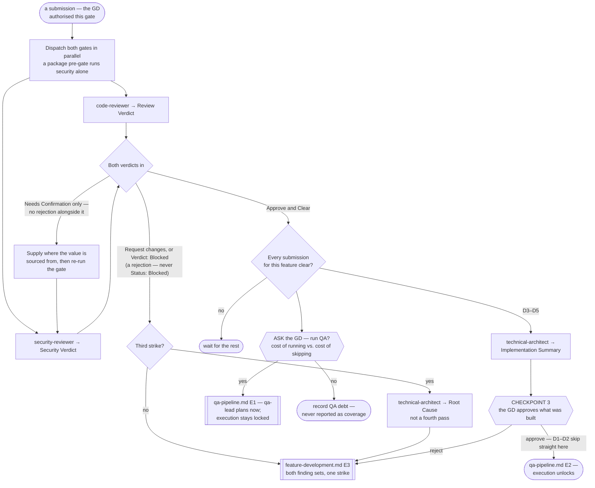

# Review Pipeline

> **Scope: one submission, through both gates, up to Checkpoint 3.** **This file owns the two review gates**;
> the QA pipeline references them rather than describing them a second time.

**This pipeline is optional, and separate from QA.** It never runs on its own initiative: **whichever party
reached the boundary asks** — `feature-development.md` step 1 for a feature's code, `qa-pipeline.md` step 3b
for a test suite, the orchestrator for an ask belonging to no pipeline — states the cost of skipping and
dispatches only on a yes, per `references/optional-gates.md`, which owns the ask's shape. QA is a separate
question with a separate answer; neither gates the other, and it is equally callable alone on code no
pipeline built, per `references/standalone-runs.md`. **The one exception is the supply-chain pre-gate**,
owed regardless of that answer per `security.md` §7 — `references/review-exit-and-custody.md`.

Sequence, loops and checkpoints live here and never in an agent file — see `feature-intake.md` for the full
statement. Every `Routed to:` below is a recommendation this pipeline acts on, not an action the agent took.

**The A-tier reaches this pipeline as a standard of evidence, never as a standard of correctness.** A bug is
a bug at A1 and at A5. What the tier changes is the **verification floor** `Verification done:` is measured
against — V1 at A1, V2 at A3, V3 at A4, V4 at A5. **A2 is V1 only where nothing changed state, and a code
submission always did**, per `task-classification.md` Step 4 and `effort-allocation.md`; reading "V1 at
A1–A2" off the tier alone measures most submissions here against a floor one level too low. **The floor
travels in the dispatch and is never the gate's to derive** — absent it, `code-reviewer` reviews correctness
and *states the floor was not supplied*, which is a gap in the brief, not in the code.

## The agents this pipeline dispatches

| Agent | Tier | Produces | Owns |
|---|---|---|---|
| `code-reviewer` | gate (opus) | **Review Verdict** | Correctness against the spec, bugs, and Shared-Core duplication |
| `security-reviewer` | gate (opus) | **Security Verdict** | Leaked secrets, dangerous files, fraudulent logic |
| `technical-architect` | gate (opus) | **Implementation Summary**, **Root Cause** | The CP3 summary, and the cause after three strikes |

`cto` and `tech-lead-sdk-platform` are reachable but owned elsewhere. **Each of the architect's two
artifacts is a distinct body on its one envelope** — `references/review-exit-and-custody.md` says which.

## Entry points

| Entry | Enters when | Carried in |
|---|---|---|
| **E1** | A submission from `feature-development.md`; **a tech lead's `Fix:`** (I10); **third-party content at the supply-chain pre-gate**, `security-reviewer` alone; or a declined gate opted into later, author still identifiable | Everything below |
| **E2** | The GD asks for an audit of code already in the repo — `orchestrator.md` step 0 sizes it here | The code in scope, and what it is audited against |
| **E3** | A submission with an author but no feature pipeline behind it — the **gated-direct lane**, or test code from `qa-pipeline.md` | The table below, minus the Tech Spec section: the behaviour it was written against, and the strike count, which caps at **2** rather than 3. **The two origins escalate to different places** at that cap — see the routing table |

**One submission per E1 entry.** A feature produces several — the Shared Core, each client agent, each
backend agent, the README — each reviewed on its own; only the checkpoint aggregates.
**E2 has no author, no strike and no CP3.** `code-reviewer` returns `Blocked` without a spec, so either name
what the audit checks against or dispatch only `security-reviewer`, which is contractually callable alone —
the same split the supply-chain pre-gate takes at E1. Its findings are a report, never a rejection, and an
audit inherits no tier: classify it per `task-classification.md`.

Moved to **`references/review-entry-inputs.md`** — every row keyed to a gate's own `If absent`, plus what
differs at **E2** and **E3**. Where each result *leaves* is `references/review-exit-and-custody.md`.

## Pipeline at a glance

Shapes match `feature-intake.md`: `([ ])` entry and stop · `[ ]` an agent or a pipeline action · `{ }` a
decision · `{{ }}` a GD checkpoint · `[[ ]]` another workflow file. Two edges are undrawn: a
**`Status: Blocked`** — ask for exactly the input named, then resume — and a **design flaw**, which goes to
the GD from any step per **I5**.

### Step 1 — the two gates, in parallel

Both agent files state the parallelism from their own side, so it is forced rather than chosen: each is told
the other runs alongside as an independent gate and must not be waited on. Neither duplicates the other's
lens, and neither may edit a file — both return findings for the author.

**Read `Verdict:` and `Status:` as two separate answers, never one for the other.** A review that requests
changes returns `Status: Done` — it finished, and the *verdict* failed; `Status: Rejected` is a mis-dispatch.
And `security-reviewer` carries **`Blocked` in both fields with opposite meanings**, which
`references/review-exit-and-custody.md` tabulates.

`feature-development.md` holds its client fan-out for the **Core submission's** verdict and nothing else, so
that one submission's turnaround is on this pipeline's critical path.

### Step 2 — one decision from two verdicts

The gates do not wait on each other. **This pipeline does wait for both before it acts** — returning the
correctness findings as they land means the author fixes them, resubmits, and only then learns of the
security finding: two round trips and two strikes for one submission's work. A submission is clear only when
`code-reviewer` returns `Approve` **and** `security-reviewer` returns `Clear`; anything else goes back as one
combined dispatch. **A rejection outranks a question**: `Needs Confirmation` arriving beside a
`Request changes` is not the ladder — it travels with the findings, per
`references/review-needs-confirmation.md`.

### Step 3 — the return, and what counts as a strike

The submission goes back to its owning agent — through `feature-development.md` at **E3** from E1, to the
author directly from E3, which places the fix in its serial order rather than jumping the queue. **Every
other kind of return has a door in `references/review-exit-and-custody.md`**, which also holds the custody
table for the fields no `Status:` or `Verdict:` row names.

**One round trip is one strike, whichever gate caused it** — a pattern spanning both gates is still a
pattern, and arguably a sharper one than three of a kind. **Not a strike**: a `Needs Confirmation`, a
`Needs-decision`, or a `Status: Blocked`; each means the gate lacks an input, not that the code is wrong.

**A Continuation Debt Record is one strike, not zero and not three.** The author spent its whole attempt
budget inside one dispatch and returned what it had — a legitimate outcome per `execution-loop.md`, charged
what any round trip costs. Carry its *known non-solutions* into the return brief: re-dispatching an approach
already recorded as failed is the one waste that file calls worse than a novel mistake.

### Step 4 — three strikes

**E1 only.** An **E3** submission caps at two and escapes sideways — no spec to root-cause against and no
ledger to record a reset in; the routing table says where each of its two origins goes.

At the third strike an **E1** submission goes to `technical-architect` rather than a fourth review pass. It
requires **the rejection history and the submitted code**, or it returns `Blocked` — carry every prior
verdict in full, never just the count. What comes back is a cause, not a verdict: a four-field body whose
**known non-solutions travel into the return brief**, per `references/review-exit-and-custody.md`. The fix
re-enters at `feature-development.md` **E3**.

**That return resets the strike count once per submission**, as `Root-cause resets: 1/1`, shared with the QA
bound rather than granted per loop. A second three-strike run stops and goes to the GD as a feature-level
Continuation Debt Record — the ladder and the CP4 bound are in **`references/loop-termination.md`**. When the
stalled submission is the Shared Core the whole feature stalls with it, correctly: everything downstream
would otherwise build against a contract three reviews could not approve.

### Step 5 — Checkpoint 3

Fires **once per feature**, when every submission is clear, and only when this pipeline ran. Moved to
**`references/review-checkpoint-3.md`** — what `technical-architect` compiles and from what, the D1–D2/D3–D5
split, why the A-tier never adds a checkpoint, and why a rejection goes to **E3**, not CP2.

### Step 6 — the handoff to QA, if the GD wants one

**QA is a separate optional pipeline and a separate ask.** Clearing both gates is not an instruction to start
testing: put the question per `references/optional-gates.md`, carrying what was built, the tier, the cost of
a coverage run and the concrete cost of skipping it. A decline is QA debt in
`<state-root>/project-state.md`, never coverage.

**The ask fires when the gates clear, not after CP3** — which is why the diagram branches `Done` two ways
rather than chaining them. On a yes `qa-lead` plans at `qa-pipeline.md` **E1** while CP3 is still with the
GD; **CP3 gates QA *execution***, unlocking at **E2**, and nothing the plan produces is invalidated by a CP3
rejection. D1–D2 has no CP3 and unlocks directly. **Send the floor, not just the tier** — V2 versus V4 is the
difference between a targeted test and an independently corroborated one, and absent it the plan is written
to whatever the agent assumes, which `verification-standards.md` prohibits.

## The `Needs Confirmation` ladder

Moved to **`references/review-needs-confirmation.md`** — the three-ask order, why it is an input to supply
rather than a verdict to escalate, its one bound, the git-history exit to `cto`, and why it does **not** run
when a rejection arrived beside it.

## Routing rules the pipeline owns

| Return | Action |
|---|---|
| `code-reviewer` `Approve` **and** `security-reviewer` `Clear` | The submission is clear. Check whether the feature's others are too |
| `code-reviewer` `Request changes`, or `security-reviewer` **`Verdict: Blocked`** | Combine both finding sets, return to the author at E3, +1 strike. **`Verdict: Blocked` is a rejection** — it arrives on `Status: Done` and is not the row below |
| `security-reviewer` `Needs Confirmation`, **and no rejection beside it** | The ladder above, then re-run that gate. Not a strike. Alongside a `Request changes`, it travels with the findings instead — step 2 |
| `code-reviewer` → `Needs-decision`, `Routed to: technical-architect` | The spec is ambiguous about what "correct" means. A spec problem, not a code one — and not a strike |
| `security-reviewer` → `Needs-decision`, `Routed to: cto` | A secret may be exposed in git history. Straight to `cto`: rotation and history rewrite are the candidates, and the finding already supplies them — this is **not** a `research-decision.md` entry |
| either gate → `Rejected` | Not that gate's submission. Re-dispatch to the right one; never a strike |
| either gate → **`Status: Blocked`** | Supply exactly the input named — **never a strike**, and never the `Verdict: Blocked` two rows up. Bounded at two identical returns |
| either gate → a **design flaw** | **The GD, immediately — invariant I5**, whatever the verdict says. Never folded into CP3 |
| a **`cto` remediation** that is not a git-history exposure — key rotation, a burned credential | To `cto` **alongside** the return to the author, never instead of it. Live, it sat inside a `Recommendation:` |
| a return names **more than one** destination | `Routed to:` is single-valued, so each one after the first is what gets dropped. Record all, act in the stated order |
| any field no row here names | **Route on the envelope, not on `Status:`/`Verdict:` alone** — `references/review-exit-and-custody.md` gives each one a destination |
| a submission arrives with a **Continuation Debt Record** | Review it as it stands and charge one strike. Attach the record's known non-solutions to whatever goes back, so the next cycle does not re-run an approach already proven to fail |
| `code-reviewer` finds `Verification done:` below the submission's verification floor | `Request changes`, and a strike — an unmet floor is an unmet requirement, not a note. It is the author's to close, never QA's to absorb |
| third strike on one **E1** submission | `technical-architect`, with the full rejection history and the code. The return resets the count once — `references/loop-termination.md` |
| second **CP3** rejection of one feature | `technical-architect` for root cause before the drift is re-dispatched; it spends the shared reset. A third stops and goes to the GD |
| second strike on an **E3** submission | The lane was mis-sized, not the author wrong twice — and **where it escalates depends on which E3 origin it is**. *Gated-direct*: `feature-intake.md` **E1** with both rejection sets and the code, per `references/gated-direct-lane.md`. *Test code from `qa-pipeline.md`*: a suite is not a feature request and has no direction to classify — it goes back to `qa-lead` as **unrun coverage**, never into intake |
| a **second** three-strike run on the same submission | Stop. A feature-level Continuation Debt Record to the GD, carrying the architect's first cause and the known non-solutions. Never a fourth review cycle |

- **Rejections are silent to the GD** — the technical loop; they see it at CP3 or through a `Status: Blocked`
  needing their input. **Three things break that silence**: a design flaw (**I5**), a `cto` remediation, and
  any cap in `loop-termination.md` reached. Silence is the default, never the rule.
- **Neither gate edits code, ever** — both are explicitly barred, and the fix belongs to whoever wrote it.
- **Submission identity, the strike count and which verdicts landed are the caller's** — every agent here
  states it cannot hold them across runs.
- **A gate whose mandatory skill did not resolve ran at reduced depth.** A live run found neither gate's
  always-on skill registered; both fell back to reading it by hand. Record what a gate says about its own
  tooling — `tools/verify-workflow-layer.ps1` now checks that every named skill is resolvable.
