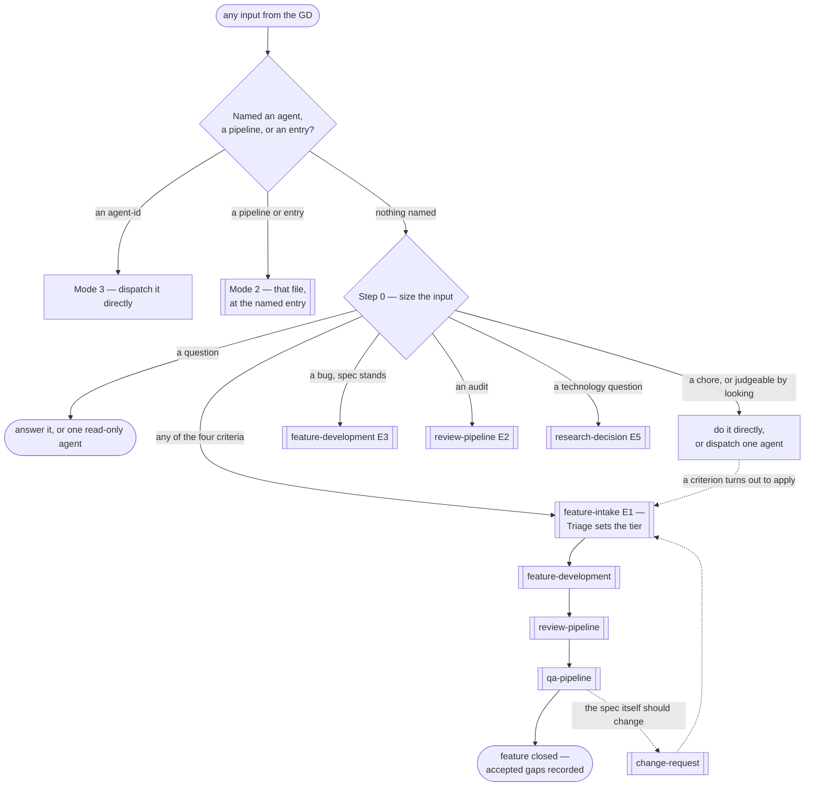

# AI-For-Game-Development

A complete, drop-in **AI game-development team** for [Claude Code](https://claude.com/claude-code), built for
Unity production work. It is not a game and not a library — it is the `.claude/` configuration layer that
turns a single general-purpose assistant into a **27-role studio** with explicit ownership boundaries,
review gates, QA sign-off, and human checkpoints where decisions actually belong to a person.

Everything in this repository is Markdown and JSON. There is no runtime, no build step, and no dependency to
install. You copy `.claude/` into a Unity project and the behaviour changes.

---

## Table of contents

- [Why this exists](#why-this-exists)
- [What you get](#what-you-get)
- [Core concepts](#core-concepts)
- [Installation](#installation)
- [Quick start](#quick-start)
- [How work is routed](#how-work-is-routed)
- [The pipelines](#the-pipelines)
- [Checkpoints and tiers](#checkpoints-and-tiers)
- [The agent roster](#the-agent-roster)
- [The skill library](#the-skill-library)
- [The rules](#the-rules)
- [Slash commands](#slash-commands)
- [Prompt templates](#prompt-templates)
- [State: the ledger and the two locks](#state-the-ledger-and-the-two-locks)
- [Repository layout](#repository-layout)
- [Extending the framework](#extending-the-framework)
- [Project conventions](#project-conventions)
- [Maintenance and verification](#maintenance-and-verification)
- [Known limitations](#known-limitations)

---

## Why this exists

A single assistant working on a Unity codebase fails in predictable ways. It puts a damage formula inside a
`MonoBehaviour`, so the server can never validate it. It calls `GetComponent<T>()` in `Update()`. It reviews
its own code and finds nothing. It reports "tested" when it read the file. It answers a two-line question by
building a subsystem, or builds a subsystem when it should have asked one question first.

None of those are knowledge failures. They are **structure** failures — no separation of authorship from
review, no owner for a decision, no record of what was actually verified, and no gate where a human says yes.

This project supplies that structure:

| Failure | What this framework puts in the way |
|---|---|
| Game rules duplicated between client and server | A hard `Game.Core.*` boundary, plus a `shared-core-boundary-audit` skill that greps for the leak |
| The author reviews their own work | `code-reviewer` and `security-reviewer` are always different agents, run in parallel, and cannot edit files |
| "It works" with nothing behind it | `verification-standards.md` — every QA output must state what it did **not** cover |
| An expensive process applied to a trivial ask | Step 0 sizing: seven lanes, first match wins, zero agent calls to decide |
| A big decision made silently | Four numbered checkpoints where the human, not an agent, is the one who approves |
| A loop that never converges | Every retry is capped and counted: 3 strikes, 3 Advisor rounds, 2 QA rounds, 1 measure-and-confirm |
| Secrets in code, history, or logs | `security.md` — a zero-tolerance prevention baseline plus a detection gate on every submission |

The design premise throughout: **agents are isolated, stateless, silent and alone.** An agent sees only the
prompt it was dispatched with. It cannot remember a previous run, cannot ask a question mid-run, and cannot
dispatch another agent. Every counter, every tier, every "which options were already rejected" therefore
belongs to the caller — which is why this repository has a workflow layer and a ledger at all.

---

## What you get

| Layer | Path | Count | What it does |
|---|---|---|---|
| **Rules** | `.claude/rules/` | 11 files | Auto-loaded into every session. Standards that bind every agent — coding, naming, performance, security, language, commits, reporting |
| **Agents** | `.claude/agents/` | 27 agents in 7 groups | Each is a system prompt defining one role, its scope, its refusals, and its output envelope |
| **Skills** | `.claude/skills/` | 90 skills in 6 groups | On-demand technique packages — a procedure plus reference material, loaded only when a task matches |
| **Workflows** | `.claude/workflows/` | 6 pipelines + orchestrator + ledger + checklist | Sequence, parallelism, retry loops, checkpoints, and cross-run state |
| **Commands** | `.claude/commands/` | 3 slash commands | Self-contained investigations you invoke directly |
| **Docs** | `.claude/docs/` | 2 authoring templates + 7 prompt templates + 20 worked examples | How to extend the framework, and how to brief it |
| **Settings** | `.claude/settings.json` | 35 allow-rules | Pre-approved read-only git commands so routine inspection does not prompt |

**The division of labour is strict**, and it is the thing that keeps files small enough to stay correct:

```
rules/       →  standards that are always true          (auto-loaded, no dispatch needed)
agents/      →  who owns what, and what they refuse     (a system prompt, never documentation)
skills/      →  how a technique works                   (loaded on demand, portable across projects)
workflows/   →  what runs when, and who waits on whom   (never inside an agent file)
```

An agent file that describes sequence is wrong. A workflow file that explains a technique is wrong. A skill
that owns a decision is wrong. Each of the templates in `.claude/docs/` enforces its own side of that line.

---

## Core concepts

### The GD

Throughout this repository, **GD** means the Game Designer / Director — *you*, the human who owns the
product decisions. Agents never decide on the GD's behalf. Four checkpoints exist specifically so that
design direction, spec approval, build acceptance, and feature closure are answered by a person.

### The four escalation criteria

The single most important mechanism in the framework. Before anything is dispatched, the request is measured
against four questions, each answerable by one grep or one read — never by dispatching an agent:

1. Does it touch `Game.Core.*` — a game rule, economy, state machine, cooldown?
2. Does it need more than one role?
3. Is it multiplayer-relevant?
4. Does it rest on something the GD has not decided yet?

**No to all four → do it directly** (0–1 agent calls). **Yes to any → the full pipeline** (8+ calls).

Route by *the cost of being wrong*, not by whether behaviour changed. A Settings button changes behaviour and
you can see whether it is right by looking at it. A damage formula cannot be judged by looking — a
determinism error there stays invisible until client and server diverge months later.

Getting this wrong toward **cheap** is recoverable: escalate the moment a criterion turns out to apply, and
little is lost. Getting it wrong toward **expensive** costs eight agent calls for one call's worth of work.

### Tiers

`technical-architect` triages every feature that reaches the intake pipeline into one of three tiers. The
tier is assigned, never negotiated, and it decides how much process the feature carries.

| Tier | Meaning | Gets |
|---|---|---|
| **Simple** | Single role, no new architecture decision | Direct notes to one agent, both review gates, one final checkpoint |
| **Medium** | Multi-role, follows established patterns, no design risk | Tech Spec, CP2 / CP3 / CP4 |
| **Complex** | New system, cross-cutting, multiplayer-relevant, or genuine uncertainty | Advisor⇄Critic loop, all four checkpoints, architecture diagram, feature `README.md` |

### Tracks

The **backend track** (multiplayer / server-authoritative) is either on or off, and it is *caller state* —
it must travel with every dispatch. `netcode-engineer` and `server-authoritative-engineer` return `Blocked`
rather than assume it is on; `technical-architect` silently assumes client-only when nobody says otherwise,
which is exactly how a multiplayer feature gets a spec it cannot fit.

### The Shared Core boundary

The architectural rule everything else defends:

| Namespace | Contains | May reference `UnityEngine` |
|---|---|---|
| `Game.Core.*` | Every rule that decides an outcome — damage, cooldowns, economy math, state machines | **Never** |
| `Game.Client.*` | MonoBehaviours, scenes, prefabs, UI, rendering, input | Yes |
| `Game.Server.*` | Server-side validation wrapping the Core — backend track only | No |

Shared Core must additionally be **deterministic**: no `UnityEngine.Random`, no wall-clock time, no float
operation that can diverge across platforms. Randomness arrives through an injected seed; time arrives
through an injected clock. This is what lets client prediction and server authority ever agree.

### The output envelope

Every agent returns a structured value, not a chat message. Four fields are mandatory:

```
## [Report name] — <subject>
- Status: Done | Blocked | Rejected | Needs-decision
- Assessed: Direct | Considered | Escalate
- Routed to: <agent-id> | gd | none
- Blocked — needs from caller: <what is missing | none>
[role-specific fields]
```

Two readings trip people up, and both are deliberate:

- **`Blocked` is a correct result, not a failure.** It means a required input was missing. The fix is to
  supply exactly what was named — never to retry with a guess, which produces a verified-looking answer that
  nobody can trust.
- **`Routed to:` is a recommendation, not an action.** Agents cannot dispatch each other. The value is for
  the caller to act on.
- For any review, **read `Verdict:`, never `Status:`.** A completed review that requests changes still
  returns `Status: Done` — the review finished; it is the verdict that failed.

### Self-assessment

Each agent classifies its own task before running it, and declares the level in its output:

| Level | Criterion | Depth |
|---|---|---|
| **Direct** | Unambiguous, established pattern, contained change | Do it, report briefly |
| **Considered** | Several viable approaches, or it touches a contract others depend on | State the approach first, then verify the result |
| **Escalate** | Needs authority this role does not own, or the same task already failed twice | Do not force it — return `Needs-decision` with `Routed to:` |

When uncertain, an agent goes one level **up**, never down.

---

## Installation

### Requirements

- **Claude Code** (CLI, desktop, web, or an IDE extension).
- A **Unity project** — this framework assumes Unity/C# throughout. The bundled `.gitignore` is the standard
  Unity one, which tells you where `.claude/` is meant to sit: at the Unity project root.
- A **Unity Editor MCP server**, if you want the Editor-driven agents (playtesting, Play Mode tests,
  profiling, scene captures) to work. Ten agents declare Editor tools in their `tools:` frontmatter.

### Steps

```bash
# 1. From your Unity project root, bring in the framework layer
git clone https://github.com/<your-fork>/AI-For-Game-Development /tmp/ai-gamedev
cp -r /tmp/ai-gamedev/.claude .

# 2. If you do not already have one, take the Unity .gitignore too
cp /tmp/ai-gamedev/.gitignore .          # skip if your project has its own

# 3. Confirm the rules layer is present — these load automatically every session
ls .claude/rules/ .claude/rules/client/ .claude/rules/qa/

# 4. Start Claude Code in the project root
claude
```

### Connecting the Unity Editor

The Editor-driven agents name their MCP tools **exactly** in frontmatter — for example
`Unity_RunCommand`, `Unity_GetConsoleLogs`, `Unity_SceneView_Capture2DScene`, `Unity_Camera_Capture`. A tool
name is the hard sandbox: a name that does not match your connected server fails silently at call time, and
the agent simply behaves as though it has no Editor.

After connecting your Unity MCP server, verify the names line up:

```bash
# What the agents expect
grep -h '^tools:' .claude/agents/*/*.md | tr ',' '\n' | grep mcp__ | sort -u
```

If your server registers a different prefix or different tool names, update the `tools:` line in each agent
file to match. Nothing else needs changing.

### Without a Unity Editor connection

Everything that does not need the Editor still works, which is most of the framework: triage, Tech Specs,
Shared Core implementation, both review gates, research, architecture decisions, git work, CI/CD authoring,
and all planning-and-reporting roles. What you lose is Play Mode verification, profiling, scene capture, and
in-Editor test execution — and QA will correctly report those as **uncovered** rather than quietly passing.

---

## Quick start

### 1. Ask a question — costs nothing

```
How does the ability cooldown flow through Game.Core.Combat right now?
```

Routes to the direct lane. Answered, or handed to one read-only agent.

### 2. Make a small, visible change — one agent

```
The camera zoom is too slow. Make it feel snappier — it is in
Assets/Scripts/Camera/CameraRig.cs, and I judge it by playing.
```

Judgeable by looking → direct lane. No triage, no Tech Spec, no checkpoint.

### 3. Build a feature — the full pipeline

Copy the skeleton from [`.claude/docs/prompt-templates/single-feature.md`](.claude/docs/prompt-templates/single-feature.md),
fill it in, and send it. The `<escalation_check>` block inside makes the lane decision explicit instead of
leaving it to a silent assumption:

```text
## Objective
Players can cast Fireball: a projectile ability with a mana cost and a cooldown.

## Context
- Where it lives: Game.Core.Combat + Assets/Scripts/Abilities
- Existing systems it must work with: AbilityBar, ManaPool
- Already available to reuse: ObjectPool<T>, VFX_ExplosionSmall

<escalation_check>
Answer each of these in one line BEFORE writing any code, then wait if any is yes:
- Does this touch `Game.Core.*` — a game rule, economy, state machine, cooldown?
- Does it need more than one role?
- Is it multiplayer-relevant?
- Does it rest on something I have not decided yet?
No to all four: build it directly.
Yes to any: say which, state the cost in agent calls, and wait for my go.
</escalation_check>

## Behaviour
- Cooldown 8s, mana cost 30, projectile speed 12 m/s
- Edge case: casting with insufficient mana plays a fail SFX and consumes nothing
- Forbidden: the cooldown must never be evaluated inside a MonoBehaviour
...
```

### 4. Investigate something specific — a slash command

```
/review-code-risks Assets/Scripts/Combat
/plan-test-coverage --spec docs/specs/fireball.md
/investigate-device-crash android com.yourstudio.yourgame
```

### 5. Call one role directly — your cost override

```
Have unity-engineer wire the Fireball prefab into the player rig.
```

Naming an `agent-id` replaces the routing default outright. The work still accrues review debt in the
ledger, but nothing blocks — the judgement was yours to make.

---

## How work is routed

Every input passes through **Step 0**, which runs before anything is dispatched, costs zero agent calls, and
is stated out loud so you can redirect immediately. The table is read top-down and **the first match wins** —
several rows can describe one input, and the cheaper row is listed first on purpose.

| Input | Handling | Agent calls |
|---|---|---|
| A question, or an ask to explain | Answer it, or one read-only agent | 0–1 |
| A chore — rename, comment, format, config | Directly | 0–1 |
| **Judgeable by looking** — UI, layout, a tuned value, an asset, one local single-role behaviour | Directly, or one agent. **No pipeline** | 0–1 |
| A bug in something the pipeline built, where its approved spec still stands | `feature-development.md` **E3** → review | 3 |
| An audit of code already in the repo | `review-pipeline.md` **E2** | 1–2 |
| A technology question, no feature attached | `research-decision.md` **E5** | 1–4 |
| Any of the four escalation criteria | `feature-intake.md` **E1** — Triage sets the tier | 8+ |

### The three modes

| Mode | You say | What runs | Cost |
|---|---|---|---|
| **1 — full run** | A feature request, nothing named | Step 0 picks a lane; that lane runs end to end | Whatever the lane costs |
| **2 — entry point** | You name a pipeline, or an entry in one | That file, from that entry, with the inputs its entry table names | One pipeline |
| **3 — direct agent** | You name one or more `agent-id`s | Exactly those, in the order given, serialised where a lock applies | One call each |

The router never asks which mode you want. It infers, then **states what it picked** — the same way triage
is assigned rather than put to a vote. You override by naming an agent or an entry point.

### The whole picture



---

## The pipelines

Six files under `.claude/workflows/`, each owning one span of the lifecycle. They are **not** auto-loaded —
`.claude/rules/orchestration.md` is the auto-loaded rule that tells the session to read them. Each has
numbered entry points so a re-entry has an address and does not restart the feature from zero.

### 1. `feature-intake.md` — a request, up to an approved Tech Spec

Dispatches `technical-architect`, `advisor`, `critic`.

| Step | What happens |
|---|---|
| 1 | The request is forwarded **verbatim**, with track state attached — never paraphrased or pre-classified |
| 2 | **Triage** — unconditional and first. Tier is assigned, not confirmed with the GD, because tier decides which checkpoints apply |
| 3–4 | **Advisor⇄Critic loop** (Complex only): `advisor` widens the options, the GD picks a direction, `critic` attacks it, the GD decides. Hard cap **3 rounds** → **CP1** |
| 5 | **Research branch** (any tier) when the request needs a capability the project lacks |
| 6 | **Tech Spec** — module boundaries, client-server contract, architecture diagram, per-agent task breakdown → **CP2** |

The loop is **GD-in-the-middle**, not agent-to-agent: `advisor` never recommends and `critic` only attacks a
direction that already exists, so the two can never run in the same round. Reaching round 3 without a lock
**stops the pipeline** and reports non-convergence — it is not a failure to retry past.

The research skip test is the load-bearing part of step 5: skip it only if you can **name** the package,
first-party API, or existing system that covers the capability. If you cannot name it, you are guessing —
branch. A skip is recorded and travels to CP2, so a wrong call is caught while the spec is still on the table.

### 2. `research-decision.md` — a capability the project lacks, up to a settled decision

Dispatches `researcher`, `rd-engineer`, `cto`. Six entry points.

| Lane | Observable at entry | Steps | What comes back |
|---|---|---|---|
| **Direct** | One capability, nothing strategic, nothing to measure | 1 | A named solution pinned to a version, with licence and caveats |
| **Considered** | Several plausible approaches, or the first-party answer is missing/deprecated | 1 → 4 | A ranked shortlist, and the decision that picked one |
| **Escalate** | Hard to reverse, a paid commitment, or a number nobody can settle by reading | 1 → 2 → 3 → 4 → 5 | A measured decision, and the standard it sets |

Three rules hold this pipeline together. **`cto` is never entered without a candidate set** — it is barred
from returning another round of open options, so research always runs first. **A spike is never
auto-dispatched** — `rd-engineer` activates only on an explicit GD summon, and a recommendation is never
converted into a dispatch. And **one measure-and-confirm cycle** is the cap: still unresolved after it,
`cto` returns `Needs-decision, Routed to: gd`.

The boundary against `advisor` is deliberate and load-bearing:

| The question | Owner |
|---|---|
| How have comparable games solved this **design** problem? | `advisor` |
| What **technology** exists today for a capability we lack? | `researcher` |

### 3. `feature-development.md` — an approved spec, up to code at the review gate

Dispatches the nine implementing roles. Three entry points (**E1** spec approved, **E2** Simple tier,
**E3** a defect returns).

**Shared Core first**, and it is forced rather than preferred: four downstream agents return `Blocked`
without the Core's public contract. The client fan-out waits on the **Core submission's review verdict and
nothing else** — a wrong contract otherwise gets rebuilt by four agents instead of one.

**The client fan-out is serial**, for three compounding reasons: one Unity Editor, three of these agents
hold Editor tools against it; any `.cs` write triggers a domain reload that kills the Play Mode session
another agent is verifying in; and agents cannot coordinate with each other. Three escapes were tested and
all fail — a worktree per agent splits files but not the single Editor process; "author now, verify later"
fails because each of those agents is *required* to verify in Play Mode; extra Editor instances need an
explicit GD request. Review is the one thing that genuinely runs concurrently, because neither gate holds
Editor tools and neither writes anything.

Order follows dependency:

| Order | Agent | Why here |
|---|---|---|
| 1 | `technical-artist` | Authors the effect that the next agent integrates |
| 2 | `unity-engineer` | Integrates the Core and those effects; exposes state the UI may bind to |
| 3 | `ui-ux-programmer` | Binds to a Core type or to that integration, so it goes last |
| any | `tech-lead-sdk-platform` | Depends on nothing here |

Backend track, when on: **protocol before authority** — `server-authoritative-engineer` blocks without
`netcode-engineer`'s message contract. The Core's shape determines the wire format, never the reverse.

Because agents cannot see each other's returns, **a field this pipeline forgets to forward is a field that
does not exist.** The handoff matrix names each one — `Public contract:`, `Determinism:`,
`Assumptions and known limitations:`, `Authored:`, `Pipeline:`, `Core calls used:`, `Message contract:`.

### 4. `review-pipeline.md` — one submission, through both gates, up to CP3

Dispatches `code-reviewer`, `security-reviewer`, `technical-architect`.

Both gates run **in parallel** and neither may edit a file. The pipeline **waits for both** before acting:
returning correctness findings the moment they land means the author fixes them, resubmits, and only then
learns of the security finding — two round trips and two strikes for one submission's worth of work.

A submission is clear only when `code-reviewer` returns `Approve` **and** `security-reviewer` returns
`Clear`. Anything else goes back as one combined dispatch, +1 strike.

| Round | What happens |
|---|---|
| Strike 1–2 | Back to the author with both finding sets |
| Strike 2 | Also fires the agent's own **Escalate** criterion — routes to a tech lead |
| Strike 3 | To `technical-architect` for **root cause**, with the full rejection history — not a fourth review pass |

A `Needs Confirmation` from the security gate is **not** a strike. It means the gate cannot tell a real
secret from a public identifier, and there is a fixed ladder for resolving it: ask
`tech-lead-sdk-platform` if it is an SDK integration, else the authoring agent, else the GD. Then re-run the
gate. Never guess in either direction.

**One submission per agent return, not one per feature.** A feature produces several — the Core, each client
agent, each backend agent, and the README — and each is reviewed on its own. Only **CP3** aggregates.

### 5. `qa-pipeline.md` — a feature that cleared review, through CP4

Dispatches `qa-lead`, `qa-automation-engineer`, `playtest-tester`, `performance-qa-engineer`,
`build-verification-tester`, `producer`.

`qa-lead` plans **first and early** — planning needs only the Tech Spec and the tier, so it runs alongside
review and its assignment is ready the moment CP3 clears. **CP3 gates QA execution, never QA planning.**

What it returns is the contract for everything below: a **coverage assignment** naming which `agent-id`
covers what, and the **exit criteria** its own sign-off will be judged against. Dispatch only the agents it
names — unasked-for coverage is the same waste as speculative code.

Three of the four executors are serial (they share the Editor). `build-verification-tester` holds **no
Editor tooling at all**, so it runs alongside them — but it serialises with `performance-qa-engineer`
whenever both target the same physical device, because a walkthrough over adb and a Development Build
profiled over adb are the same wire.

**The device lane exists only when a build does.** `build-run-engineer` refuses anything but an explicit GD
request, so no build means no device lane. When there is one, three things happen in a fixed order: cases are
**derived** from the spec via `/plan-test-coverage` (never improvised), the device is **confirmed before the
artifact is touched**, and a crash **stops that case's path** with logs pulled rather than being silently
relaunched past.

This lane is the only thing in the project that can satisfy the *"it works on the target platform"* claim.
Everything else is Editor-bound and is labelled **indicative** every single time it is quoted.

`qa-lead` then signs off against the exit criteria **it wrote itself**, and never returns `Signed off` while
a gap remains. That refusal is the point of the role. A gap that cannot be closed goes to `producer` and
**CP4**, where only the GD can accept it — and an accepted gap is written into the feature's known
limitations *before* closure is reported, or "nobody checked" becomes indistinguishable from "QA passed".

### 6. `change-request.md` — a change to a spec the GD already approved

Dispatches `technical-architect`, `producer`.

Step 1 is **halt before classifying**: stop dispatching new work against the spec under question the moment
the change arrives, before the architect has said anything. Agents already running **cannot be recalled** —
they will finish and return work written against the old spec.

| Severity | Criterion | Reopens |
|---|---|---|
| **Minor** | Module boundaries and interfaces in the spec are unchanged | Nothing — the spec is updated in place, `producer` carries it next cycle |
| **Moderate** | The spec's structure changes, but the direction and its assumptions still hold | **CP2** |
| **Major** | It invalidates an assumption `critic` stress-tested, or a risk the GD accepted at CP1 | **CP1** |

**Minor is the one to get wrong** — it is the only severity that never reaches a checkpoint, so a
misclassification changes an approved spec without the GD seeing it. If a boundary or an interface moves at
all, it is Moderate. The size of the diff is not the criterion, and neither is how obvious it looks.

A change request **resets the strike count** on every submission it invalidates: those submissions are now
measured against a different spec, and a carried-over strike would charge the author for the GD's change.

---

## Checkpoints and tiers

Four checkpoints. Each is a point where an **agent stops and a person answers.**

| CP | Owned by | The GD approves | Rejecting means |
|---|---|---|---|
| **1** | `feature-intake.md` | The locked direction, and which risks they accept and live with | Back into the Advisor⇄Critic loop, within the 3-round cap |
| **2** | `feature-intake.md` | The Tech Spec | Back to `technical-architect` for revision — **not** back to CP1 |
| **3** | `review-pipeline.md` | What was actually built, via the Implementation Summary | Named drift back to its author — **not** back to CP2 |
| **4** | `qa-pipeline.md` | Closing the feature, given what QA actually found | Splits: drift → a defect; "I want something else now" → a change request |

| Tier | CP1 | CP2 | CP3 | CP4 |
|---|---|---|---|---|
| **Simple** | skip | skip | merged into CP4 | ✔ |
| **Medium** | skip | ✔ | ✔ | ✔ |
| **Complex** | ✔ | ✔ | ✔ | ✔ |

The rollback targets are precise on purpose. CP2 is the rollback target for a **spec** change; a CP3
rejection says the code drifted from a spec that still stands, which is a different problem with a different
owner.

---

## The agent roster

27 agents in 7 groups. Model tier is matched to the hardest level the role actually reaches — a role promoted
a tier it does not need is a standing cost paid on every dispatch.

### Architecture (4)

| Agent | Model | Owns |
|---|---|---|
| [`technical-architect`](.claude/agents/architecture/technical-architect.md) | opus | Triage, Tech Spec, module boundaries, client-server contract, three-strikes root cause, CP3 summary |
| [`cto`](.claude/agents/architecture/cto.md) | opus | Strategic, hard-to-reverse technology choices; the top of the technical escalation chain |
| [`researcher`](.claude/agents/architecture/researcher.md) | sonnet | Sourced, dated research into technology the project lacks — recommends, never decides |
| [`rd-engineer`](.claude/agents/architecture/rd-engineer.md) | sonnet | Disposable spikes producing measured evidence — GD-summoned only |

### Client (7)

| Agent | Model | Owns |
|---|---|---|
| [`csharp-engineer`](.claude/agents/client/csharp-engineer.md) | sonnet | `Game.Core.*` — the rules, and the public contract every other layer builds against |
| [`unity-engineer`](.claude/agents/client/unity-engineer.md) | sonnet | Scenes, prefabs, physics, rendering, assets, input, the routine optimization pass |
| [`ui-ux-programmer`](.claude/agents/client/ui-ux-programmer.md) | sonnet | Screens and their binding to state they read but never own |
| [`technical-artist`](.claude/agents/client/technical-artist.md) | sonnet | Shaders, VFX, and compute shaders whose deliverable is a visual effect |
| [`tech-lead-csharp-unity`](.claude/agents/client/tech-lead-csharp-unity.md) | opus | Architecture-level C#/Unity problems past routine debugging — escalation only |
| [`tech-lead-performance`](.claude/agents/client/tech-lead-performance.md) | opus | Deep memory, GPU, native, Job System/Burst/DOTS — escalation only |
| [`tech-lead-sdk-platform`](.claude/agents/client/tech-lead-sdk-platform.md) | opus | Every third-party SDK and store integration, including policy compliance |

### Backend (2) — active only when the multiplayer track is on

| Agent | Model | Owns |
|---|---|---|
| [`netcode-engineer`](.claude/agents/backend/netcode-engineer.md) | sonnet | Prediction/reconciliation, lag compensation, message format, tick rate, transport |
| [`server-authoritative-engineer`](.claude/agents/backend/server-authoritative-engineer.md) | sonnet | Server-side validation wrapping the Core — never reimplements a rule |

### QA (7)

| Agent | Model | Owns |
|---|---|---|
| [`qa-lead`](.claude/agents/qa/qa-lead.md) | opus | QA scope, exit criteria, and the sign-off verdict. Judges; never dispatches, never executes |
| [`code-reviewer`](.claude/agents/qa/code-reviewer.md) | opus | Correctness against the spec, bugs, and Shared-Core duplication |
| [`security-reviewer`](.claude/agents/qa/security-reviewer.md) | opus | Leaked secrets, dangerous files, fraudulent logic — and *not* false-flagging public SDK ids |
| [`qa-automation-engineer`](.claude/agents/qa/qa-automation-engineer.md) | sonnet | Edit Mode + Play Mode tests, including packet-loss and latency cases |
| [`playtest-tester`](.claude/agents/qa/playtest-tester.md) | sonnet | GDD scenarios played by hand in the Editor; design-flaw detection |
| [`performance-qa-engineer`](.claude/agents/qa/performance-qa-engineer.md) | sonnet | Frame time, GC, memory, draw calls measured against a stated budget — never fixes |
| [`build-verification-tester`](.claude/agents/qa/build-verification-tester.md) | sonnet | The real artifact: startup, critical paths, the suite on the Player, cases walked on a device |

### DevOps (3)

| Agent | Model | Owns |
|---|---|---|
| [`git-expert`](.claude/agents/devops/git-expert.md) | opus | Every git operation, unrecoverable-looking states, and commit forensics |
| [`ci-cd-engineer`](.claude/agents/devops/ci-cd-engineer.md) | sonnet | Jenkins pipelines, Unity batchmode scripts, Fastlane lanes, Firebase distribution — authors, never executes |
| [`build-run-engineer`](.claude/agents/devops/build-run-engineer.md) | haiku | Platform builds and multi-instance Editor runs — **explicit GD request only** |

### Leadership (3)

| Agent | Model | Owns |
|---|---|---|
| [`advisor`](.claude/agents/leadership/advisor.md) | sonnet | Widening the option space — never recommends, never ranks |
| [`critic`](.claude/agents/leadership/critic.md) | opus | Attacking a direction the GD leans toward, ranked by severity |
| [`producer`](.claude/agents/leadership/producer.md) | sonnet | Aggregating status, defects and risk into one report — synthesizes, never judges |

### Live-Ops (1)

| Agent | Model | Owns |
|---|---|---|
| [`crash-anr-investigator`](.claude/agents/live-ops/crash-anr-investigator.md) | opus | Crashes and ANRs from **released production telemetry only** — Play Console, Crashlytics, App Store Connect |

> A local device trace is **not** this agent's job — it declines one by contract. Use
> `/investigate-device-crash` for a device you are holding.

### Tool sandboxes that matter

| Constraint | Who | Why |
|---|---|---|
| **No `Write`/`Edit`** | 13 agents | Reports, measurements and verdicts leave no source. Direct dispatch is their normal mode; no review debt |
| **Editor tools** | 10 agents | Only one may run at a time, project-wide — one Unity Editor process |
| **Device tools** | 2 agents | Only one may run at a time, project-wide — one adb wire |
| **Reviewers cannot edit** | `code-reviewer`, `security-reviewer` | The fix belongs to whoever wrote the code, always |

The `tools:` list is the **hard sandbox**. Guardrail prose is only advisory — a dangerous capability is
removed by omitting the tool, never by writing a rule that asks the agent not to use it.

---

## The skill library

90 skills. A skill is a technique package: a procedure in `SKILL.md`, plus `references/*.md` files that load
only when the procedure cites them. The `description` frontmatter is the *only* text read when deciding
whether to open a skill, so it is written as a retrieval index — distinctive symbols first, then task shapes,
then an explicit "Not for:" boundary list.

### Client (57) — the Unity and .NET surface

| Area | Skills |
|---|---|
| **Rendering** | `render-pipeline-urp-hdrp`, `unity-urp-rendering`, `unity-hdrp-rendering`, `unity-lighting`, `unity-post-processing`, `shader-authoring`, `compute-shader-vfx`, `vfx-particle-authoring` |
| **UI** | `ugui`, `ui-toolkit`, `flexalon-layouts`, `osa-optimized-scrollview-adapter`, `dotween-tweening`, `litmotion-tweening` |
| **Physics** | `unity-3d-physics`, `unity-2d-physics`, `unity-physics`, `unity-navmesh-navigation` |
| **2D / 3D content** | `unity-2d-sprite`, `unity-2d-spriteshape`, `unity-tilemap`, `unity-3d-mesh`, `spine-animation`, `unity-animation` |
| **Camera & audio** | `unity-camera-fundamentals`, `unity-cinemachine-authoring`, `unity-audio-mixer` |
| **DOTS** | `unity-ecs-architecture`, `unity-entities-graphics`, `unity-job-system-and-burst`, `unity-burst-compiler`, `unity-collections`, `unity-mathematics`, `netcode-for-entities` |
| **Networking** | `netcode-for-gameobjects`, `unity-transport`, `magiconion-rpc-networking`, `memorypack-serialization` |
| **Architecture** | `vcontainer-dependency-injection`, `unity-scriptableobject-architecture`, `stateless-state-machines`, `messagepipe-event-messaging`, `r3-reactive-extensions` |
| **Performance** | `unity-profiler-diagnostics`, `zlinq-zero-allocation-linq`, `zstring-zero-allocation-strings`, `dotnet-memory-and-collections`, `dotnet-concurrency-and-async`, `unitask-async-programming` |
| **Tooling & data** | `odin-inspector`, `unity-addressables`, `unity-input-system`, `unity-test-framework`, `csvhelper-csv-data`, `nrandom-random-generation`, `source-generator-authoring`, `roslyn-analyzer-codefix` |

### QA (7)

`shared-core-boundary-audit` · `secret-and-supply-chain-scan` · `risk-based-test-planning` ·
`playtest-scenario-execution` · `performance-budget-verification` · `device-test-walkthrough` ·
`build-fault-triage`

`shared-core-boundary-audit` is the one to know: it converts the project's single unabsorbable defect class —
a rule that exists in two places, or a Core that cannot produce the same answer twice — into a mechanical
grep that runs the same way every time, rather than a judgement that depends on how carefully one person
happened to read a diff.

### Architecture (10)

`netcode-architecture-decision` · `backend-build-vs-buy` · `anti-cheat-strategy` ·
`ad-mediation-monetization-platform` · `analytics-telemetry-platform` · `live-ops-content-pipeline` ·
`cross-platform-expansion-assessment` · `tech-vendor-dependency-risk-assessment` ·
`tco-reversibility-scoring` · `engineering-standard-adr-authoring`

### DevOps (9)

`git-safety-anchor` · `git-recovery` · `git-forensics` · `git-unity-repo` · `jenkins-pipeline-authoring` ·
`unity-batchmode-cli` · `fastlane-mobile-delivery` · `firebase-app-distribution` ·
`ci-pipeline-failure-triage`

### Live-Ops (3)

`crash-anr-fault-domain-triage` · `crash-anr-symbolication` · `crash-anr-reporting-gate`

### Research (4)

`technology-scouting-sweep` · `source-credibility-grading` · `practical-fit-screening` ·
`solution-comparison-report`

---

## The rules

Everything under `.claude/rules/**` is **auto-loaded into every session**. This is why the framework works
at all without you invoking anything: the standards are always present, and `orchestration.md` is what gives
the workflow layer its ignition.

### Always-on, every agent

| File | What it governs |
|---|---|
| [`orchestration.md`](.claude/rules/orchestration.md) | Read the router and the ledger before dispatching. Seven invariants including the Editor lock and the device lock |
| [`language-and-comments.md`](.claude/rules/language-and-comments.md) | Input may be Vietnamese/English/mixed. **All internal work is English.** The final reply to the GD is **always Vietnamese** |
| [`security.md`](.claude/rules/security.md) | Zero tolerance, every scope. Eight violation classes, and the allowlist of genuinely public identifiers |
| [`implementation-note.md`](.claude/rules/implementation-note.md) | The six-field handoff every submission carries to a review gate |
| [`commit-message.md`](.claude/rules/commit-message.md) | English imperative subject, blank line, body explaining **why**. No Conventional Commits prefixes |

### Client track

| File | What it governs |
|---|---|
| [`coding-principles.md`](.claude/rules/client/coding-principles.md) | SOLID, KISS, YAGNI, Boy Scout, Law of Demeter, POLA, SLAP. Shared Core integrity. `this.` qualification. Null safety, including Unity's fake-null idiom |
| [`naming-convention.md`](.claude/rules/client/naming-convention.md) | The full casing table, the Unity Inspector-serialized camelCase override, and the asset naming table |
| [`performance-and-algorithms.md`](.claude/rules/client/performance-and-algorithms.md) | Data-structure selection, memory discipline, complexity discipline, and the Unity-specific optimization catalogue |
| [`feature-documentation.md`](.claude/rules/client/feature-documentation.md) | The seven-section feature `README.md` — **Complex tier only**, explicitly exempting Simple and Medium |

### QA track

| File | What it governs |
|---|---|
| [`verification-standards.md`](.claude/rules/qa/verification-standards.md) | When a claim counts as verified. Coverage claimed is coverage owed |
| [`defect-reporting.md`](.claude/rules/qa/defect-reporting.md) | The five mandatory elements of a finding, the severity ladder, and defect vs. design flaw vs. as-designed |

### Three rules worth reading first

**`this.` qualification is mandatory** — `this.health -= damage;`, `this.Attack();`. This deliberately
diverges from the common C# default of omitting it. The reason is Unity-specific: in a long `Update()` or
coroutine body, a local variable frequently shares a name shape with a field, and the prefix makes
instance-member access visually distinct at a glance.

**Unity null checks use the implicit `bool`, plain C# uses `!= null`** —

```csharp
if (this.ballRigidbody)      // UnityEngine.Object-derived → implicit bool
{
}

if (this.combatState != null) // plain C# / Game.Core.* type → explicit comparison
{
}
```

Both give the correct destroyed-object result, but the direct `bool` check is the cheaper path at runtime and
is Unity's own idiom. The exception is narrow and literal — never apply it to a `Game.Core.*` type, an
interface, or a `string`.

**Every QA output must state what it did not cover.** The `Not covered` / `Not measured` field is mandatory
and is never `none` unless coverage genuinely was exhaustive. A report that lists only what passed is read
downstream as "this feature was checked", and the gap between what was exercised and what the reader assumes
was exercised is exactly where shipped defects live.

---

## Slash commands

Three self-contained investigations. Each reports and routes; **none of them edits code.**

| Command | Arguments | What it does |
|---|---|---|
| [`/review-code-risks`](.claude/commands/review-code-risks.md) | `[file-or-directory-path...]` | Static review of C#/Unity code for runtime performance, memory efficiency, and hidden crash/ANR risk. Concise report, fix direction only |
| [`/plan-test-coverage`](.claude/commands/plan-test-coverage.md) | `[paths...] [--spec doc]` | Derives a full test case list (normal + edge), a manual test flow, and cross-feature impact analysis. Produces cases; never decides which are owed |
| [`/investigate-device-crash`](.claude/commands/investigate-device-crash.md) | `[android\|ios] [package-id]` | Investigates a crash or ANR on the **currently connected device** and reports bug, root cause, and fix direction |

`/plan-test-coverage` is also a pipeline component: `qa-pipeline.md` step 2b uses it to derive the per-case
list for a device walkthrough, filtered to what `qa-lead` already assigned.

---

## Prompt templates

Seven templates in `.claude/docs/prompt-templates/`, split by **purpose** rather than by subject. A
multiplayer feature and a settings screen use the same template — they differ in which optional block you
keep.

| You want to | Template | Lane | Cost |
|---|---|---|---|
| Understand code, rename, tune a value, write something small | `basic-request.md` | direct | 0–1 |
| Add **one** feature, any size | `single-feature.md` | direct **or** `feature-intake.md` E1 — `<escalation_check>` decides | 0–1 or 8+ |
| Add a **batch** of features | `multi-feature.md` | plan first, then loop `single-feature` per item | 1–3, then n |
| Build a throwaway prototype, or measure feasibility | `prototype.md` | direct | 1–3 |
| Implement from an existing GDD / spec / vendor doc | `from-documents.md` | map first, then `feature-intake.md` E1 | 1–3, then 8+ |
| Fix a reproducible bug | `bugfix-debug.md` | direct, or `feature-development.md` E3 | 0–3 |
| Investigate a rare, non-reproducible fault | `rare-case.md` | investigate first, do not fix yet | 1–3 |

### The six-part frame

Every template is a variant of the same six parts. A broken prompt is almost always a **missing part**, not
an insufficiently long one.

| Part | Answers | How it fails when missing |
|---|---|---|
| `Objective` | What is different once this is done? | Claude optimizes for what it guesses you wanted — convincingly |
| `Context` | Where does this live, on what, what already exists? | It re-finds what you already knew, or edits the wrong same-named file |
| `Scope` | What may be touched, and what is off limits? | Changes spread into unrelated code and the review triples |
| `Constraints` | Which rules, which budgets, what is banned? | It runs, but violates a convention, and gets redone |
| `Deliverable` | What shape comes back? | You get prose when you needed a diff, or code when you needed an assessment |
| `Done when` | What decides that this is finished? | No basis for saying "not done" — every disagreement becomes a matter of taste |

`Scope` and `Done when` are the two most often omitted, and they are precisely the two most expensive to omit.

### Format contract

| Form | Use for | Why |
|---|---|---|
| **Markdown** | All instruction: headings, bullets, tables | It is what Claude Code reads every day. No token cost for syntax, and easy to hand-edit |
| **XML tags** | Anything **pasted verbatim**: logs, spec excerpts, existing code, measurements | The line between "this is data" and "this is a command" blurs in a long pasted block. Tags are that quotation mark |
| **JSON** | Only when the content genuinely is tabular data | It forces escaping, one missing comma breaks the block, and it flattens prose into an unreadable single line |

### 20 worked examples

`.claude/docs/prompt-templates/examples/` contains 20 fully-filled examples — every bracket replaced, for a
hypothetical Unity project. Read them for **structure** (which blocks were kept, which deleted, and why), not
for values. `.claude/docs/prompt-templates/base-practices/` holds the same seven skeletons as plain `.txt`
for copy-paste.

> Note: `prompt-templates/` is written in Vietnamese, matching the GD-facing language protocol. The templates'
> section headings stay in English, and what you fill in may be either language.

---

## State: the ledger and the two locks

`.claude/workflows/state/ledger.md` holds the cross-run state **no agent can hold.** It is written **at each
transition**, not at the end of a run — a counter that survives only in conversation context is not a safety
mechanism.

| State | Protects against |
|---|---|
| Feature · tier · track | `technical-architect` silently assuming client-only; `qa-lead` silently assuming Medium |
| Checkpoint position | Not knowing which CP a change request reopens |
| Submission id · strikes · QA-fails | The three-strikes rule and the two-round passes-review/fails-QA bound never firing |
| Advisor⇄Critic round · options ruled out | Blowing the 3-round cap; `advisor` re-proposing an option already rejected |
| Verdicts landed | Acting on one verdict and paying two round trips for one submission |
| Performance baseline | A run silently *becoming* the baseline |
| **Open review debt** | Unreviewed source shipping, indistinguishable from reviewed source |
| Reporting period | `producer` duplicating or missing status |

### Review debt

Any agent holding `Write`/`Edit` that is dispatched outside a review gate accrues **review debt**. It is
**recorded, never enforced** — it blocks no dispatch and settles in batch at the next natural gate. Recording
costs nothing; it is simply the difference between knowing what is unreviewed and not knowing.

### The Editor lock

One Unity Editor process, project-wide. Ten agents hold Editor tools against it. **Two holders never run at
once**, whatever mode started each — a case no single pipeline can see, which is why the lock lives in the
ledger rather than in a workflow.

### The device lock

One physical device, project-wide. `build-verification-tester` walking cases over adb and
`performance-qa-engineer` profiling a Development Build over adb are the same wire. Independent of the Editor
lock — one agent can hold both.

---

## Repository layout

```
.
├── .claude/
│   ├── agents/                     # 27 role definitions, 7 groups
│   │   ├── architecture/           #   4 — architect, cto, researcher, rd-engineer
│   │   ├── backend/                #   2 — netcode, server authority
│   │   ├── client/                 #   7 — core, unity, ui, tech art, 3 tech leads
│   │   ├── devops/                 #   3 — git, ci/cd, build-run
│   │   ├── leadership/             #   3 — advisor, critic, producer
│   │   ├── live-ops/               #   1 — crash/ANR investigator
│   │   └── qa/                     #   7 — qa lead, 2 review gates, 4 executors
│   │
│   ├── commands/                   # 3 slash commands
│   │
│   ├── docs/
│   │   ├── agent-template.md       # the 7-section agent skeleton + post-write checklist
│   │   ├── skill-template.md       # the 8-section skill skeleton + budget rules
│   │   ├── skill-reference-template.md
│   │   └── prompt-templates/       # 7 templates, 7 .txt skeletons, 20 worked examples
│   │
│   ├── rules/                      # 11 auto-loaded rule files
│   │   ├── client/                 #   coding, naming, performance, feature docs
│   │   ├── qa/                     #   verification standards, defect reporting
│   │   ├── commit-message.md
│   │   ├── implementation-note.md
│   │   ├── language-and-comments.md
│   │   ├── orchestration.md        #   the ignition rule for the workflow layer
│   │   └── security.md
│   │
│   ├── skills/                     # 90 skills, 6 groups
│   │   ├── architecture/  (10)
│   │   ├── client/        (57)
│   │   ├── devops/        (9)
│   │   ├── live-ops/      (3)
│   │   ├── qa/            (7)
│   │   └── research/      (4)
│   │
│   ├── workflows/
│   │   ├── orchestrator.md         # the router — Step 0, the 3 modes, the entry index
│   │   ├── feature-intake.md       # request → approved Tech Spec
│   │   ├── research-decision.md    # a missing capability → a settled decision
│   │   ├── feature-development.md  # approved spec → code at the gate
│   │   ├── review-pipeline.md      # one submission → both gates → CP3
│   │   ├── qa-pipeline.md          # cleared review → QA → CP4
│   │   ├── change-request.md       # a spec change → its blast radius
│   │   ├── state/ledger.md         # cross-run state, the two locks, review debt
│   │   └── workflow-checklist.md   # authoring progress (exempt from the 200-line cap)
│   │
│   └── settings.json               # 35 pre-approved read-only git commands
│
├── .gitignore                      # the standard Unity ignore set
└── README.md                       # this file
```

**This repository contains no Unity project and no C# source.** It is the configuration layer only. The
`.gitignore` is Unity's because the layer is designed to sit at a Unity project root.

---

## Extending the framework

### Adding an agent

Copy the skeleton in [`.claude/docs/agent-template.md`](.claude/docs/agent-template.md) to
`.claude/agents/<group>/<agent-name>.md`. All **7 sections** stay, even when a slot needs one line —
presence is what the checklist verifies; depth is proportional to the role.

Before writing anything, check the existing agents for an overlapping owner. **Two agents must never own the
same decision.** Extend the current owner rather than adding a rival.

The frontmatter is exact — exact keys, exact order:

```yaml
---
name: agent-name-in-kebab-case   # identical to the filename, unique across .claude/agents/
description: "What it does + when to delegate + 2-4 quoted triggers, ending with
  `Not for: <agent-id> owns <scope>.` for every adjacent role."
model: sonnet                    # fable | opus | sonnet | haiku | inherit
tools: Read, Grep, Glob          # comma-separated, NOT a YAML array
color: blue                      # one colour per group, from the registry
---
```

`description` is the **only** text the dispatcher reads. A boundary stated in the body cannot prevent a wrong
dispatch — it has to be in the description.

Model selection matches the **hardest level the role reaches in section 4**, not how important the role
sounds:

| `model` | Pick when the role's peak level is |
|---|---|
| `fable` | **Escalate** on long-horizon, high-stakes reasoning where a wrong call is expensive and hard to detect |
| `opus` | **Escalate** — owns hard-to-reverse decisions, or is a gate whose miss costs a full cycle downstream |
| `sonnet` | **Considered** — real work against a spec, several viable approaches, known boundaries |
| `haiku` | **Direct** — narrow, high-volume, mechanical work |
| `inherit` | Nothing. It resolves to the session's model and is not a cost control |

Then run the post-write checks at the bottom of the template:

```bash
A=.claude/agents/<group>/<agent-name>.md
awk 'END{print NR" lines"}' $A; awk 'NF>120 {print FNR": "NF}' $A   # over-long → empty
grep -n "^tools: \[" $A                                  # YAML-array form → empty
grep -c "^## [0-9]\." $A                                 # sections → 7
grep -c "^- Status:\|^- Assessed:\|^- Routed to:" $A     # envelope → 3
grep -q "language-and-comments" $A || echo "missing global rules reference"
grep -rh "^name:" .claude/agents/ | cut -d' ' -f2 | sort # valid ids for every cross-reference
```

### Adding a skill

Copy [`.claude/docs/skill-template.md`](.claude/docs/skill-template.md) to
`.claude/skills/<group>/<skill-name>/SKILL.md`. `name:` must equal the **leaf folder name**, not the group
path. Sections 1–8 are mandatory and keep their numbers.

The `description` is a **retrieval index, not a summary** — 50–100 words, and the only thing read when
deciding whether to open the skill. Three ordered parts: **SURFACE** (the distinctive symbols a request will
match on — package ids, namespaces, class and attribute names, Editor paths, config keys), **WHEN** (task
shapes in the requester's words), **NOT FOR** (every boundary as one terse list). A vague description fails
silently: it never fires, and it never reports that it did not.

Budget: body under 200 lines, 100–150 optimal, no single line over 150–180 words. Push depth into
`references/*.md` and cite each file at its point of use in §4. Every reference file follows
[`skill-reference-template.md`](.claude/docs/skill-reference-template.md), which enforces a strict division:
`SKILL.md` is **the procedure**; `references/*.md` is **the context that procedure needs** — never a second
procedure.

Skill folders must be **drop-in portable** across projects.

### Adding a workflow step

Sequence, parallelism, retry loops and checkpoints live in `.claude/workflows/*` and **never in an agent
file.** When you add a step:

1. Give it an **entry point** if anything can re-enter at it — a re-entry without an address restarts the
   feature from zero and discards state no agent can rebuild.
2. Name every **required input** and what happens when it is absent, keyed to a real agent's `If absent` row.
3. Add it to the pipeline's **routing table** — every `Routed to:` value must have a defined action.
4. Update the **mermaid diagram**, keeping the shape vocabulary: `([ ])` entry/stop · `[ ]` an agent or a
   pipeline action · `{ }` a decision · `{{ }}` a GD checkpoint · `[[ ]]` another workflow file.
5. Record the row in [`workflow-checklist.md`](.claude/workflows/workflow-checklist.md).

### What does not belong where

| Concern | Home |
|---|---|
| Sequence, parallelism, retry loops, checkpoints | `.claude/workflows/*` |
| Cross-run state; choosing who runs next from a `Routed to:` value | `orchestrator.md` + `state/ledger.md` |
| How a technique works | the skill |
| Coding standards, naming, working language | `.claude/rules/*` |
| Who owns a decision, and what they refuse | the agent file |

---

## Project conventions

### Language protocol

| Where | Language |
|---|---|
| Your input | Vietnamese, English, or mixed — parsed as-is, never asked to restate |
| All internal work — reasoning, Tech Specs, verdicts, reports, code, identifiers, commit messages, logs | **English, always** |
| Code comments | **English only**, no exceptions, no mixed-language code |
| The final reply to you | **Vietnamese, always** — every role, without exception |

A verbatim quote from your original request may stay in its original language, but must be clearly marked as
a quote.

### Comment depth

- **Small, simple** members: no comment, or a one-liner. Don't force one where the name and signature already
  say it.
- **Long or complex** members: full XML doc comments stating the member's role in its larger component, what
  it coordinates and what state it touches, and the **mechanism** — never a line-by-line restatement.
- "Long or complex" is a judgement call, not a line count. A 50-line function doing one obvious loop is
  simple; a 15-line function juggling edge cases and a non-obvious ordering constraint is complex.
- Comments explain the non-obvious **why**, never the **what** the code already says.

### Commit messages

English, imperative subject, blank line, body. **No** `feat:` / `fix:` / `chore:` prefixes — this repository
does not use Conventional Commits and its history has none.

The body says what a reader who already has the diff still cannot see: why the change was needed, why this
approach over another reasonable one, and what it deliberately does *not* do. Every commit carries a body,
with one exception — a change whose subject is already the complete explanation (a typo fix, a version bump),
where a body could only restate it.

**One commit, one change.** A body that needs "and also" is two commits — not for tidiness, but because
`git bisect` can only name a commit as a cause if that commit did one thing, and `git revert` can only undo
cleanly if the commit did not carry two unrelated changes alongside.

### Document length

Every document under `.claude/` holds a **200-line cap**, with two deliberate exemptions:
`workflow-checklist.md` (append-only by design) and this README. References are written as **tables**, not
prose lists. And MCP server names are never hardcoded in prose — the agent `tools:` frontmatter is the one
place a real server name belongs, because that is where a mismatch actually breaks something.

---

## Maintenance and verification

### Framework-wide sanity checks

```bash
# Every agent has all 7 sections
for f in .claude/agents/*/*.md; do
  echo "$(basename $f): $(grep -c '^## [0-9]\.' $f)"
done

# Every agent-id referenced anywhere actually exists
grep -rh "^name:" .claude/agents/ | cut -d' ' -f2 | sort > /tmp/ids
grep -rhoE '`[a-z][a-z-]+`' .claude/workflows/*.md | tr -d '`' | sort -u | comm -23 - /tmp/ids

# No skill body exceeds its budget
find .claude/skills -name SKILL.md -exec wc -l {} + | awk '$1 > 200'

# Every .claude path quoted in a rule or workflow resolves
grep -rohE '\.claude/[A-Za-z0-9/._-]*\.md' .claude/ | sort -u | while read -r p; do
  [ -f "$p" ] || echo "BROKEN REF: $p"
done

# The 200-line cap, with its two exemptions
find .claude -name '*.md' ! -name 'workflow-checklist.md' -exec wc -l {} + \
  | awk '$1 > 200 && $2 != "total"'
```

### Prompt template checks

Both `prompt-templates/README.md` and `prompt-templates/examples/README.md` ship their own verification
blocks — bracket leakage, tag pairing, skeleton count, and broken path references. Run them after editing
anything in that folder.

### Authoring progress

[`workflow-checklist.md`](.claude/workflows/workflow-checklist.md) tracks which part of which pipeline is
written and which the GD has approved — two separate axes, because a part can be written and not yet
approved. It is append-only and exempt from the line cap: never compress it to fit, add the row.

---

## Known limitations

Stated plainly, because a framework built on "state what you did not cover" cannot exempt itself.

- **The Implementation Note has one approximated field.** `Deliberately out of scope` is assembled from an
  agent's `Routed to:`, but an agent that notices a nearby problem and leaves it alone may instead record it
  under `Assumptions and known limitations:`. Read it as evidence when present, never as proof of absence.
  Closing the gap means adding the field to every implementing agent's output envelope; until a real review
  round trip proves that cost worth paying, the gap is stated rather than hidden.
- **One Editor, one device.** Editor-driven work is serial, project-wide, and no amount of parallelism
  changes that. Multi-instance runs exist but require an explicit request routed to `build-run-engineer`.
- **Device coverage requires an explicit build request.** No build means no device lane, and Editor results
  never substitute for a device claim. The absence shows up as a **stated gap** at CP4 rather than as a
  silent pass — which is the intent, but it is still an uncovered path.
- **`.claude/workflows/*` is not auto-loaded.** Only `.claude/rules/**` is. `orchestration.md` exists purely
  to be that ignition; if it is removed, the pipelines become documentation nobody reads.
- **MCP tool names are project-specific.** The agent frontmatter names them exactly, and a name that does not
  match your connected server fails silently at call time rather than erroring.
- **Vietnamese-facing docs.** `prompt-templates/` is written in Vietnamese by design, following the GD-facing
  language protocol. Everything else — agents, skills, rules, workflows — is English.

---

## License

No license file is present in this repository. Add one before distributing.
